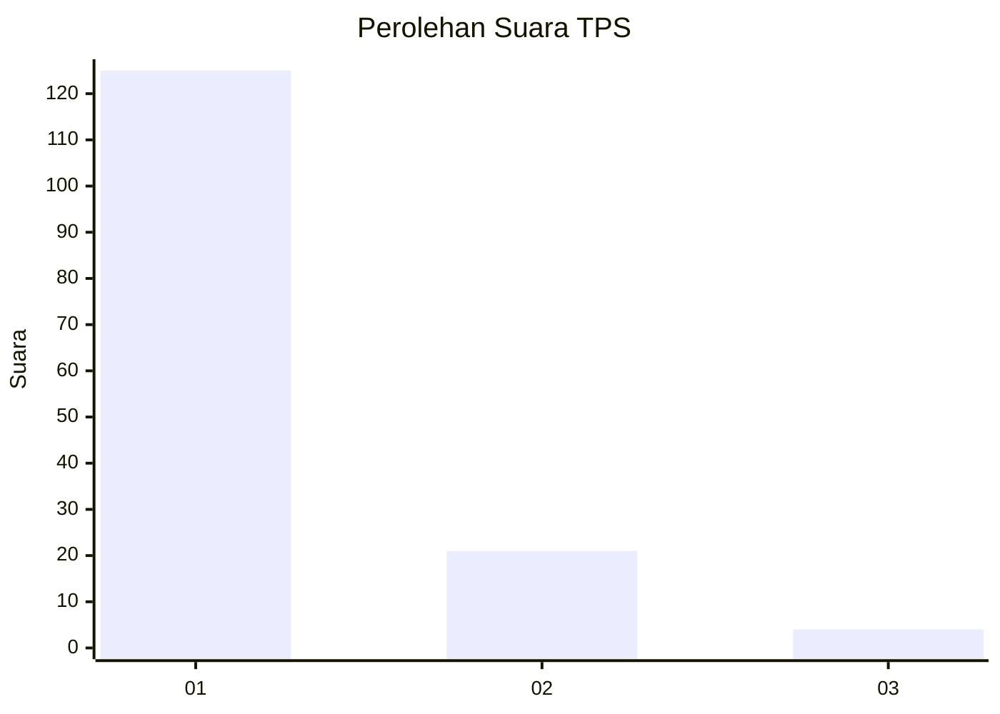
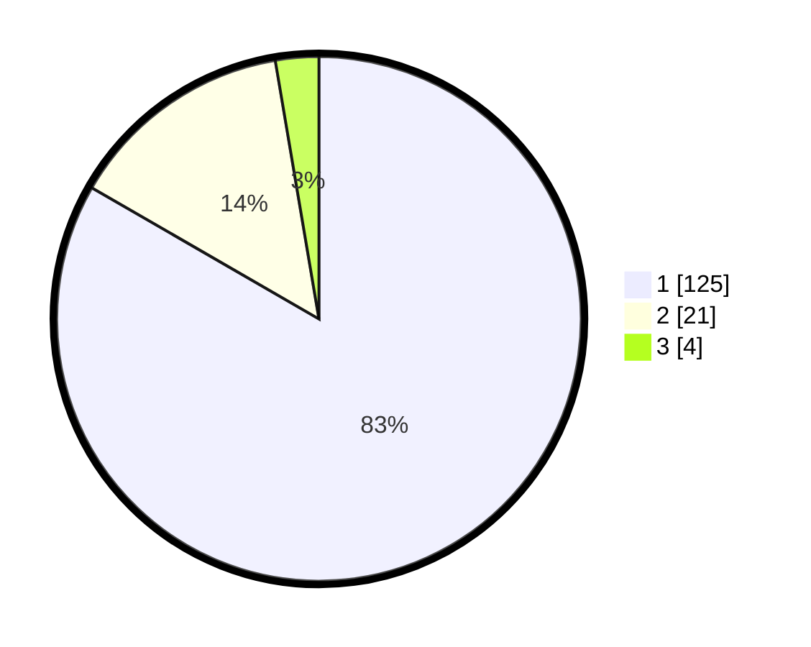

# Hasil

## Grafik

## Tabel

| No. | Nama Paslon    | Suara | Suara (raw) | Persentase |
|:--- |:-------------- | -----:| -----------:| ----------:|
| 1   | ANIES MUHAIMIN | 125   | [125][p-1]  | 83,33      |
| 2   | PRABOWO GIBRAN | 21    | [21][p-2]   | 14,00      |
| 3   | GANJAR MAHFUD  | 4     | [4][p-3]    | 2,67       |

[p-1]: https://github.com/gigit-pemilu/pemilu-2024-11-aceh/blob/main/pilpres/hitung-suara/sub/11-aceh/sub/07-pidie/sub/07-indrajaya/sub/2030-mesjid-baro/sub/001-tps/sub/paslon-1.txt
[p-2]: https://github.com/gigit-pemilu/pemilu-2024-11-aceh/blob/main/pilpres/hitung-suara/sub/11-aceh/sub/07-pidie/sub/07-indrajaya/sub/2030-mesjid-baro/sub/001-tps/sub/paslon-2.txt
[p-3]: https://github.com/gigit-pemilu/pemilu-2024-11-aceh/blob/main/pilpres/hitung-suara/sub/11-aceh/sub/07-pidie/sub/07-indrajaya/sub/2030-mesjid-baro/sub/001-tps/sub/paslon-3.txt

## Foto C Plano

https://sirekap-obj-formc.kpu.go.id/ff5a/pemilu/ppwp/11/07/07/20/30/1107072030001-20240214-211423--23cf74a3-3b49-48d4-b585-48d42bfe53f8.jpg

https://sirekap-obj-formc.kpu.go.id/ff5a/pemilu/ppwp/11/07/07/20/30/1107072030001-20240214-211748--a50f1e13-0bcf-497d-8408-74fe425410af.jpg

https://sirekap-obj-formc.kpu.go.id/ff5a/pemilu/ppwp/11/07/07/20/30/1107072030001-20240214-222057--039528a8-063f-4e8b-a9e5-268592efaf06.jpg

## Metadata

| Key        | Value               |
| ---------- | ------------------- |
| Time Stamp | 2024-02-19 06:16:00 |

