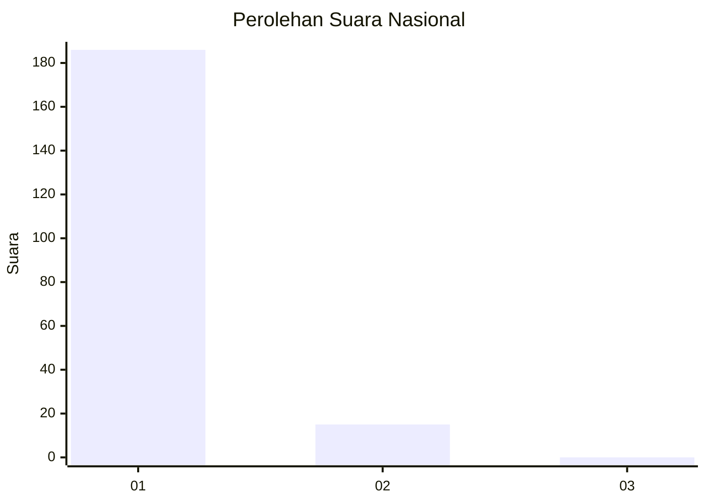
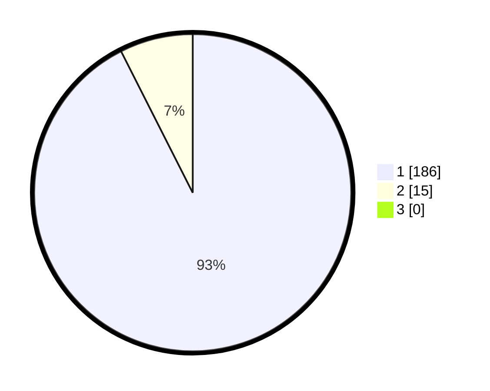

# Hasil

## Grafik

## Tabel

| No. | Nama Paslon    | Suara | Suara (raw) | Persentase |
|:--- |:-------------- | -----:| -----------:| ----------:|
| 1   | ANIES MUHAIMIN | 186   | [186][p-1]  | 92,54      |
| 2   | PRABOWO GIBRAN | 15    | [15][p-2]   | 7,46       |
| 3   | GANJAR MAHFUD  | 0     | [0][p-3]    | 0,00       |

[p-1]: https://github.com/gigit-pemilu/pemilu-2024/blob/main/pilpres/hitung-suara/sub/11-aceh/sub/07-pidie/sub/07-indrajaya/sub/2032-cot-seukee/sub/001-tps/sub/paslon-1.txt
[p-2]: https://github.com/gigit-pemilu/pemilu-2024/blob/main/pilpres/hitung-suara/sub/11-aceh/sub/07-pidie/sub/07-indrajaya/sub/2032-cot-seukee/sub/001-tps/sub/paslon-2.txt
[p-3]: https://github.com/gigit-pemilu/pemilu-2024/blob/main/pilpres/hitung-suara/sub/11-aceh/sub/07-pidie/sub/07-indrajaya/sub/2032-cot-seukee/sub/001-tps/sub/paslon-3.txt

## Foto C Plano

https://sirekap-obj-formc.kpu.go.id/3eb5/pemilu/ppwp/11/07/07/20/32/1107072032001-20240215-105114--37257f81-db35-4875-878b-884ffcc549a6.jpg

https://sirekap-obj-formc.kpu.go.id/3eb5/pemilu/ppwp/11/07/07/20/32/1107072032001-20240215-084118--20ce950c-868f-41e0-b24b-e7165428f8bc.jpg

https://sirekap-obj-formc.kpu.go.id/3eb5/pemilu/ppwp/11/07/07/20/32/1107072032001-20240215-084358--6a7722d1-bd53-4504-972b-195a8cda756d.jpg

## Metadata

| Key        | Value               |
| ---------- | ------------------- |
| Time Stamp | 2024-02-19 06:16:00 |

