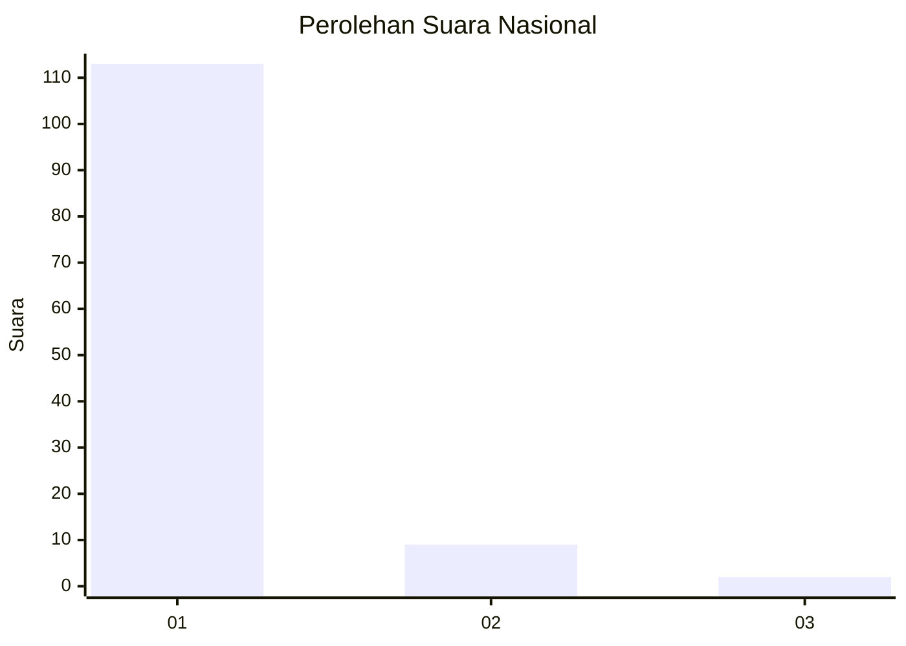
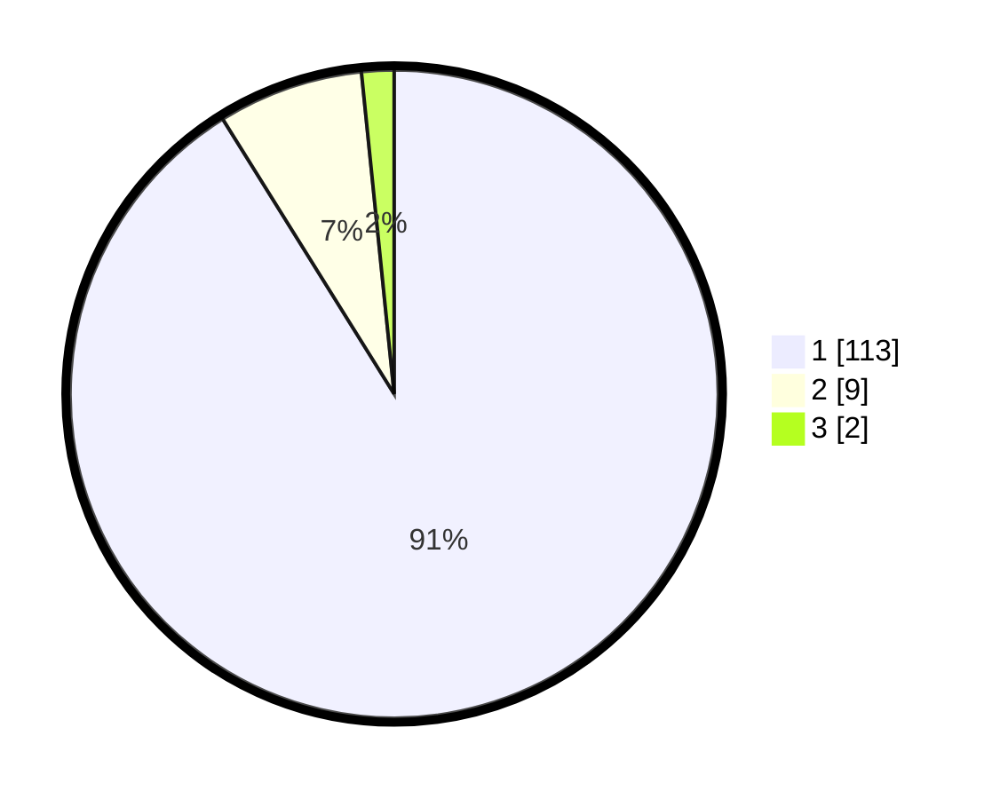

# Hasil

## Grafik

## Tabel

| No. | Nama Paslon    | Suara | Suara (raw) | Persentase |
|:--- |:-------------- | -----:| -----------:| ----------:|
| 1   | ANIES MUHAIMIN | 113   | [113][p-1]  | 91,13      |
| 2   | PRABOWO GIBRAN | 9     | [9][p-2]    | 7,26       |
| 3   | GANJAR MAHFUD  | 2     | [2][p-3]    | 1,61       |

[p-1]: https://github.com/gigit-pemilu/pemilu-2024/blob/main/pilpres/hitung-suara/sub/11-aceh/sub/07-pidie/sub/07-indrajaya/sub/2033-drien/sub/001-tps/sub/paslon-1.txt
[p-2]: https://github.com/gigit-pemilu/pemilu-2024/blob/main/pilpres/hitung-suara/sub/11-aceh/sub/07-pidie/sub/07-indrajaya/sub/2033-drien/sub/001-tps/sub/paslon-2.txt
[p-3]: https://github.com/gigit-pemilu/pemilu-2024/blob/main/pilpres/hitung-suara/sub/11-aceh/sub/07-pidie/sub/07-indrajaya/sub/2033-drien/sub/001-tps/sub/paslon-3.txt

## Foto C Plano

https://sirekap-obj-formc.kpu.go.id/9644/pemilu/ppwp/11/07/07/20/33/1107072033001-20240215-103200--3bf5e748-9cda-46d6-8d59-16a7faf9a5be.jpg

https://sirekap-obj-formc.kpu.go.id/9644/pemilu/ppwp/11/07/07/20/33/1107072033001-20240215-103216--e7280903-a77e-4a9f-812f-2b5ce761bfdf.jpg

https://sirekap-obj-formc.kpu.go.id/9644/pemilu/ppwp/11/07/07/20/33/1107072033001-20240215-103225--27699aa6-eade-4fd3-87b2-2382f128e721.jpg

## Metadata

| Key        | Value               |
| ---------- | ------------------- |
| Time Stamp | 2024-02-24 22:31:28 |

