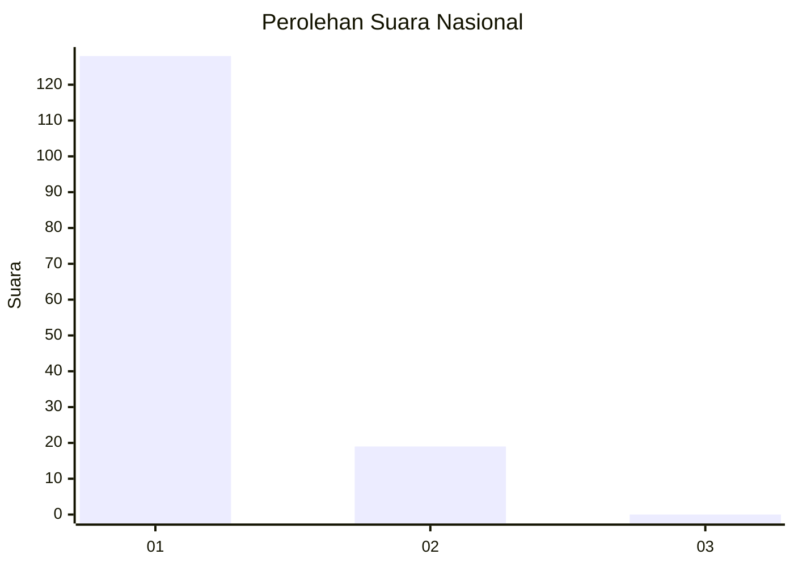
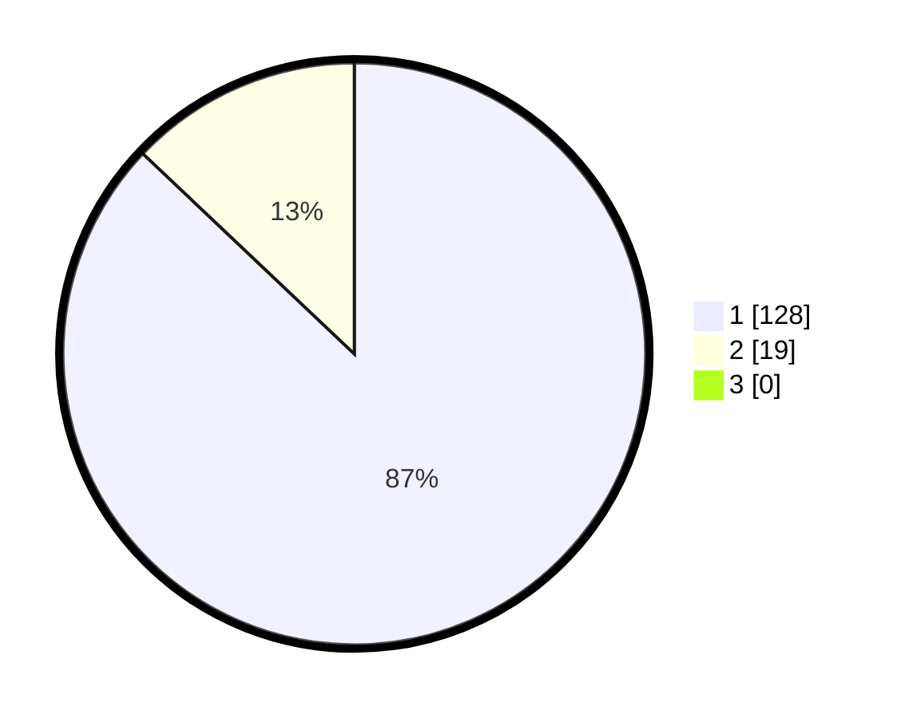

# Hasil

## Grafik

## Tabel

| No. | Nama Paslon    | Suara | Suara (raw) | Persentase |
|:--- |:-------------- | -----:| -----------:| ----------:|
| 1   | ANIES MUHAIMIN | 128   | [128][p-1]  | 87,07      |
| 2   | PRABOWO GIBRAN | 19    | [19][p-2]   | 12,93      |
| 3   | GANJAR MAHFUD  | 0     | [0][p-3]    | 0,00       |

[p-1]: https://github.com/gigit-pemilu/pemilu-2024/blob/main/pilpres/hitung-suara/sub/11-aceh/sub/07-pidie/sub/07-indrajaya/sub/2034-rumia/sub/001-tps/sub/paslon-1.txt
[p-2]: https://github.com/gigit-pemilu/pemilu-2024/blob/main/pilpres/hitung-suara/sub/11-aceh/sub/07-pidie/sub/07-indrajaya/sub/2034-rumia/sub/001-tps/sub/paslon-2.txt
[p-3]: https://github.com/gigit-pemilu/pemilu-2024/blob/main/pilpres/hitung-suara/sub/11-aceh/sub/07-pidie/sub/07-indrajaya/sub/2034-rumia/sub/001-tps/sub/paslon-3.txt

## Foto C Plano

https://sirekap-obj-formc.kpu.go.id/9dac/pemilu/ppwp/11/07/07/20/34/1107072034001-20240215-002929--47aaaaee-72cd-4b04-9e7e-9b7dc3148405.jpg

https://sirekap-obj-formc.kpu.go.id/9dac/pemilu/ppwp/11/07/07/20/34/1107072034001-20240215-003044--dd6fb1c8-1493-454e-b7f8-7136e77491e6.jpg

https://sirekap-obj-formc.kpu.go.id/9dac/pemilu/ppwp/11/07/07/20/34/1107072034001-20240215-003204--e5025d75-2bca-4bec-bb57-5a2524b40822.jpg

## Metadata

| Key        | Value               |
| ---------- | ------------------- |
| Time Stamp | 2024-02-24 22:31:28 |

