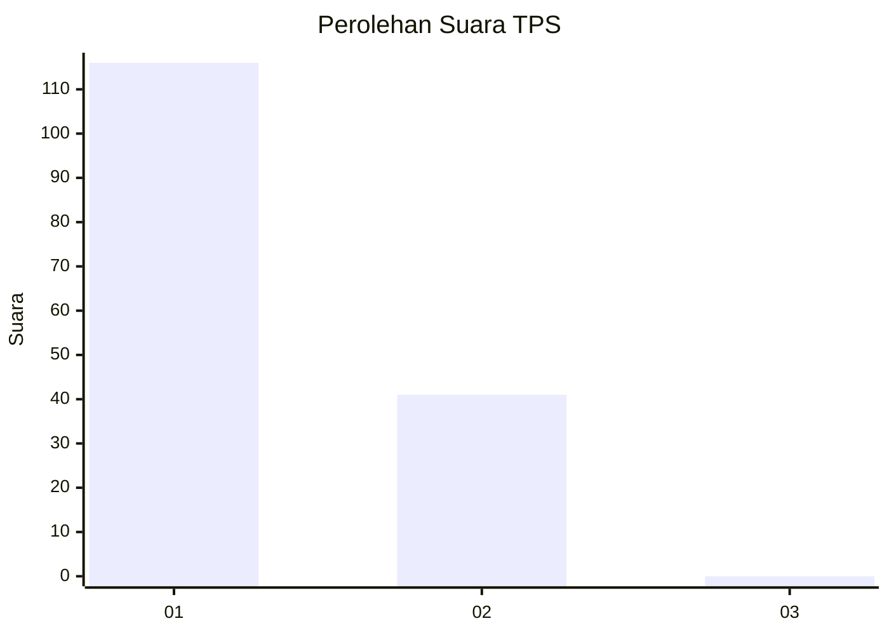
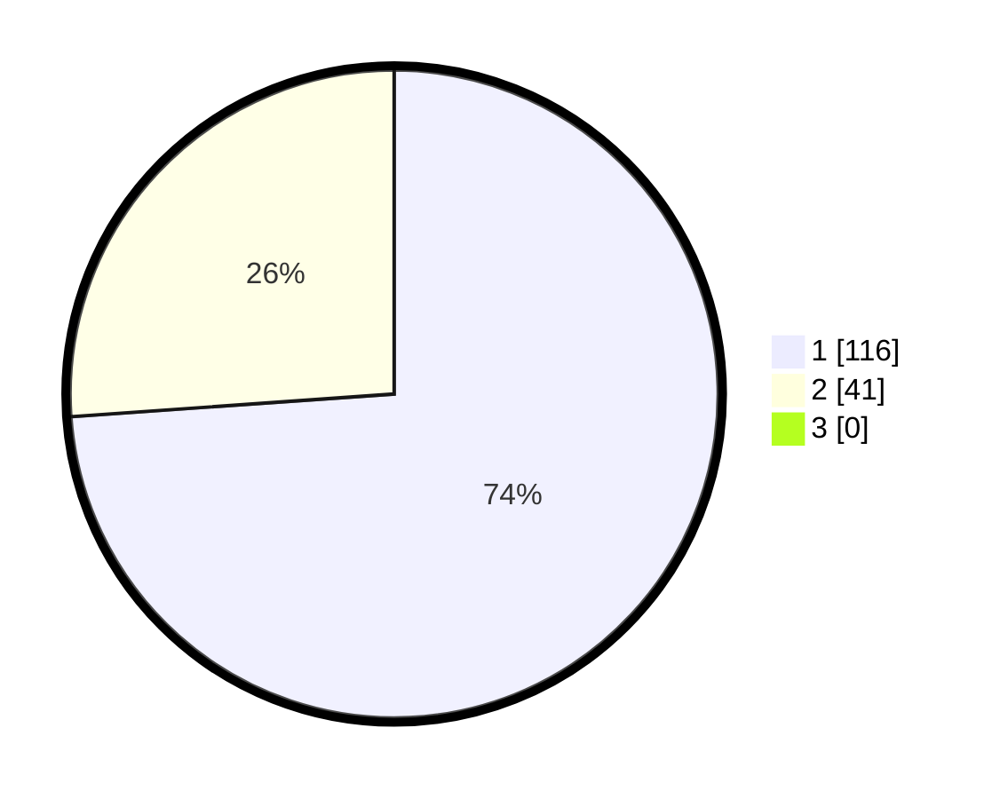

# Hasil

## Grafik

## Tabel

| No. | Nama Paslon    | Suara | Suara (raw) | Persentase |
|:--- |:-------------- | -----:| -----------:| ----------:|
| 1   | ANIES MUHAIMIN | 116   | [116][p-1]  | 73,89      |
| 2   | PRABOWO GIBRAN | 41    | [41][p-2]   | 26,11      |
| 3   | GANJAR MAHFUD  | 0     | [0][p-3]    | 0,00       |

[p-1]: https://github.com/gigit-pemilu/pemilu-2024-11-aceh/blob/main/pilpres/hitung-suara/sub/11-aceh/sub/07-pidie/sub/07-indrajaya/sub/2036-baro-bluek/sub/001-tps/sub/paslon-1.txt
[p-2]: https://github.com/gigit-pemilu/pemilu-2024-11-aceh/blob/main/pilpres/hitung-suara/sub/11-aceh/sub/07-pidie/sub/07-indrajaya/sub/2036-baro-bluek/sub/001-tps/sub/paslon-2.txt
[p-3]: https://github.com/gigit-pemilu/pemilu-2024-11-aceh/blob/main/pilpres/hitung-suara/sub/11-aceh/sub/07-pidie/sub/07-indrajaya/sub/2036-baro-bluek/sub/001-tps/sub/paslon-3.txt

## Foto C Plano

https://sirekap-obj-formc.kpu.go.id/f95c/pemilu/ppwp/11/07/07/20/36/1107072036001-20240215-110923--15a1dc31-a1e8-4358-91d8-20e6ff97f865.jpg

https://sirekap-obj-formc.kpu.go.id/f95c/pemilu/ppwp/11/07/07/20/36/1107072036001-20240215-104232--a78dd292-3a35-470e-9bfe-beb2b426bbea.jpg

https://sirekap-obj-formc.kpu.go.id/f95c/pemilu/ppwp/11/07/07/20/36/1107072036001-20240215-104406--e23181e9-5779-4b2e-8223-fbf4cc1054e6.jpg

## Metadata

| Key        | Value               |
| ---------- | ------------------- |
| Time Stamp | 2024-02-19 06:16:00 |

