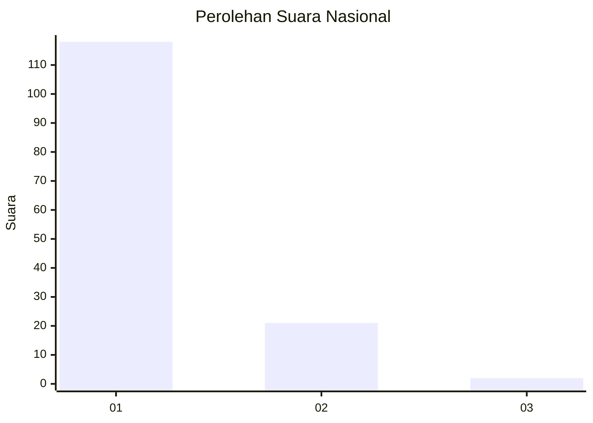
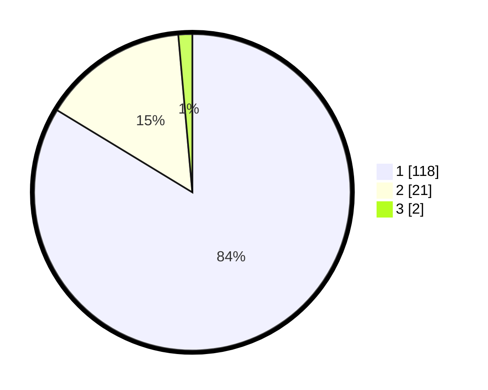

# Hasil

## Grafik

## Tabel

| No. | Nama Paslon    | Suara | Suara (raw) | Persentase |
|:--- |:-------------- | -----:| -----------:| ----------:|
| 1   | ANIES MUHAIMIN | 118   | [118][p-1]  | 83,69      |
| 2   | PRABOWO GIBRAN | 21    | [21][p-2]   | 14,89      |
| 3   | GANJAR MAHFUD  | 2     | [2][p-3]    | 1,42       |

[p-1]: https://github.com/gigit-pemilu/pemilu-2024/blob/main/pilpres/hitung-suara/sub/11-aceh/sub/07-pidie/sub/07-indrajaya/sub/2037-mesjid-ulee-gampong/sub/001-tps/sub/paslon-1.txt
[p-2]: https://github.com/gigit-pemilu/pemilu-2024/blob/main/pilpres/hitung-suara/sub/11-aceh/sub/07-pidie/sub/07-indrajaya/sub/2037-mesjid-ulee-gampong/sub/001-tps/sub/paslon-2.txt
[p-3]: https://github.com/gigit-pemilu/pemilu-2024/blob/main/pilpres/hitung-suara/sub/11-aceh/sub/07-pidie/sub/07-indrajaya/sub/2037-mesjid-ulee-gampong/sub/001-tps/sub/paslon-3.txt

## Foto C Plano

https://sirekap-obj-formc.kpu.go.id/b228/pemilu/ppwp/11/07/07/20/37/1107072037001-20240214-220422--c084a5bf-386a-4298-b08e-ac452a207822.jpg

https://sirekap-obj-formc.kpu.go.id/b228/pemilu/ppwp/11/07/07/20/37/1107072037001-20240214-220729--c2b8f1c5-e27d-4cda-9a4a-7a14e21e0488.jpg

https://sirekap-obj-formc.kpu.go.id/b228/pemilu/ppwp/11/07/07/20/37/1107072037001-20240214-220920--f68d9f00-7959-49bc-803d-478f625518a6.jpg

## Metadata

| Key        | Value               |
| ---------- | ------------------- |
| Time Stamp | 2024-02-24 22:31:28 |

