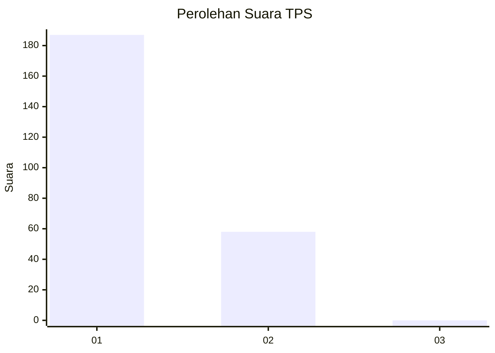
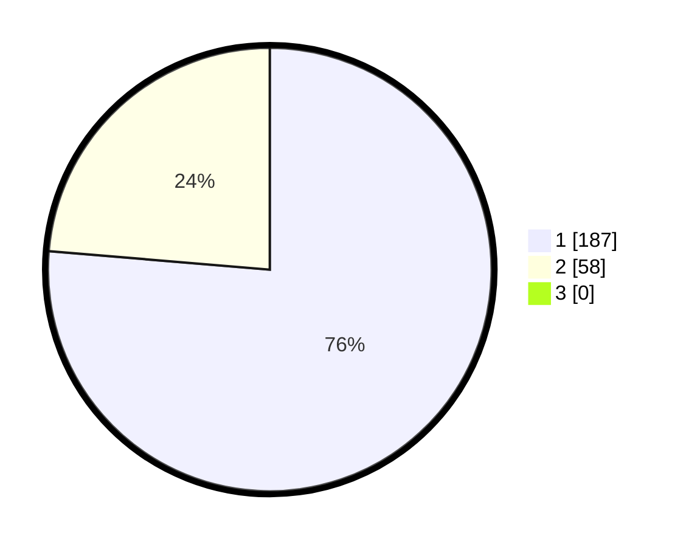

# Hasil

## Grafik

## Tabel

| No. | Nama Paslon    | Suara | Suara (raw) | Persentase |
|:--- |:-------------- | -----:| -----------:| ----------:|
| 1   | ANIES MUHAIMIN | 187   | [187][p-1]  | 76,33      |
| 2   | PRABOWO GIBRAN | 58    | [58][p-2]   | 23,67      |
| 3   | GANJAR MAHFUD  | 0     | [0][p-3]    | 0,00       |

[p-1]: https://github.com/gigit-pemilu/pemilu-2024-11-aceh/blob/main/pilpres/hitung-suara/sub/11-aceh/sub/07-pidie/sub/07-indrajaya/sub/2038-dayah-bie/sub/001-tps/sub/paslon-1.txt
[p-2]: https://github.com/gigit-pemilu/pemilu-2024-11-aceh/blob/main/pilpres/hitung-suara/sub/11-aceh/sub/07-pidie/sub/07-indrajaya/sub/2038-dayah-bie/sub/001-tps/sub/paslon-2.txt
[p-3]: https://github.com/gigit-pemilu/pemilu-2024-11-aceh/blob/main/pilpres/hitung-suara/sub/11-aceh/sub/07-pidie/sub/07-indrajaya/sub/2038-dayah-bie/sub/001-tps/sub/paslon-3.txt

## Foto C Plano

https://sirekap-obj-formc.kpu.go.id/ca4e/pemilu/ppwp/11/07/07/20/38/1107072038001-20240215-020501--0fae7a63-a96d-4234-b56f-93f82e579a01.jpg

https://sirekap-obj-formc.kpu.go.id/ca4e/pemilu/ppwp/11/07/07/20/38/1107072038001-20240215-020659--37d8aeab-cf2f-4d89-a7c6-c5e53001d4da.jpg

https://sirekap-obj-formc.kpu.go.id/ca4e/pemilu/ppwp/11/07/07/20/38/1107072038001-20240215-020953--7957c57b-a9a8-4c06-9a71-83ed48b4b6fd.jpg

## Metadata

| Key        | Value               |
| ---------- | ------------------- |
| Time Stamp | 2024-02-17 18:30:00 |

