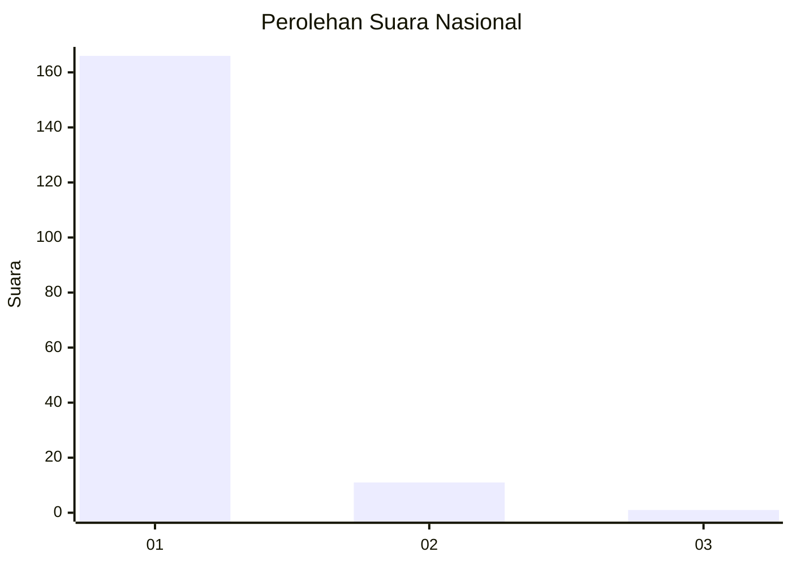
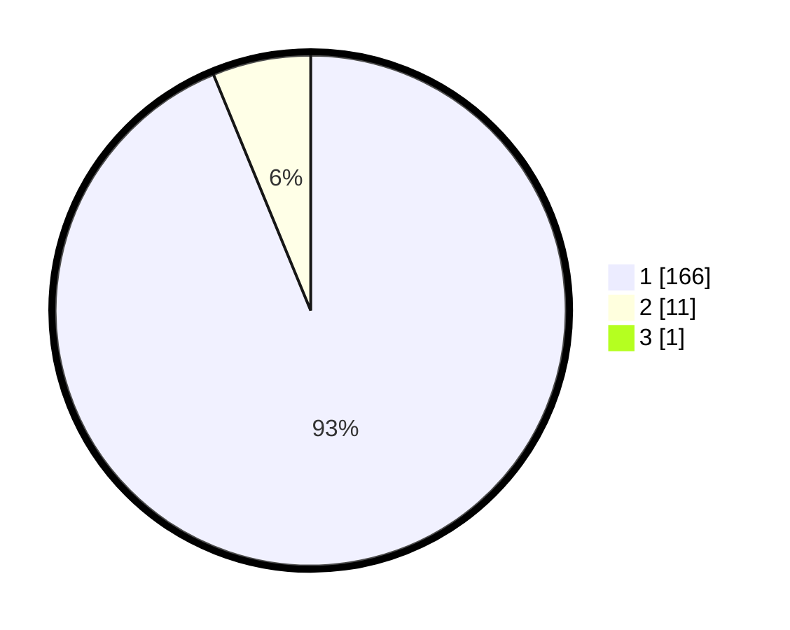

# Hasil

## Grafik

## Tabel

| No. | Nama Paslon    | Suara | Suara (raw) | Persentase |
|:--- |:-------------- | -----:| -----------:| ----------:|
| 1   | ANIES MUHAIMIN | 166   | [166][p-1]  | 93,26      |
| 2   | PRABOWO GIBRAN | 11    | [11][p-2]   | 6,18       |
| 3   | GANJAR MAHFUD  | 1     | [1][p-3]    | 0,56       |

[p-1]: https://github.com/gigit-pemilu/pemilu-2024/blob/main/pilpres/hitung-suara/sub/11-aceh/sub/07-pidie/sub/07-indrajaya/sub/2039-balee-baroh-bluek/sub/002-tps/sub/paslon-1.txt
[p-2]: https://github.com/gigit-pemilu/pemilu-2024/blob/main/pilpres/hitung-suara/sub/11-aceh/sub/07-pidie/sub/07-indrajaya/sub/2039-balee-baroh-bluek/sub/002-tps/sub/paslon-2.txt
[p-3]: https://github.com/gigit-pemilu/pemilu-2024/blob/main/pilpres/hitung-suara/sub/11-aceh/sub/07-pidie/sub/07-indrajaya/sub/2039-balee-baroh-bluek/sub/002-tps/sub/paslon-3.txt

## Foto C Plano

https://sirekap-obj-formc.kpu.go.id/8902/pemilu/ppwp/11/07/07/20/39/1107072039002-20240215-014722--1e694338-6d88-47bf-916d-42e0ac3c084e.jpg

https://sirekap-obj-formc.kpu.go.id/8902/pemilu/ppwp/11/07/07/20/39/1107072039002-20240215-014924--5c2cae12-ae2f-461b-891d-07250632e749.jpg

https://sirekap-obj-formc.kpu.go.id/8902/pemilu/ppwp/11/07/07/20/39/1107072039002-20240215-015157--4e7e6b68-3052-4525-837e-3b8afb23fabe.jpg

## Metadata

| Key        | Value               |
| ---------- | ------------------- |
| Time Stamp | 2024-02-19 06:16:00 |

