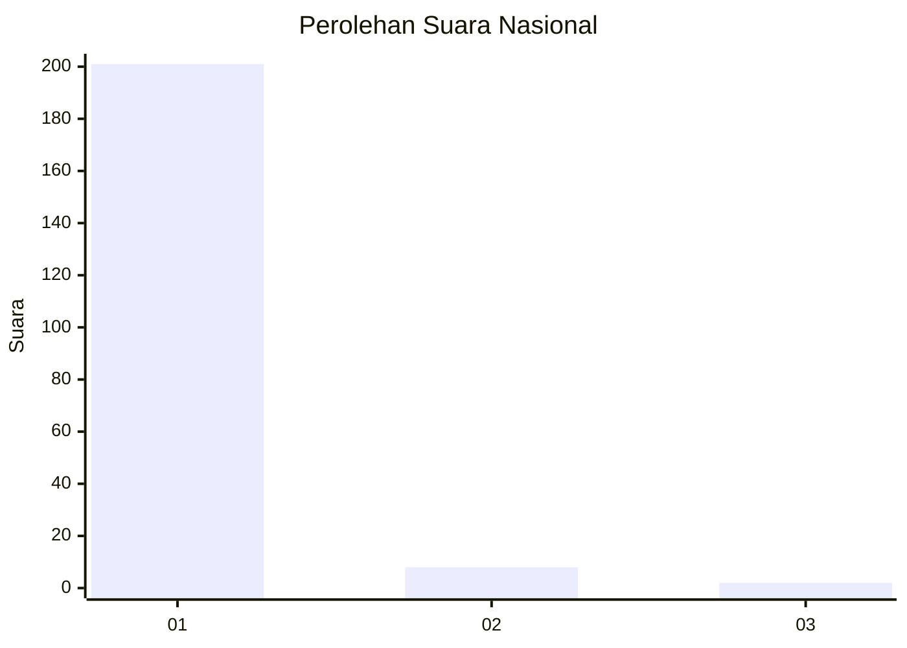
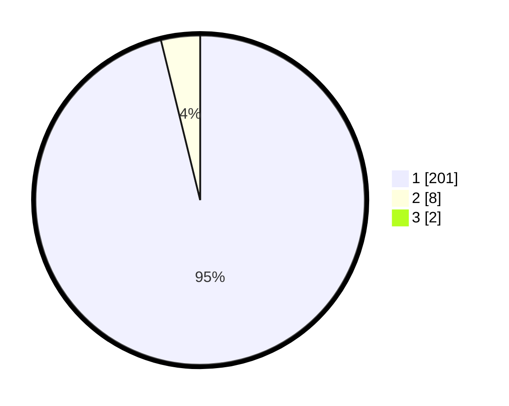

# Hasil

## Grafik

## Tabel

| No. | Nama Paslon    | Suara | Suara (raw) | Persentase |
|:--- |:-------------- | -----:| -----------:| ----------:|
| 1   | ANIES MUHAIMIN | 201   | [201][p-1]  | 95,26      |
| 2   | PRABOWO GIBRAN | 8     | [8][p-2]    | 3,79       |
| 3   | GANJAR MAHFUD  | 2     | [2][p-3]    | 0,95       |

[p-1]: https://github.com/gigit-pemilu/pemilu-2024/blob/main/pilpres/hitung-suara/sub/11-aceh/sub/07-pidie/sub/07-indrajaya/sub/2041-blang-rapai/sub/001-tps/sub/paslon-1.txt
[p-2]: https://github.com/gigit-pemilu/pemilu-2024/blob/main/pilpres/hitung-suara/sub/11-aceh/sub/07-pidie/sub/07-indrajaya/sub/2041-blang-rapai/sub/001-tps/sub/paslon-2.txt
[p-3]: https://github.com/gigit-pemilu/pemilu-2024/blob/main/pilpres/hitung-suara/sub/11-aceh/sub/07-pidie/sub/07-indrajaya/sub/2041-blang-rapai/sub/001-tps/sub/paslon-3.txt

## Foto C Plano

https://sirekap-obj-formc.kpu.go.id/b97f/pemilu/ppwp/11/07/07/20/41/1107072041001-20240215-005053--d50838b2-6ed5-445c-a1a5-4eff5969163b.jpg

https://sirekap-obj-formc.kpu.go.id/b97f/pemilu/ppwp/11/07/07/20/41/1107072041001-20240215-005425--f4042ea0-edf4-46a9-a8e9-9d31b1ae83ca.jpg

https://sirekap-obj-formc.kpu.go.id/b97f/pemilu/ppwp/11/07/07/20/41/1107072041001-20240215-030402--26c889c6-05c8-4ec6-9ed8-9af8b9746488.jpg

## Metadata

| Key        | Value               |
| ---------- | ------------------- |
| Time Stamp | 2024-02-19 06:16:00 |

