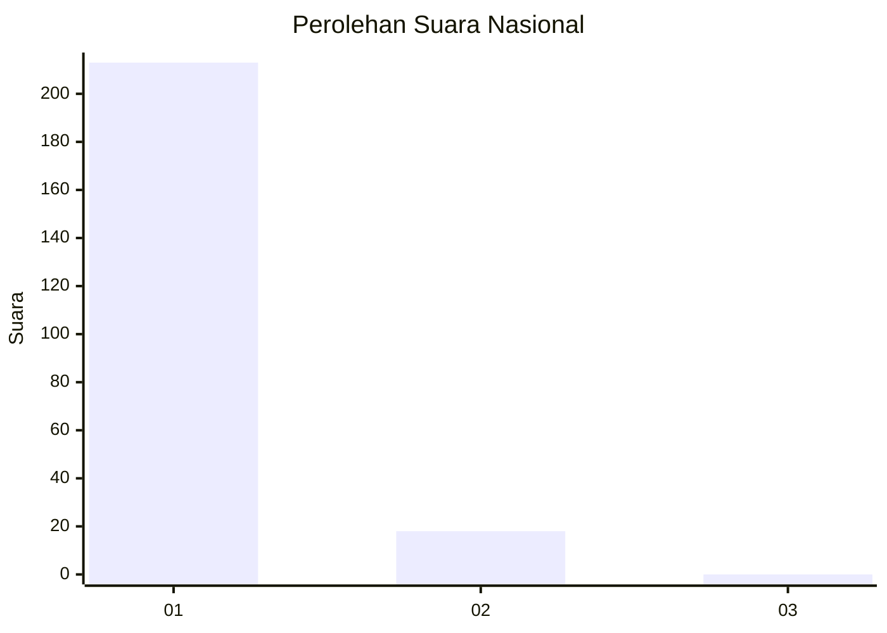
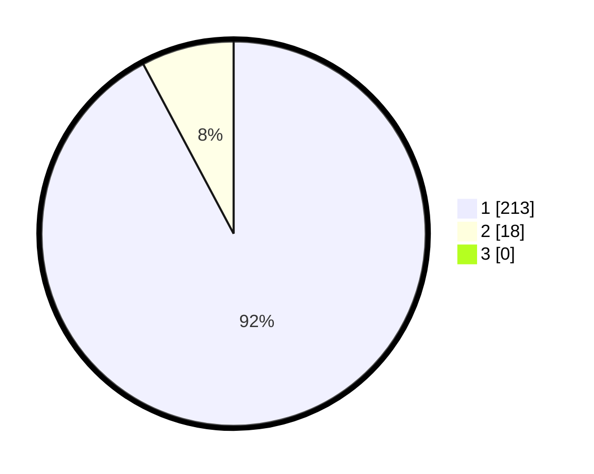

# Hasil

## Grafik

## Tabel

| No. | Nama Paslon    | Suara | Suara (raw) | Persentase |
|:--- |:-------------- | -----:| -----------:| ----------:|
| 1   | ANIES MUHAIMIN | 213   | [213][p-1]  | 92,21      |
| 2   | PRABOWO GIBRAN | 18    | [18][p-2]   | 7,79       |
| 3   | GANJAR MAHFUD  | 0     | [0][p-3]    | 0,00       |

[p-1]: https://github.com/gigit-pemilu/pemilu-2024/blob/main/pilpres/hitung-suara/sub/11-aceh/sub/07-pidie/sub/07-indrajaya/sub/2044-balee-baroh-gapui/sub/001-tps/sub/paslon-1.txt
[p-2]: https://github.com/gigit-pemilu/pemilu-2024/blob/main/pilpres/hitung-suara/sub/11-aceh/sub/07-pidie/sub/07-indrajaya/sub/2044-balee-baroh-gapui/sub/001-tps/sub/paslon-2.txt
[p-3]: https://github.com/gigit-pemilu/pemilu-2024/blob/main/pilpres/hitung-suara/sub/11-aceh/sub/07-pidie/sub/07-indrajaya/sub/2044-balee-baroh-gapui/sub/001-tps/sub/paslon-3.txt

## Foto C Plano

https://sirekap-obj-formc.kpu.go.id/aa45/pemilu/ppwp/11/07/07/20/44/1107072044001-20240215-025318--fd40f56a-670a-408e-96aa-e96b2f87aae8.jpg

https://sirekap-obj-formc.kpu.go.id/aa45/pemilu/ppwp/11/07/07/20/44/1107072044001-20240215-025423--938dcf58-2559-4aed-bb77-ffd2ec29240d.jpg

https://sirekap-obj-formc.kpu.go.id/aa45/pemilu/ppwp/11/07/07/20/44/1107072044001-20240215-025529--eaca6368-31a0-439e-b6e1-9981610e7db9.jpg

## Metadata

| Key        | Value               |
| ---------- | ------------------- |
| Time Stamp | 2024-02-19 06:16:00 |

