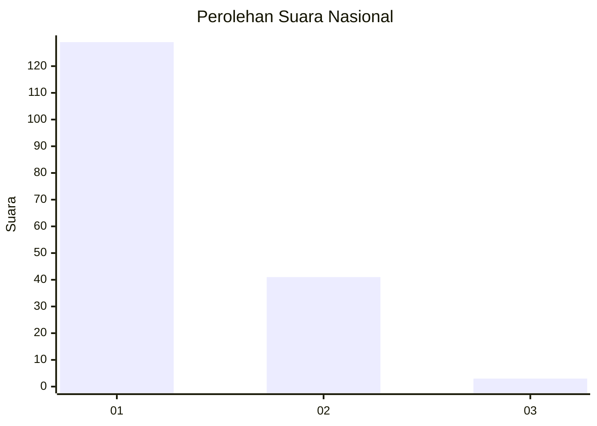
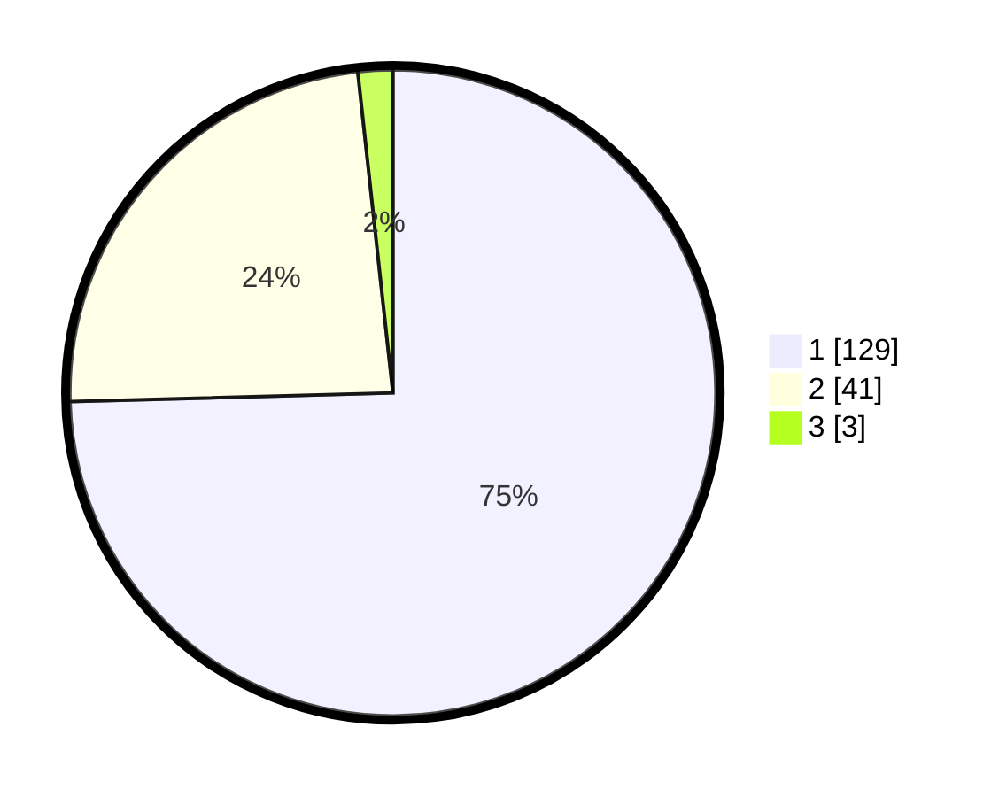

# Hasil

## Grafik

## Tabel

| No. | Nama Paslon    | Suara | Suara (raw) | Persentase |
|:--- |:-------------- | -----:| -----------:| ----------:|
| 1   | ANIES MUHAIMIN | 129   | [129][p-1]  | 74,57      |
| 2   | PRABOWO GIBRAN | 41    | [41][p-2]   | 23,70      |
| 3   | GANJAR MAHFUD  | 3     | [3][p-3]    | 1,73       |

[p-1]: https://github.com/gigit-pemilu/pemilu-2024/blob/main/pilpres/hitung-suara/sub/11-aceh/sub/07-pidie/sub/07-indrajaya/sub/2045-glee-gapui/sub/001-tps/sub/paslon-1.txt
[p-2]: https://github.com/gigit-pemilu/pemilu-2024/blob/main/pilpres/hitung-suara/sub/11-aceh/sub/07-pidie/sub/07-indrajaya/sub/2045-glee-gapui/sub/001-tps/sub/paslon-2.txt
[p-3]: https://github.com/gigit-pemilu/pemilu-2024/blob/main/pilpres/hitung-suara/sub/11-aceh/sub/07-pidie/sub/07-indrajaya/sub/2045-glee-gapui/sub/001-tps/sub/paslon-3.txt

## Foto C Plano

https://sirekap-obj-formc.kpu.go.id/b19e/pemilu/ppwp/11/07/07/20/45/1107072045001-20240214-214946--d0124ecf-c4c5-4e69-a5e0-1ce547d6491f.jpg

https://sirekap-obj-formc.kpu.go.id/b19e/pemilu/ppwp/11/07/07/20/45/1107072045001-20240214-215449--922eb37a-1b91-4efe-a244-4c85e919f3b0.jpg

https://sirekap-obj-formc.kpu.go.id/b19e/pemilu/ppwp/11/07/07/20/45/1107072045001-20240214-215222--8c4937cb-da38-40c4-be5a-b7ffd130e4bc.jpg

## Metadata

| Key        | Value               |
| ---------- | ------------------- |
| Time Stamp | 2024-02-24 22:31:28 |

