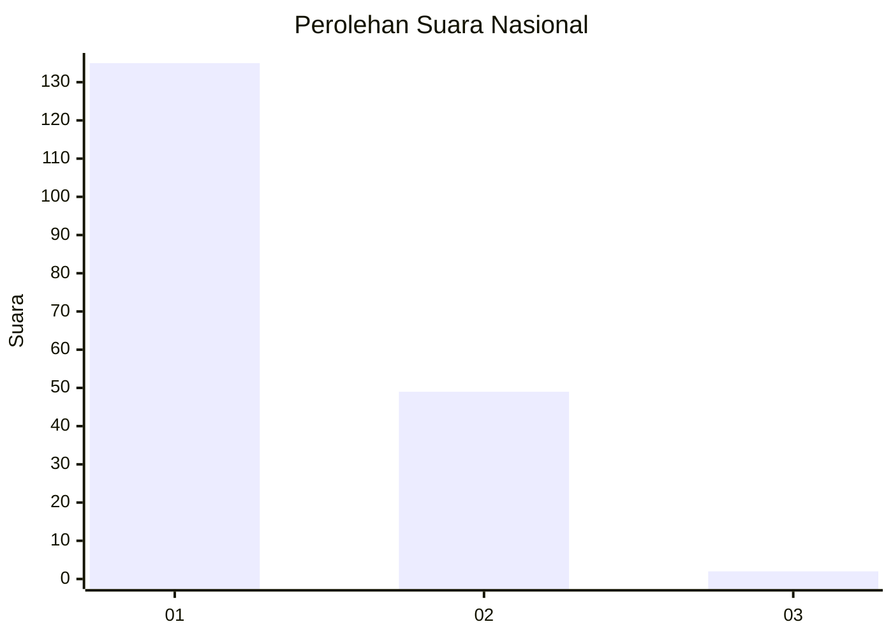
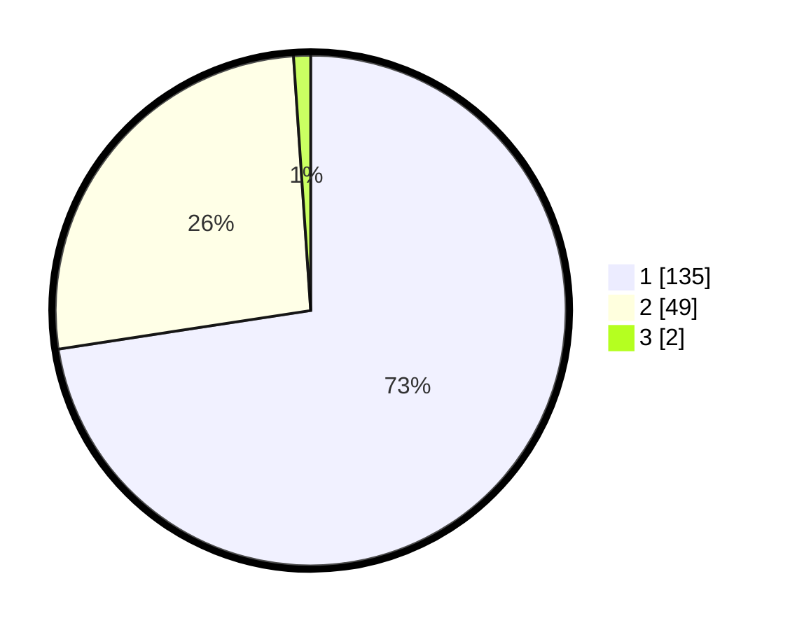

# Hasil

## Grafik

## Tabel

| No. | Nama Paslon    | Suara | Suara (raw) | Persentase |
|:--- |:-------------- | -----:| -----------:| ----------:|
| 1   | ANIES MUHAIMIN | 135   | [135][p-1]  | 72,58      |
| 2   | PRABOWO GIBRAN | 49    | [49][p-2]   | 26,34      |
| 3   | GANJAR MAHFUD  | 2     | [2][p-3]    | 1,08       |

[p-1]: https://github.com/gigit-pemilu/pemilu-2024/blob/main/pilpres/hitung-suara/sub/11-aceh/sub/07-pidie/sub/07-indrajaya/sub/2045-glee-gapui/sub/002-tps/sub/paslon-1.txt
[p-2]: https://github.com/gigit-pemilu/pemilu-2024/blob/main/pilpres/hitung-suara/sub/11-aceh/sub/07-pidie/sub/07-indrajaya/sub/2045-glee-gapui/sub/002-tps/sub/paslon-2.txt
[p-3]: https://github.com/gigit-pemilu/pemilu-2024/blob/main/pilpres/hitung-suara/sub/11-aceh/sub/07-pidie/sub/07-indrajaya/sub/2045-glee-gapui/sub/002-tps/sub/paslon-3.txt

## Foto C Plano

https://sirekap-obj-formc.kpu.go.id/9269/pemilu/ppwp/11/07/07/20/45/1107072045002-20240214-230913--098e997b-c67e-4cdd-9a08-812505df6a74.jpg

https://sirekap-obj-formc.kpu.go.id/9269/pemilu/ppwp/11/07/07/20/45/1107072045002-20240215-094923--99387c50-04db-4b73-88cb-f7ff208ddcdd.jpg

https://sirekap-obj-formc.kpu.go.id/9269/pemilu/ppwp/11/07/07/20/45/1107072045002-20240214-232103--2d532dae-adc2-4f33-b114-1b47a0366c8b.jpg

## Metadata

| Key        | Value               |
| ---------- | ------------------- |
| Time Stamp | 2024-02-25 11:00:00 |

