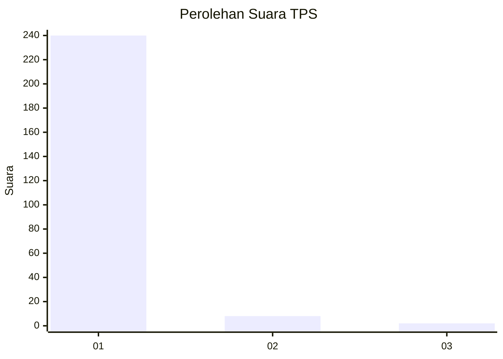
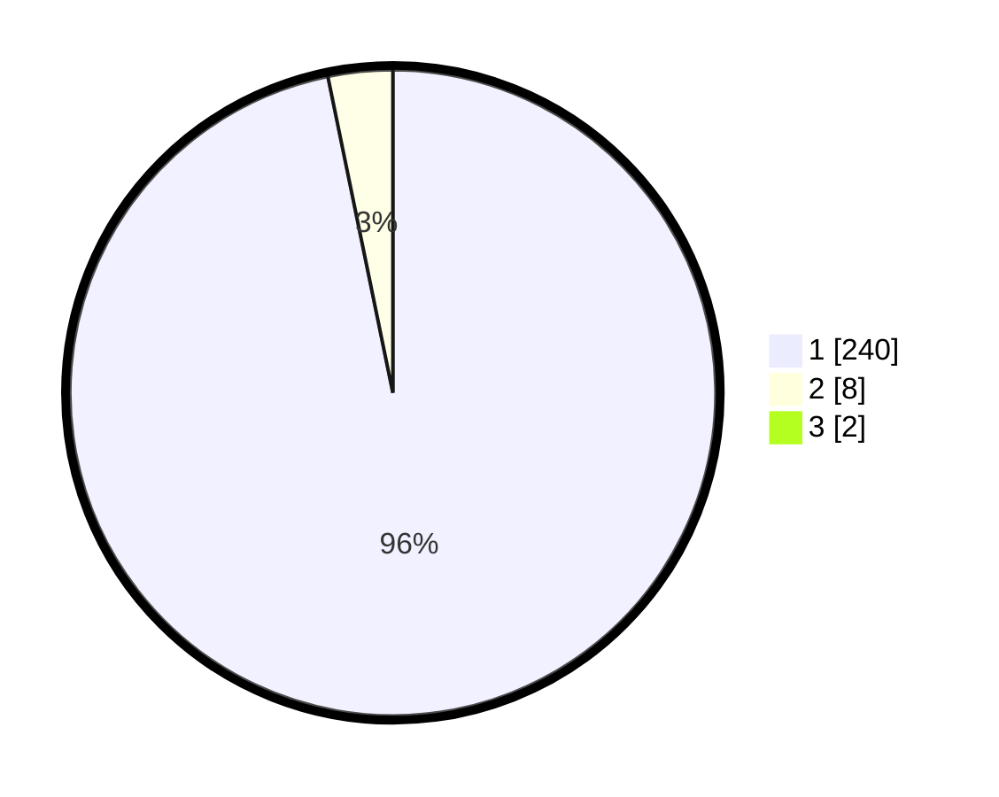

# Hasil

## Grafik

## Tabel

| No. | Nama Paslon    | Suara | Suara (raw) | Persentase |
|:--- |:-------------- | -----:| -----------:| ----------:|
| 1   | ANIES MUHAIMIN | 240   | [240][p-1]  | 96,00      |
| 2   | PRABOWO GIBRAN | 8     | [8][p-2]    | 3,20       |
| 3   | GANJAR MAHFUD  | 2     | [2][p-3]    | 0,80       |

[p-1]: https://github.com/gigit-pemilu/pemilu-2024-11-aceh/blob/main/pilpres/hitung-suara/sub/11-aceh/sub/07-pidie/sub/07-indrajaya/sub/2046-teungoh-suwiek/sub/001-tps/sub/paslon-1.txt
[p-2]: https://github.com/gigit-pemilu/pemilu-2024-11-aceh/blob/main/pilpres/hitung-suara/sub/11-aceh/sub/07-pidie/sub/07-indrajaya/sub/2046-teungoh-suwiek/sub/001-tps/sub/paslon-2.txt
[p-3]: https://github.com/gigit-pemilu/pemilu-2024-11-aceh/blob/main/pilpres/hitung-suara/sub/11-aceh/sub/07-pidie/sub/07-indrajaya/sub/2046-teungoh-suwiek/sub/001-tps/sub/paslon-3.txt

## Foto C Plano

https://sirekap-obj-formc.kpu.go.id/8e55/pemilu/ppwp/11/07/07/20/46/1107072046001-20240215-062412--14d0b791-31b4-4199-8ec2-0858f7805d5b.jpg

https://sirekap-obj-formc.kpu.go.id/8e55/pemilu/ppwp/11/07/07/20/46/1107072046001-20240215-030624--1a9993e1-6ba3-4d91-872e-af8523210cd7.jpg

https://sirekap-obj-formc.kpu.go.id/8e55/pemilu/ppwp/11/07/07/20/46/1107072046001-20240215-062448--9b2de2ad-9dcb-4507-8975-06f23478c32c.jpg

## Metadata

| Key        | Value               |
| ---------- | ------------------- |
| Time Stamp | 2024-02-19 06:16:00 |

