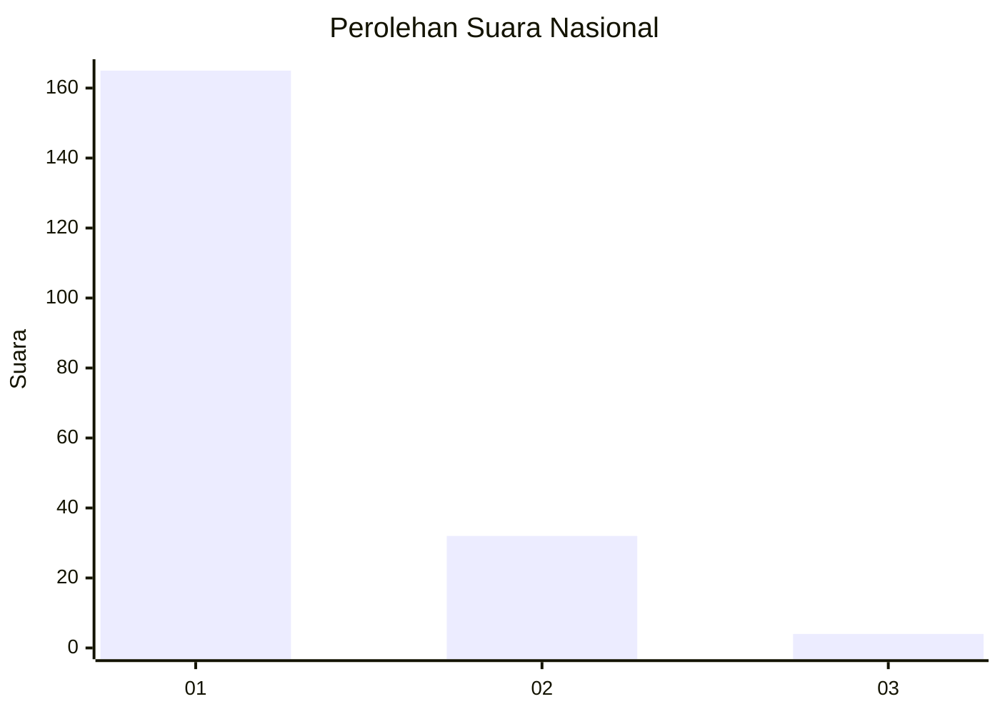
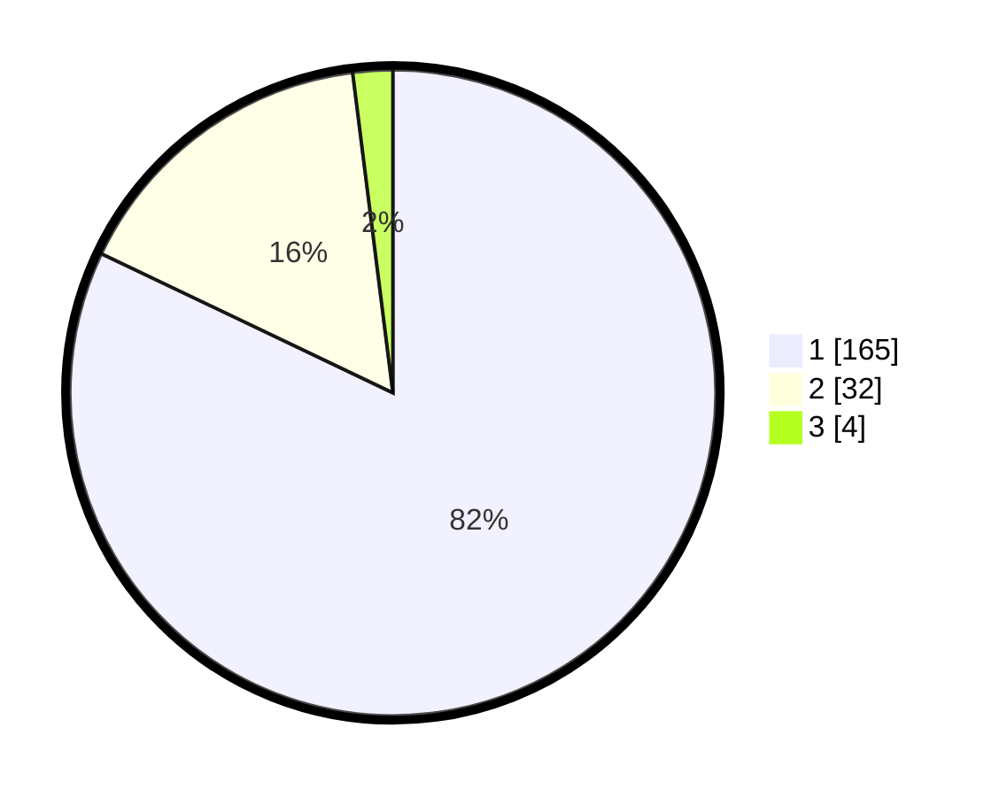

# Hasil

## Grafik

## Tabel

| No. | Nama Paslon    | Suara | Suara (raw) | Persentase |
|:--- |:-------------- | -----:| -----------:| ----------:|
| 1   | ANIES MUHAIMIN | 165   | [165][p-1]  | 82,09      |
| 2   | PRABOWO GIBRAN | 32    | [32][p-2]   | 15,92      |
| 3   | GANJAR MAHFUD  | 4     | [4][p-3]    | 1,99       |

[p-1]: https://github.com/gigit-pemilu/pemilu-2024/blob/main/pilpres/hitung-suara/sub/11-aceh/sub/07-pidie/sub/07-indrajaya/sub/2047-mesjid-suwiek/sub/001-tps/sub/paslon-1.txt
[p-2]: https://github.com/gigit-pemilu/pemilu-2024/blob/main/pilpres/hitung-suara/sub/11-aceh/sub/07-pidie/sub/07-indrajaya/sub/2047-mesjid-suwiek/sub/001-tps/sub/paslon-2.txt
[p-3]: https://github.com/gigit-pemilu/pemilu-2024/blob/main/pilpres/hitung-suara/sub/11-aceh/sub/07-pidie/sub/07-indrajaya/sub/2047-mesjid-suwiek/sub/001-tps/sub/paslon-3.txt

## Foto C Plano

https://sirekap-obj-formc.kpu.go.id/b9a3/pemilu/ppwp/11/07/07/20/47/1107072047001-20240215-102107--e723d932-3be8-4279-b192-9b0c194f556f.jpg

https://sirekap-obj-formc.kpu.go.id/b9a3/pemilu/ppwp/11/07/07/20/47/1107072047001-20240215-102431--66845adf-9b6f-4a22-b1e4-f0fe27274235.jpg

https://sirekap-obj-formc.kpu.go.id/b9a3/pemilu/ppwp/11/07/07/20/47/1107072047001-20240215-102612--b8f21de6-1a6e-4b2e-9086-a81041bcbff1.jpg

## Metadata

| Key        | Value               |
| ---------- | ------------------- |
| Time Stamp | 2024-02-19 06:16:00 |

