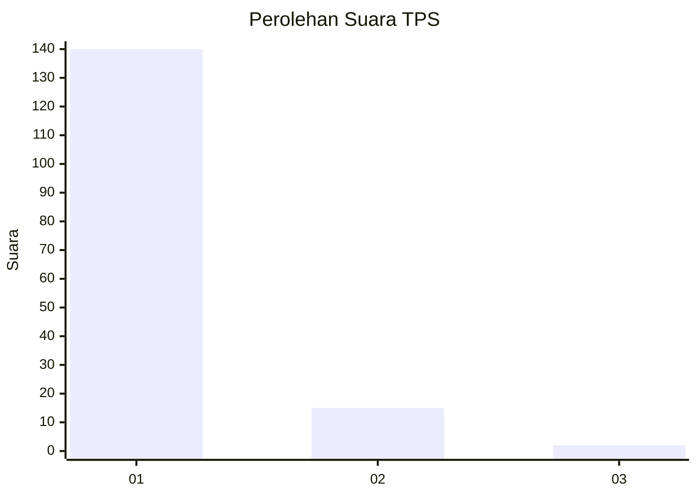
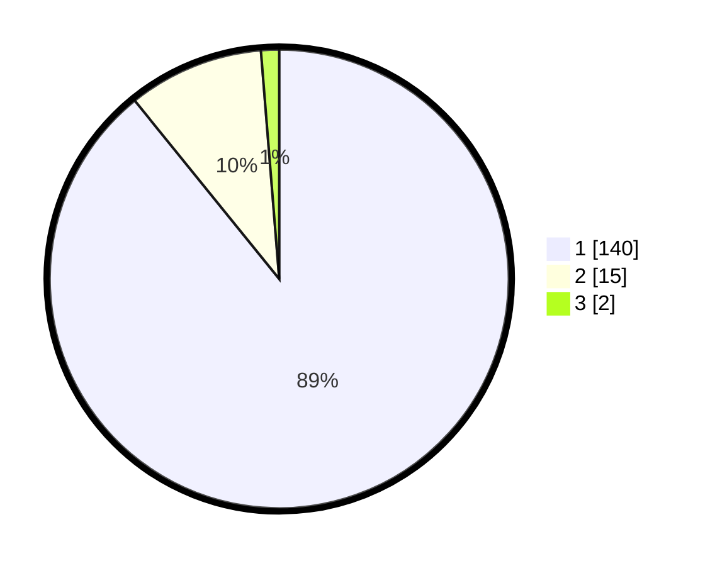

# Hasil

## Grafik

## Tabel

| No. | Nama Paslon    | Suara | Suara (raw) | Persentase |
|:--- |:-------------- | -----:| -----------:| ----------:|
| 1   | ANIES MUHAIMIN | 140   | [140][p-1]  | 89,17      |
| 2   | PRABOWO GIBRAN | 15    | [15][p-2]   | 9,55       |
| 3   | GANJAR MAHFUD  | 2     | [2][p-3]    | 1,27       |

[p-1]: https://github.com/gigit-pemilu/pemilu-2024-11-aceh/blob/main/pilpres/hitung-suara/sub/11-aceh/sub/07-pidie/sub/07-indrajaya/sub/2047-mesjid-suwiek/sub/002-tps/sub/paslon-1.txt
[p-2]: https://github.com/gigit-pemilu/pemilu-2024-11-aceh/blob/main/pilpres/hitung-suara/sub/11-aceh/sub/07-pidie/sub/07-indrajaya/sub/2047-mesjid-suwiek/sub/002-tps/sub/paslon-2.txt
[p-3]: https://github.com/gigit-pemilu/pemilu-2024-11-aceh/blob/main/pilpres/hitung-suara/sub/11-aceh/sub/07-pidie/sub/07-indrajaya/sub/2047-mesjid-suwiek/sub/002-tps/sub/paslon-3.txt

## Foto C Plano

https://sirekap-obj-formc.kpu.go.id/4870/pemilu/ppwp/11/07/07/20/47/1107072047002-20240215-102553--af15d312-86bb-481c-bcfe-3ce13749a5bc.jpg

https://sirekap-obj-formc.kpu.go.id/4870/pemilu/ppwp/11/07/07/20/47/1107072047002-20240215-102822--882b699f-90a7-4f32-9970-7acc235c9be5.jpg

https://sirekap-obj-formc.kpu.go.id/4870/pemilu/ppwp/11/07/07/20/47/1107072047002-20240215-103115--85691d0e-dcaf-4652-8652-889b227000b9.jpg

## Metadata

| Key        | Value               |
| ---------- | ------------------- |
| Time Stamp | 2024-02-24 22:31:28 |

