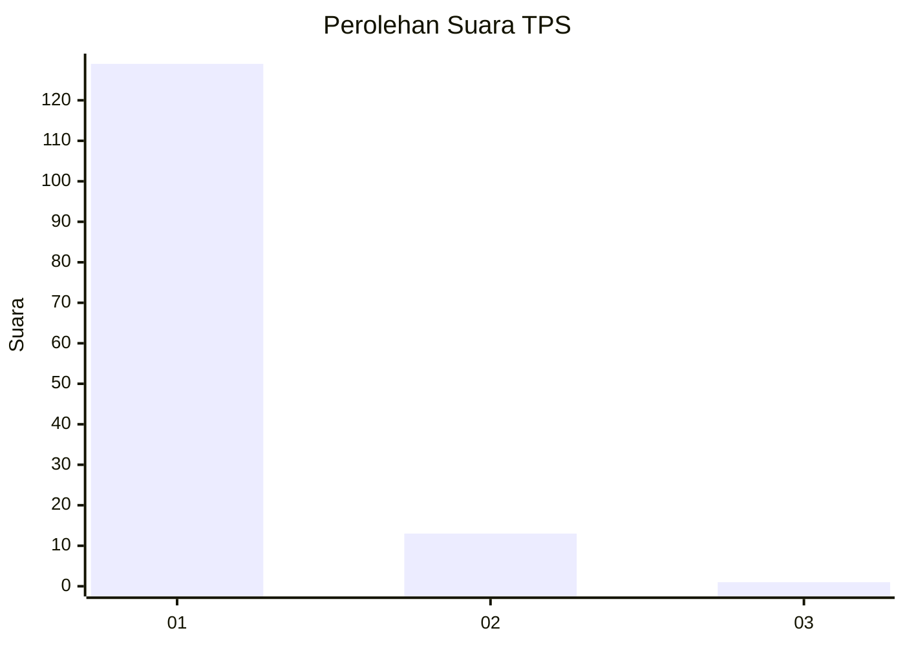
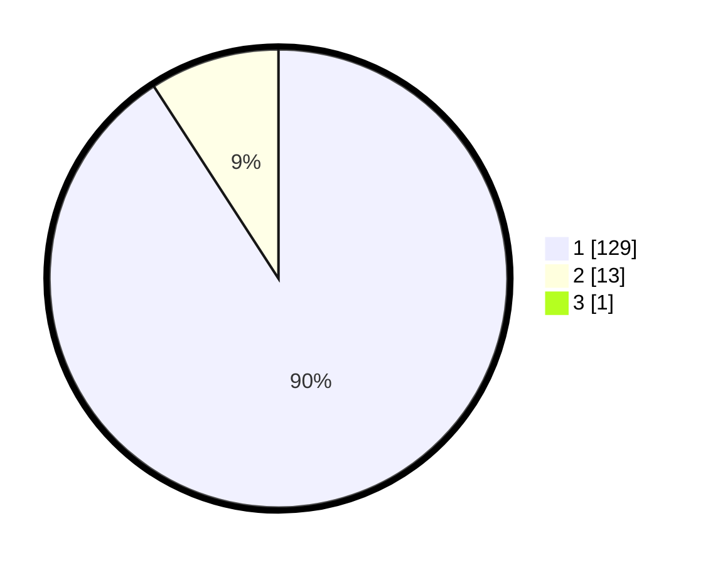

# Hasil

## Grafik

## Tabel

| No. | Nama Paslon    | Suara | Suara (raw) | Persentase |
|:--- |:-------------- | -----:| -----------:| ----------:|
| 1   | ANIES MUHAIMIN | 129   | [129][p-1]  | 90,21      |
| 2   | PRABOWO GIBRAN | 13    | [13][p-2]   | 9,09       |
| 3   | GANJAR MAHFUD  | 1     | [1][p-3]    | 0,70       |

[p-1]: https://github.com/gigit-pemilu/pemilu-2024-11-aceh/blob/main/pilpres/hitung-suara/sub/11-aceh/sub/07-pidie/sub/07-indrajaya/sub/2048-tuha-suwiek/sub/001-tps/sub/paslon-1.txt
[p-2]: https://github.com/gigit-pemilu/pemilu-2024-11-aceh/blob/main/pilpres/hitung-suara/sub/11-aceh/sub/07-pidie/sub/07-indrajaya/sub/2048-tuha-suwiek/sub/001-tps/sub/paslon-2.txt
[p-3]: https://github.com/gigit-pemilu/pemilu-2024-11-aceh/blob/main/pilpres/hitung-suara/sub/11-aceh/sub/07-pidie/sub/07-indrajaya/sub/2048-tuha-suwiek/sub/001-tps/sub/paslon-3.txt

## Foto C Plano

https://sirekap-obj-formc.kpu.go.id/2e75/pemilu/ppwp/11/07/07/20/48/1107072048001-20240215-042543--edd2934f-c619-4fde-b599-275a56b9bbce.jpg

https://sirekap-obj-formc.kpu.go.id/2e75/pemilu/ppwp/11/07/07/20/48/1107072048001-20240215-042718--625f38f2-b17e-4ada-9776-06ce5ec5082e.jpg

https://sirekap-obj-formc.kpu.go.id/2e75/pemilu/ppwp/11/07/07/20/48/1107072048001-20240215-042847--bbf8a1f9-cd81-4a66-9a2e-691efd8ab9e9.jpg

## Metadata

| Key        | Value               |
| ---------- | ------------------- |
| Time Stamp | 2024-02-19 06:16:00 |

