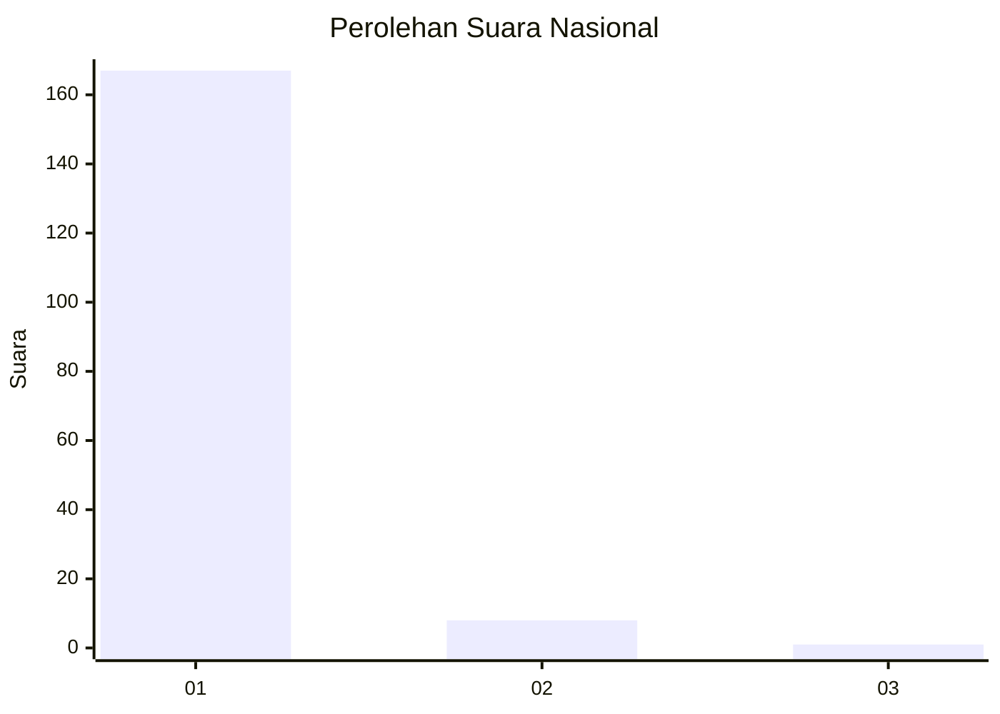
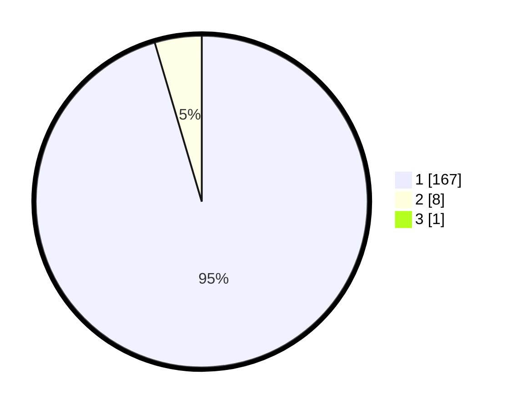

# Hasil

## Grafik

## Tabel

| No. | Nama Paslon    | Suara | Suara (raw) | Persentase |
|:--- |:-------------- | -----:| -----------:| ----------:|
| 1   | ANIES MUHAIMIN | 167   | [167][p-1]  | 94,89      |
| 2   | PRABOWO GIBRAN | 8     | [8][p-2]    | 4,55       |
| 3   | GANJAR MAHFUD  | 1     | [1][p-3]    | 0,57       |

[p-1]: https://github.com/gigit-pemilu/pemilu-2024/blob/main/pilpres/hitung-suara/sub/11-aceh/sub/07-pidie/sub/07-indrajaya/sub/2050-blang-lhok-kaju/sub/001-tps/sub/paslon-1.txt
[p-2]: https://github.com/gigit-pemilu/pemilu-2024/blob/main/pilpres/hitung-suara/sub/11-aceh/sub/07-pidie/sub/07-indrajaya/sub/2050-blang-lhok-kaju/sub/001-tps/sub/paslon-2.txt
[p-3]: https://github.com/gigit-pemilu/pemilu-2024/blob/main/pilpres/hitung-suara/sub/11-aceh/sub/07-pidie/sub/07-indrajaya/sub/2050-blang-lhok-kaju/sub/001-tps/sub/paslon-3.txt

## Foto C Plano

https://sirekap-obj-formc.kpu.go.id/8a7f/pemilu/ppwp/11/07/07/20/50/1107072050001-20240214-204813--d6803e3e-a301-44ca-a6e7-db3b2bf2e571.jpg

https://sirekap-obj-formc.kpu.go.id/8a7f/pemilu/ppwp/11/07/07/20/50/1107072050001-20240214-205023--92a55aa0-7fea-4b66-bbea-56af3eb8b782.jpg

https://sirekap-obj-formc.kpu.go.id/8a7f/pemilu/ppwp/11/07/07/20/50/1107072050001-20240214-205114--112002ee-4caf-4be0-b00d-e482d5069beb.jpg

## Metadata

| Key        | Value               |
| ---------- | ------------------- |
| Time Stamp | 2024-02-19 06:16:00 |

