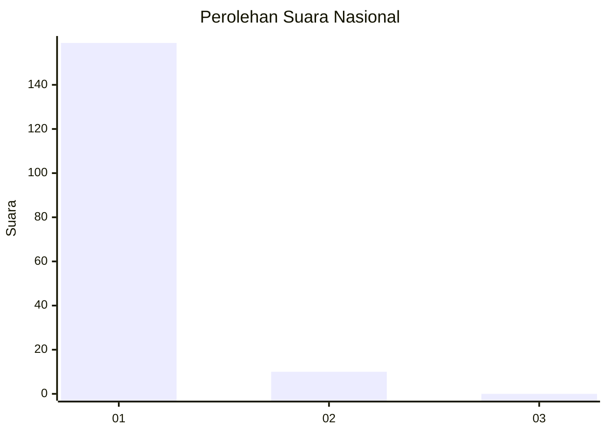
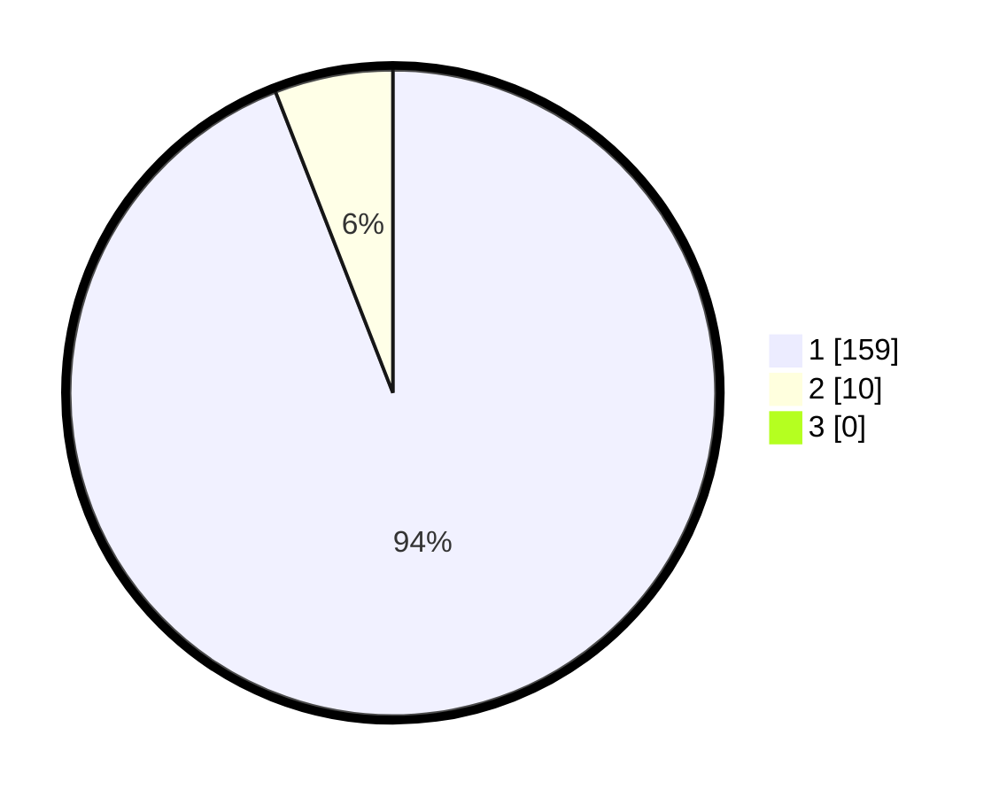

# Hasil

## Grafik

## Tabel

| No. | Nama Paslon    | Suara | Suara (raw) | Persentase |
|:--- |:-------------- | -----:| -----------:| ----------:|
| 1   | ANIES MUHAIMIN | 159   | [159][p-1]  | 94,08      |
| 2   | PRABOWO GIBRAN | 10    | [10][p-2]   | 5,92       |
| 3   | GANJAR MAHFUD  | 0     | [0][p-3]    | 0,00       |

[p-1]: https://github.com/gigit-pemilu/pemilu-2024/blob/main/pilpres/hitung-suara/sub/11-aceh/sub/07-pidie/sub/07-indrajaya/sub/2050-blang-lhok-kaju/sub/002-tps/sub/paslon-1.txt
[p-2]: https://github.com/gigit-pemilu/pemilu-2024/blob/main/pilpres/hitung-suara/sub/11-aceh/sub/07-pidie/sub/07-indrajaya/sub/2050-blang-lhok-kaju/sub/002-tps/sub/paslon-2.txt
[p-3]: https://github.com/gigit-pemilu/pemilu-2024/blob/main/pilpres/hitung-suara/sub/11-aceh/sub/07-pidie/sub/07-indrajaya/sub/2050-blang-lhok-kaju/sub/002-tps/sub/paslon-3.txt

## Foto C Plano

https://sirekap-obj-formc.kpu.go.id/341d/pemilu/ppwp/11/07/07/20/50/1107072050002-20240214-221717--a7b716ca-6641-4cd6-a61d-e4f06ece32bc.jpg

https://sirekap-obj-formc.kpu.go.id/341d/pemilu/ppwp/11/07/07/20/50/1107072050002-20240214-221811--662173a6-87ee-4cd8-910a-6e1fcf75971d.jpg

https://sirekap-obj-formc.kpu.go.id/341d/pemilu/ppwp/11/07/07/20/50/1107072050002-20240214-221832--83c97be8-8e6b-490b-a749-ad17efff5d18.jpg

## Metadata

| Key        | Value               |
| ---------- | ------------------- |
| Time Stamp | 2024-02-24 22:31:28 |

