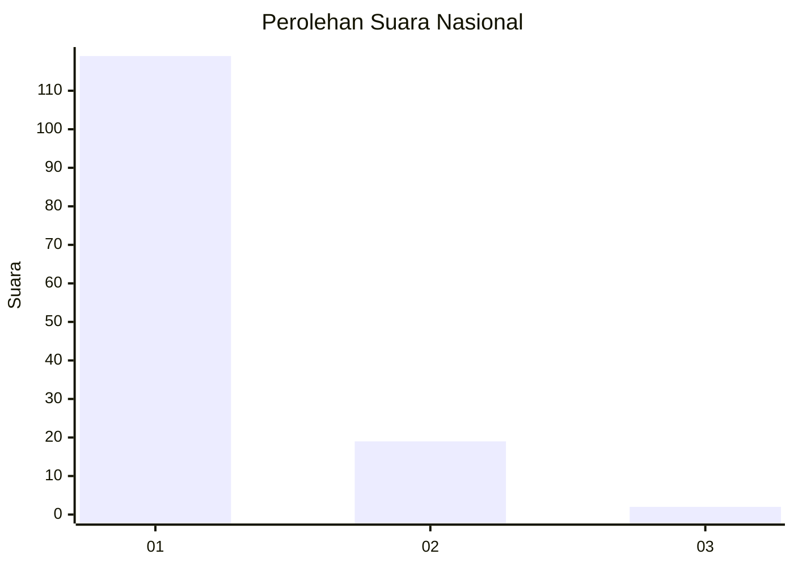
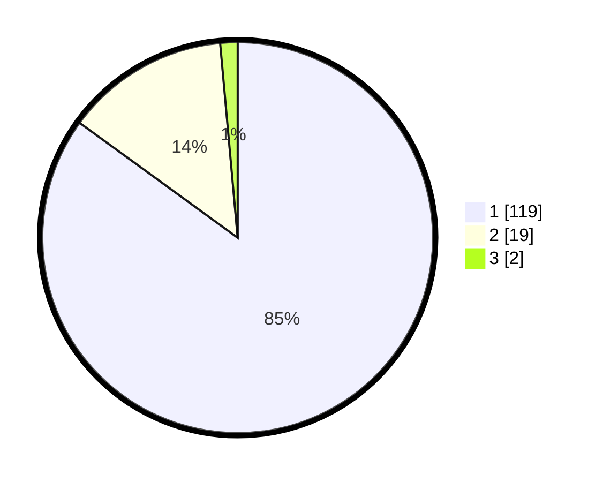

# Hasil

## Grafik

## Tabel

| No. | Nama Paslon    | Suara | Suara (raw) | Persentase |
|:--- |:-------------- | -----:| -----------:| ----------:|
| 1   | ANIES MUHAIMIN | 119   | [119][p-1]  | 85,00      |
| 2   | PRABOWO GIBRAN | 19    | [19][p-2]   | 13,57      |
| 3   | GANJAR MAHFUD  | 2     | [2][p-3]    | 1,43       |

[p-1]: https://github.com/gigit-pemilu/pemilu-2024/blob/main/pilpres/hitung-suara/sub/11-aceh/sub/07-pidie/sub/08-kembang-tanjong/sub/2002-aron-asan-kumbang/sub/001-tps/sub/paslon-1.txt
[p-2]: https://github.com/gigit-pemilu/pemilu-2024/blob/main/pilpres/hitung-suara/sub/11-aceh/sub/07-pidie/sub/08-kembang-tanjong/sub/2002-aron-asan-kumbang/sub/001-tps/sub/paslon-2.txt
[p-3]: https://github.com/gigit-pemilu/pemilu-2024/blob/main/pilpres/hitung-suara/sub/11-aceh/sub/07-pidie/sub/08-kembang-tanjong/sub/2002-aron-asan-kumbang/sub/001-tps/sub/paslon-3.txt

## Foto C Plano

https://sirekap-obj-formc.kpu.go.id/4d3d/pemilu/ppwp/11/07/08/20/02/1107082002001-20240215-012609--0fce27da-b197-4243-84e0-87caca5be377.jpg

https://sirekap-obj-formc.kpu.go.id/4d3d/pemilu/ppwp/11/07/08/20/02/1107082002001-20240215-012743--57be432e-fc36-4a77-adb6-93cdeca1ab4c.jpg

https://sirekap-obj-formc.kpu.go.id/4d3d/pemilu/ppwp/11/07/08/20/02/1107082002001-20240215-012855--eeab84f8-1ee9-4e4f-bac7-4e04d48b464a.jpg

## Metadata

| Key        | Value               |
| ---------- | ------------------- |
| Time Stamp | 2024-02-17 03:00:02 |

