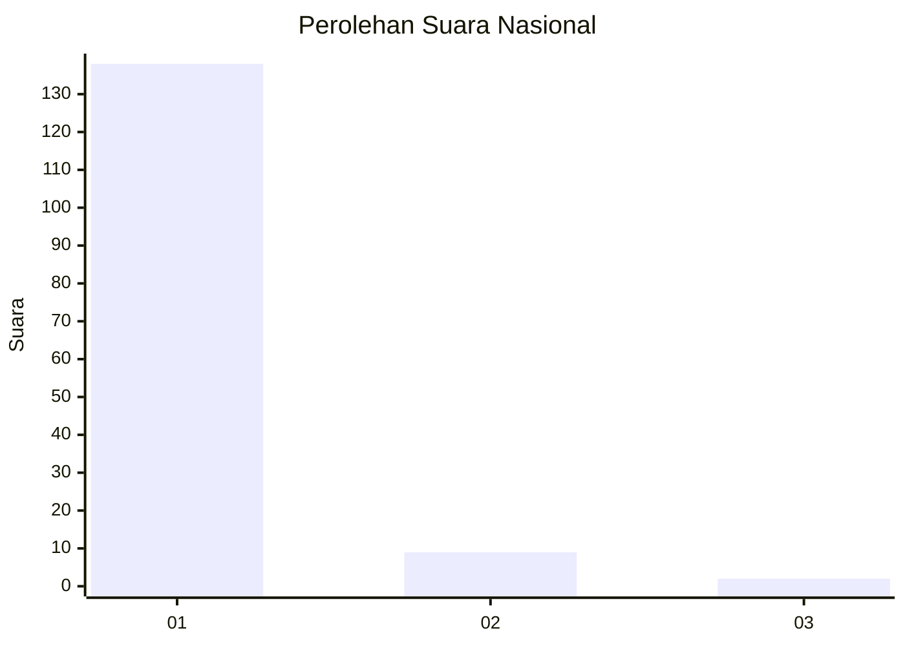
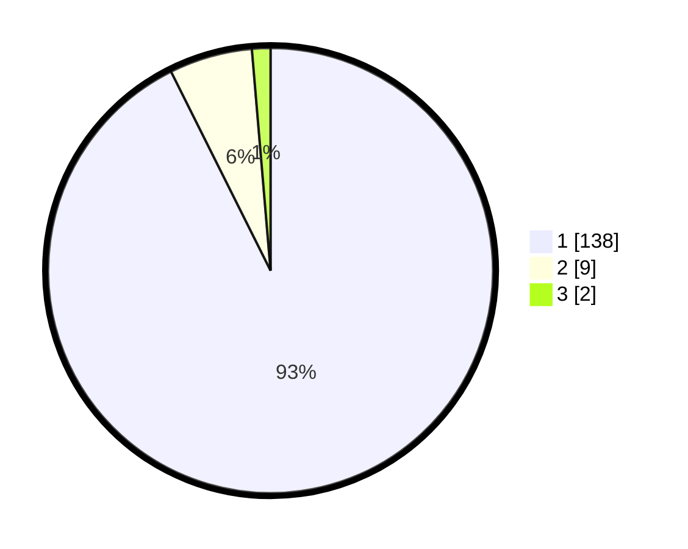

# Hasil

## Grafik

## Tabel

| No. | Nama Paslon    | Suara | Suara (raw) | Persentase |
|:--- |:-------------- | -----:| -----------:| ----------:|
| 1   | ANIES MUHAIMIN | 138   | [138][p-1]  | 92,62      |
| 2   | PRABOWO GIBRAN | 9     | [9][p-2]    | 6,04       |
| 3   | GANJAR MAHFUD  | 2     | [2][p-3]    | 1,34       |

[p-1]: https://github.com/gigit-pemilu/pemilu-2024/blob/main/pilpres/hitung-suara/sub/11-aceh/sub/07-pidie/sub/08-kembang-tanjong/sub/2002-aron-asan-kumbang/sub/002-tps/sub/paslon-1.txt
[p-2]: https://github.com/gigit-pemilu/pemilu-2024/blob/main/pilpres/hitung-suara/sub/11-aceh/sub/07-pidie/sub/08-kembang-tanjong/sub/2002-aron-asan-kumbang/sub/002-tps/sub/paslon-2.txt
[p-3]: https://github.com/gigit-pemilu/pemilu-2024/blob/main/pilpres/hitung-suara/sub/11-aceh/sub/07-pidie/sub/08-kembang-tanjong/sub/2002-aron-asan-kumbang/sub/002-tps/sub/paslon-3.txt

## Foto C Plano

https://sirekap-obj-formc.kpu.go.id/cf21/pemilu/ppwp/11/07/08/20/02/1107082002002-20240215-013153--e37f13fb-600f-43b3-a4c4-ce3f90fdf48d.jpg

https://sirekap-obj-formc.kpu.go.id/cf21/pemilu/ppwp/11/07/08/20/02/1107082002002-20240215-013342--396503f8-95f6-4769-9dfb-127f0a6a7dd7.jpg

https://sirekap-obj-formc.kpu.go.id/cf21/pemilu/ppwp/11/07/08/20/02/1107082002002-20240215-013453--1bd5dc62-8e73-47b7-8410-c93c2130ef27.jpg

## Metadata

| Key        | Value               |
| ---------- | ------------------- |
| Time Stamp | 2024-02-17 03:00:02 |

