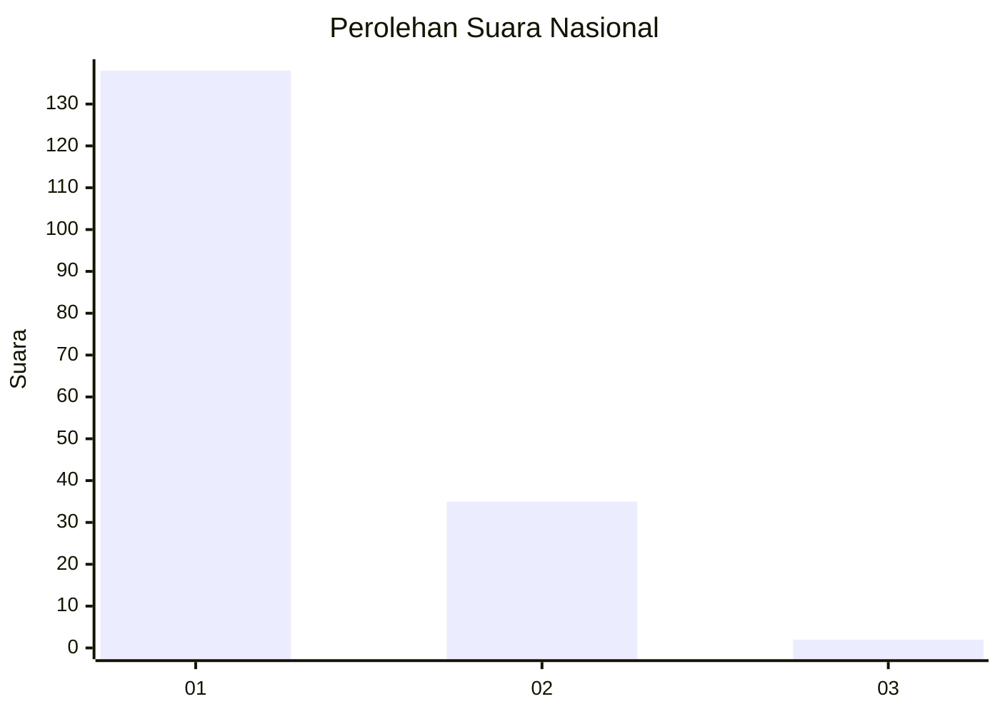
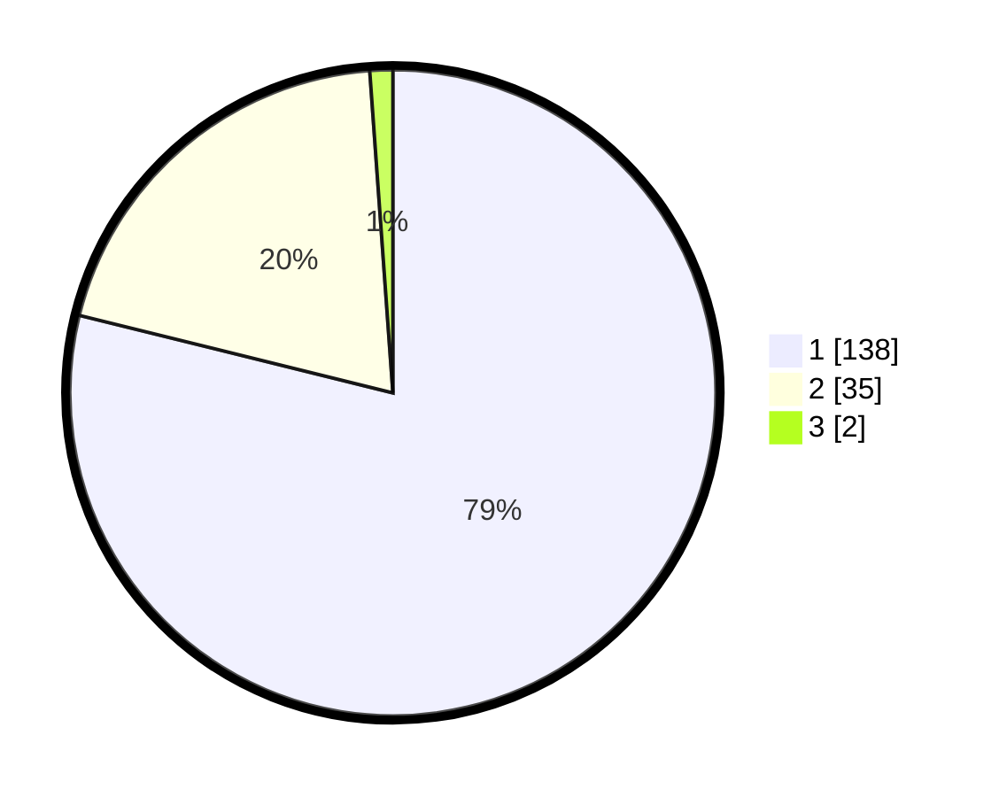

# Hasil

## Grafik

## Tabel

| No. | Nama Paslon    | Suara | Suara (raw) | Persentase |
|:--- |:-------------- | -----:| -----------:| ----------:|
| 1   | ANIES MUHAIMIN | 138   | [138][p-1]  | 78,86      |
| 2   | PRABOWO GIBRAN | 35    | [35][p-2]   | 20,00      |
| 3   | GANJAR MAHFUD  | 2     | [2][p-3]    | 1,14       |

[p-1]: https://github.com/gigit-pemilu/pemilu-2024/blob/main/pilpres/hitung-suara/sub/11-aceh/sub/07-pidie/sub/08-kembang-tanjong/sub/2024-meunasah-sukon/sub/001-tps/sub/paslon-1.txt
[p-2]: https://github.com/gigit-pemilu/pemilu-2024/blob/main/pilpres/hitung-suara/sub/11-aceh/sub/07-pidie/sub/08-kembang-tanjong/sub/2024-meunasah-sukon/sub/001-tps/sub/paslon-2.txt
[p-3]: https://github.com/gigit-pemilu/pemilu-2024/blob/main/pilpres/hitung-suara/sub/11-aceh/sub/07-pidie/sub/08-kembang-tanjong/sub/2024-meunasah-sukon/sub/001-tps/sub/paslon-3.txt

## Foto C Plano

https://sirekap-obj-formc.kpu.go.id/3e10/pemilu/ppwp/11/07/08/20/24/1107082024001-20240215-085811--43c462b3-d3b1-4c92-9b8f-ef82aa61bc77.jpg

https://sirekap-obj-formc.kpu.go.id/3e10/pemilu/ppwp/11/07/08/20/24/1107082024001-20240215-090030--108b036a-9d3e-49df-9bd1-755ae83d11ce.jpg

https://sirekap-obj-formc.kpu.go.id/3e10/pemilu/ppwp/11/07/08/20/24/1107082024001-20240215-090119--5963f329-b63a-441e-a5bc-a82a4f7fa8bb.jpg

## Metadata

| Key        | Value               |
| ---------- | ------------------- |
| Time Stamp | 2024-02-17 03:00:02 |

