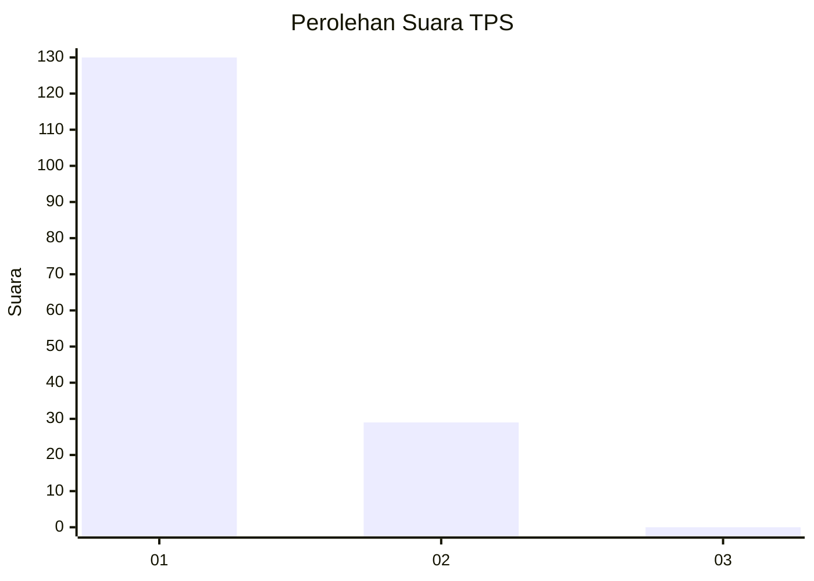
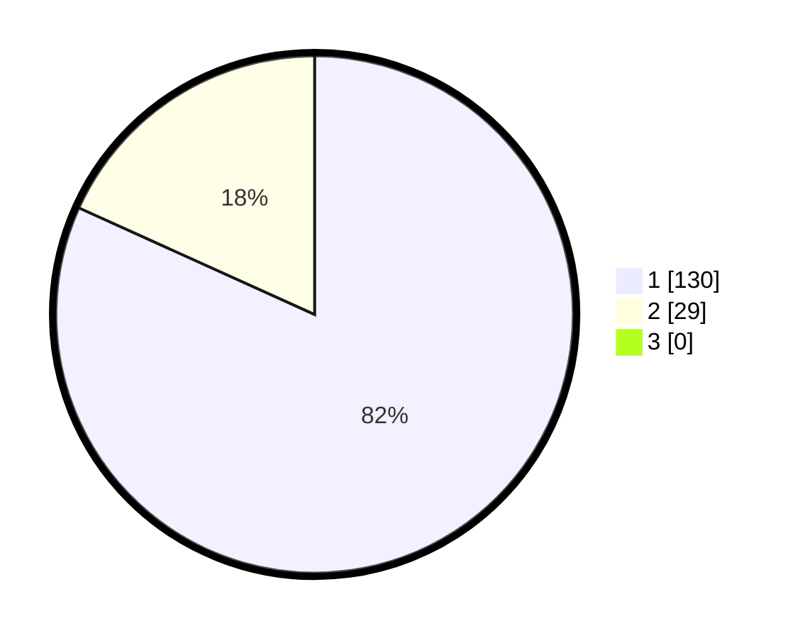

# Hasil

## Grafik

## Tabel

| No. | Nama Paslon    | Suara | Suara (raw) | Persentase |
|:--- |:-------------- | -----:| -----------:| ----------:|
| 1   | ANIES MUHAIMIN | 130   | [130][p-1]  | 81,76      |
| 2   | PRABOWO GIBRAN | 29    | [29][p-2]   | 18,24      |
| 3   | GANJAR MAHFUD  | 0     | [0][p-3]    | 0,00       |

[p-1]: https://github.com/gigit-pemilu/pemilu-2024-11-aceh/blob/main/pilpres/hitung-suara/sub/11-aceh/sub/07-pidie/sub/08-kembang-tanjong/sub/2024-meunasah-sukon/sub/002-tps/sub/paslon-1.txt
[p-2]: https://github.com/gigit-pemilu/pemilu-2024-11-aceh/blob/main/pilpres/hitung-suara/sub/11-aceh/sub/07-pidie/sub/08-kembang-tanjong/sub/2024-meunasah-sukon/sub/002-tps/sub/paslon-2.txt
[p-3]: https://github.com/gigit-pemilu/pemilu-2024-11-aceh/blob/main/pilpres/hitung-suara/sub/11-aceh/sub/07-pidie/sub/08-kembang-tanjong/sub/2024-meunasah-sukon/sub/002-tps/sub/paslon-3.txt

## Foto C Plano

https://sirekap-obj-formc.kpu.go.id/02af/pemilu/ppwp/11/07/08/20/24/1107082024002-20240215-075539--d133ad52-1595-49cf-9e2e-83c22ac191c0.jpg

https://sirekap-obj-formc.kpu.go.id/02af/pemilu/ppwp/11/07/08/20/24/1107082024002-20240215-075119--588347b0-30cb-4872-9ddd-35c91e0358ea.jpg

https://sirekap-obj-formc.kpu.go.id/02af/pemilu/ppwp/11/07/08/20/24/1107082024002-20240215-075256--047479c2-9157-4830-8f19-53feacb51ae1.jpg

## Metadata

| Key        | Value               |
| ---------- | ------------------- |
| Time Stamp | 2024-02-17 03:00:02 |

