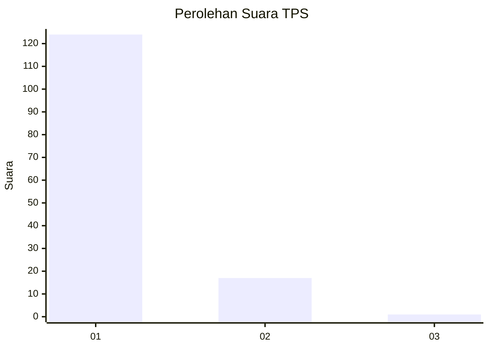
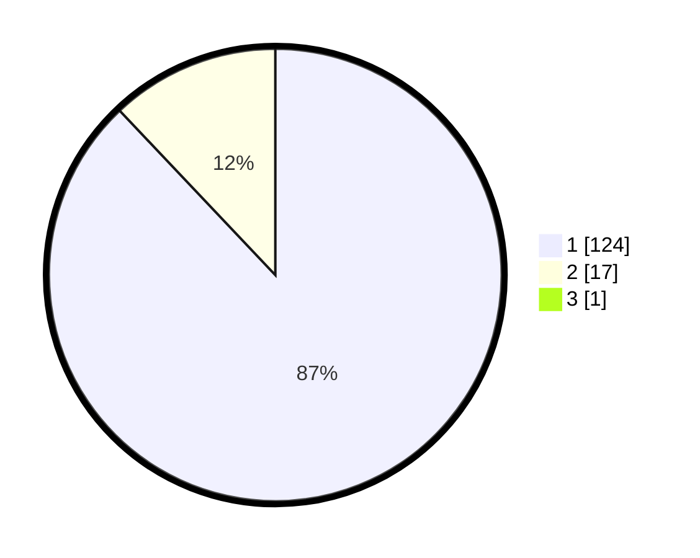

# Hasil

## Grafik

## Tabel

| No. | Nama Paslon    | Suara | Suara (raw) | Persentase |
|:--- |:-------------- | -----:| -----------:| ----------:|
| 1   | ANIES MUHAIMIN | 124   | [124][p-1]  | 87,32      |
| 2   | PRABOWO GIBRAN | 17    | [17][p-2]   | 11,97      |
| 3   | GANJAR MAHFUD  | 1     | [1][p-3]    | 0,70       |

[p-1]: https://github.com/gigit-pemilu/pemilu-2024-11-aceh/blob/main/pilpres/hitung-suara/sub/11-aceh/sub/07-pidie/sub/08-kembang-tanjong/sub/2026-meunasah-krueng/sub/001-tps/sub/paslon-1.txt
[p-2]: https://github.com/gigit-pemilu/pemilu-2024-11-aceh/blob/main/pilpres/hitung-suara/sub/11-aceh/sub/07-pidie/sub/08-kembang-tanjong/sub/2026-meunasah-krueng/sub/001-tps/sub/paslon-2.txt
[p-3]: https://github.com/gigit-pemilu/pemilu-2024-11-aceh/blob/main/pilpres/hitung-suara/sub/11-aceh/sub/07-pidie/sub/08-kembang-tanjong/sub/2026-meunasah-krueng/sub/001-tps/sub/paslon-3.txt

## Foto C Plano

https://sirekap-obj-formc.kpu.go.id/33ea/pemilu/ppwp/11/07/08/20/26/1107082026001-20240217-052150--82042fe0-f914-4cc8-af26-adb992f02dfe.jpg

https://sirekap-obj-formc.kpu.go.id/33ea/pemilu/ppwp/11/07/08/20/26/1107082026001-20240217-041314--3b4e82e0-5357-424e-9035-7878e0646281.jpg

https://sirekap-obj-formc.kpu.go.id/33ea/pemilu/ppwp/11/07/08/20/26/1107082026001-20240217-041330--d1f3ad5a-7fe5-4ad5-8a59-6ff830fdc131.jpg

## Metadata

| Key        | Value               |
| ---------- | ------------------- |
| Time Stamp | 2024-02-17 13:37:34 |

