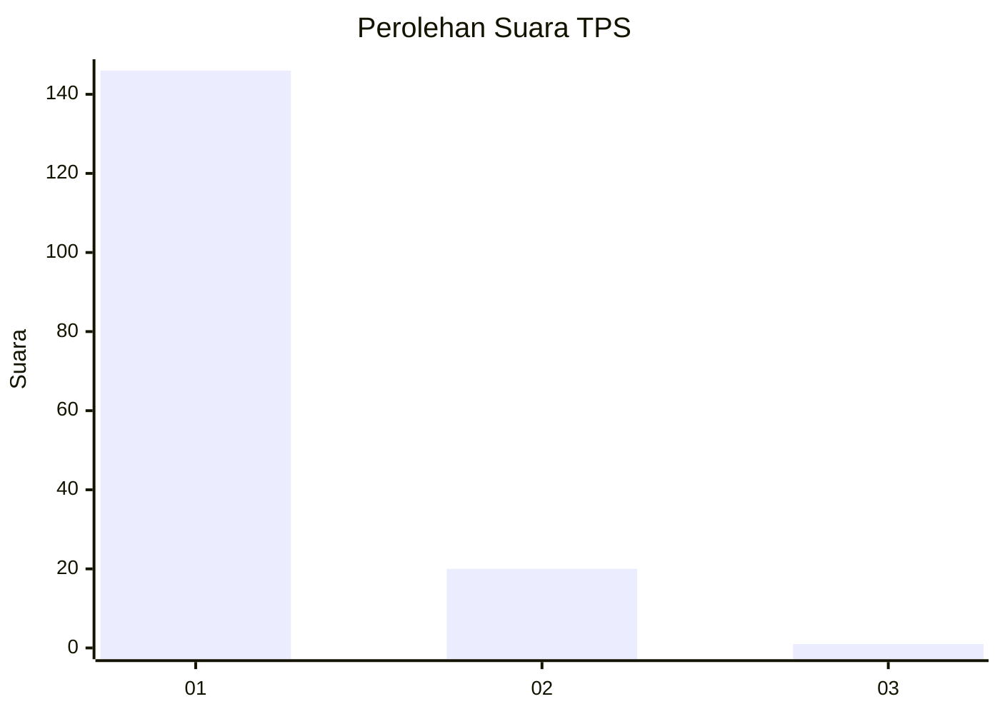
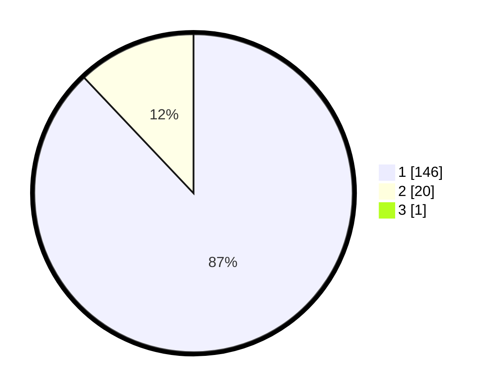

# Hasil

## Grafik

## Tabel

| No. | Nama Paslon    | Suara | Suara (raw) | Persentase |
|:--- |:-------------- | -----:| -----------:| ----------:|
| 1   | ANIES MUHAIMIN | 146   | [146][p-1]  | 87,43      |
| 2   | PRABOWO GIBRAN | 20    | [20][p-2]   | 11,98      |
| 3   | GANJAR MAHFUD  | 1     | [1][p-3]    | 0,60       |

[p-1]: https://github.com/gigit-pemilu/pemilu-2024-11-aceh/blob/main/pilpres/hitung-suara/sub/11-aceh/sub/07-pidie/sub/08-kembang-tanjong/sub/2026-meunasah-krueng/sub/002-tps/sub/paslon-1.txt
[p-2]: https://github.com/gigit-pemilu/pemilu-2024-11-aceh/blob/main/pilpres/hitung-suara/sub/11-aceh/sub/07-pidie/sub/08-kembang-tanjong/sub/2026-meunasah-krueng/sub/002-tps/sub/paslon-2.txt
[p-3]: https://github.com/gigit-pemilu/pemilu-2024-11-aceh/blob/main/pilpres/hitung-suara/sub/11-aceh/sub/07-pidie/sub/08-kembang-tanjong/sub/2026-meunasah-krueng/sub/002-tps/sub/paslon-3.txt

## Foto C Plano

https://sirekap-obj-formc.kpu.go.id/a9e1/pemilu/ppwp/11/07/08/20/26/1107082026002-20240215-034827--3c2c97f9-06b5-47f0-b02b-8c70ff174ac9.jpg

https://sirekap-obj-formc.kpu.go.id/a9e1/pemilu/ppwp/11/07/08/20/26/1107082026002-20240215-004217--97a6f43e-051e-4f81-98c2-dc79feff250d.jpg

https://sirekap-obj-formc.kpu.go.id/a9e1/pemilu/ppwp/11/07/08/20/26/1107082026002-20240215-034502--dc11d1db-24b4-47d4-a0ea-dc6b23363478.jpg

## Metadata

| Key        | Value               |
| ---------- | ------------------- |
| Time Stamp | 2024-02-17 03:30:02 |

