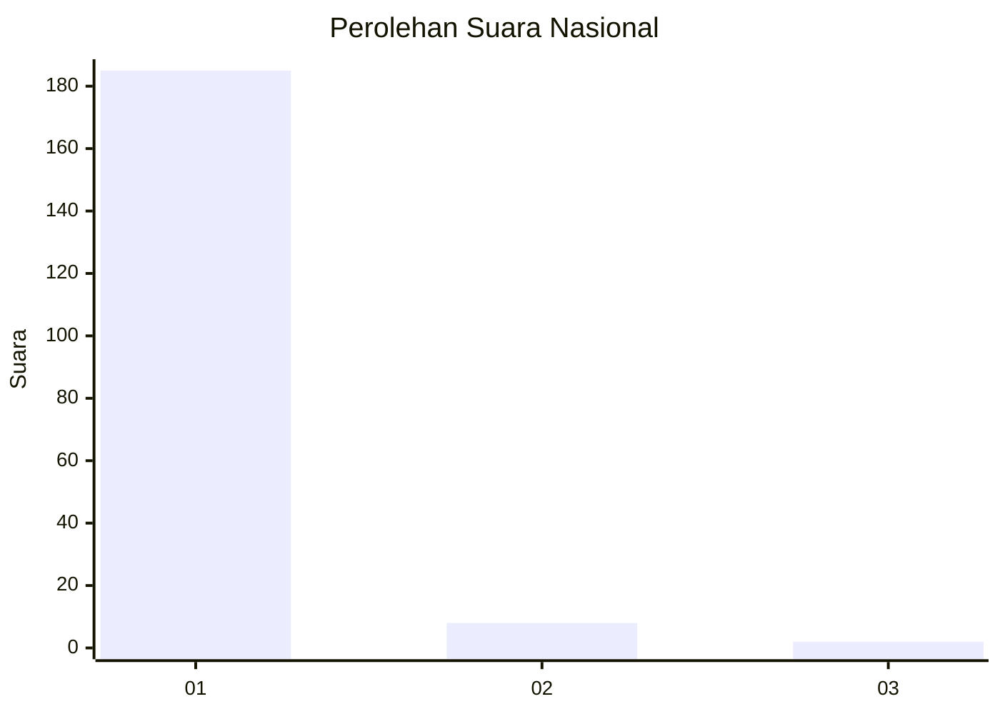
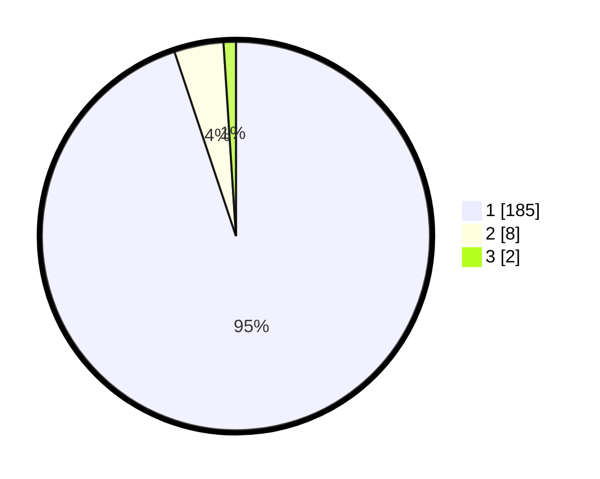

# Hasil

## Grafik

## Tabel

| No. | Nama Paslon    | Suara | Suara (raw) | Persentase |
|:--- |:-------------- | -----:| -----------:| ----------:|
| 1   | ANIES MUHAIMIN | 185   | [185][p-1]  | 94,87      |
| 2   | PRABOWO GIBRAN | 8     | [8][p-2]    | 4,10       |
| 3   | GANJAR MAHFUD  | 2     | [2][p-3]    | 1,03       |

[p-1]: https://github.com/gigit-pemilu/pemilu-2024/blob/main/pilpres/hitung-suara/sub/11-aceh/sub/07-pidie/sub/08-kembang-tanjong/sub/2031-lamkawe/sub/001-tps/sub/paslon-1.txt
[p-2]: https://github.com/gigit-pemilu/pemilu-2024/blob/main/pilpres/hitung-suara/sub/11-aceh/sub/07-pidie/sub/08-kembang-tanjong/sub/2031-lamkawe/sub/001-tps/sub/paslon-2.txt
[p-3]: https://github.com/gigit-pemilu/pemilu-2024/blob/main/pilpres/hitung-suara/sub/11-aceh/sub/07-pidie/sub/08-kembang-tanjong/sub/2031-lamkawe/sub/001-tps/sub/paslon-3.txt

## Foto C Plano

https://sirekap-obj-formc.kpu.go.id/5692/pemilu/ppwp/11/07/08/20/31/1107082031001-20240215-040823--5ba4ac59-ec7b-4766-9233-9e466fb1205d.jpg

https://sirekap-obj-formc.kpu.go.id/5692/pemilu/ppwp/11/07/08/20/31/1107082031001-20240215-041001--449ef0fd-e6ec-41f7-a1bc-b89b013a6acb.jpg

https://sirekap-obj-formc.kpu.go.id/5692/pemilu/ppwp/11/07/08/20/31/1107082031001-20240215-041105--9fe845e6-2129-46cd-bd44-8e4297f33ffa.jpg

## Metadata

| Key        | Value               |
| ---------- | ------------------- |
| Time Stamp | 2024-02-17 18:00:00 |

