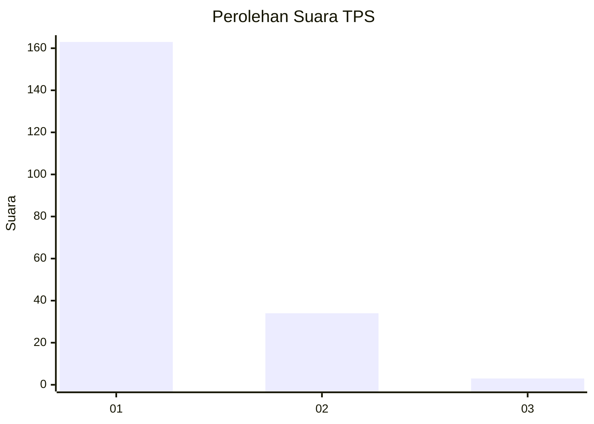
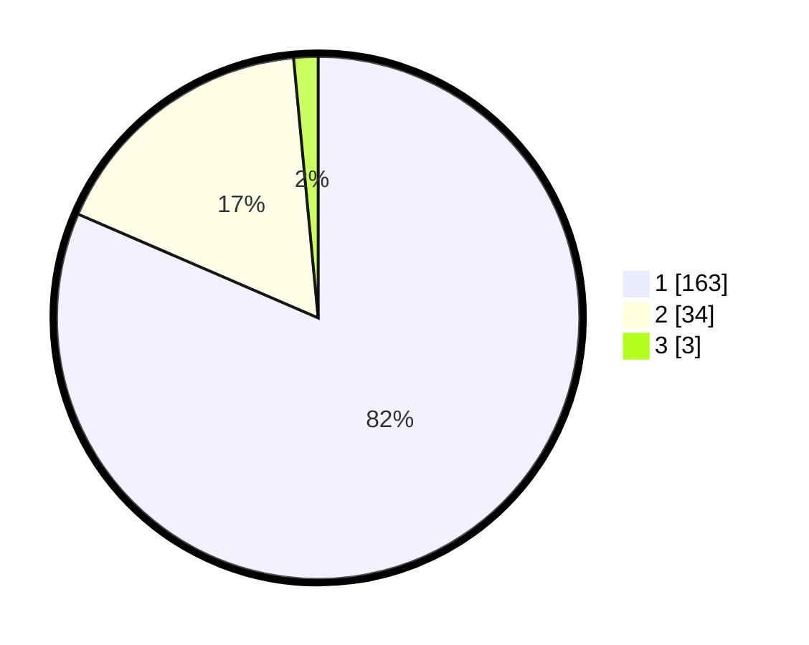

# Hasil

## Grafik

## Tabel

| No. | Nama Paslon    | Suara | Suara (raw) | Persentase |
|:--- |:-------------- | -----:| -----------:| ----------:|
| 1   | ANIES MUHAIMIN | 163   | [163][p-1]  | 81,50      |
| 2   | PRABOWO GIBRAN | 34    | [34][p-2]   | 17,00      |
| 3   | GANJAR MAHFUD  | 3     | [3][p-3]    | 1,50       |

[p-1]: https://github.com/gigit-pemilu/pemilu-2024-11-aceh/blob/main/pilpres/hitung-suara/sub/11-aceh/sub/07-pidie/sub/09-kota-sigli/sub/2001-blang-paseh/sub/001-tps/sub/paslon-1.txt
[p-2]: https://github.com/gigit-pemilu/pemilu-2024-11-aceh/blob/main/pilpres/hitung-suara/sub/11-aceh/sub/07-pidie/sub/09-kota-sigli/sub/2001-blang-paseh/sub/001-tps/sub/paslon-2.txt
[p-3]: https://github.com/gigit-pemilu/pemilu-2024-11-aceh/blob/main/pilpres/hitung-suara/sub/11-aceh/sub/07-pidie/sub/09-kota-sigli/sub/2001-blang-paseh/sub/001-tps/sub/paslon-3.txt

## Foto C Plano

https://sirekap-obj-formc.kpu.go.id/11c7/pemilu/ppwp/11/07/09/20/01/1107092001001-20240219-214513--3f8ca2ac-a0f8-4adf-b111-843cf1ba57af.jpg

https://sirekap-obj-formc.kpu.go.id/11c7/pemilu/ppwp/11/07/09/20/01/1107092001001-20240219-214634--11ad621b-434f-401c-9afe-12cb0fdbddb9.jpg

## Metadata

| Key        | Value               |
| ---------- | ------------------- |
| Time Stamp | 2024-02-19 22:00:00 |

