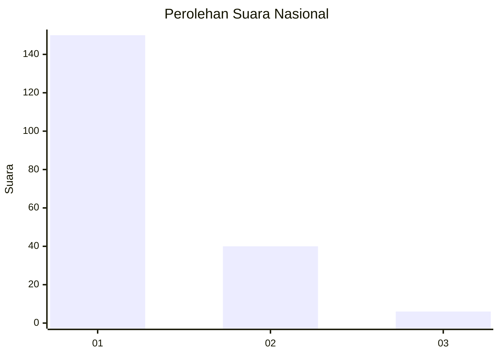
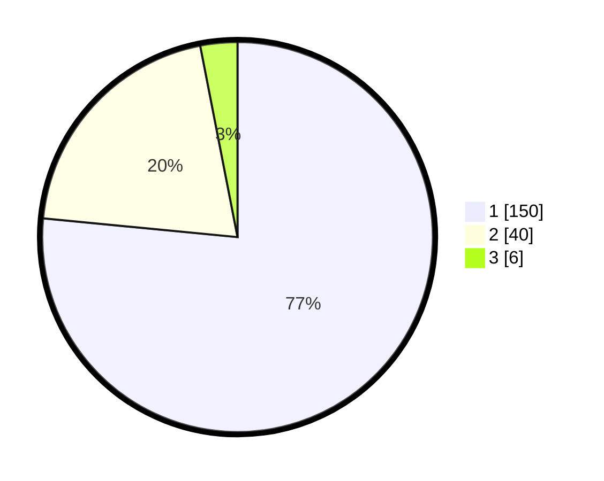

# Hasil

## Grafik

## Tabel

| No. | Nama Paslon    | Suara | Suara (raw) | Persentase |
|:--- |:-------------- | -----:| -----------:| ----------:|
| 1   | ANIES MUHAIMIN | 150   | [150][p-1]  | 76,53      |
| 2   | PRABOWO GIBRAN | 40    | [40][p-2]   | 20,41      |
| 3   | GANJAR MAHFUD  | 6     | [6][p-3]    | 3,06       |

[p-1]: https://github.com/gigit-pemilu/pemilu-2024/blob/main/pilpres/hitung-suara/sub/11-aceh/sub/07-pidie/sub/09-kota-sigli/sub/2001-blang-paseh/sub/002-tps/sub/paslon-1.txt
[p-2]: https://github.com/gigit-pemilu/pemilu-2024/blob/main/pilpres/hitung-suara/sub/11-aceh/sub/07-pidie/sub/09-kota-sigli/sub/2001-blang-paseh/sub/002-tps/sub/paslon-2.txt
[p-3]: https://github.com/gigit-pemilu/pemilu-2024/blob/main/pilpres/hitung-suara/sub/11-aceh/sub/07-pidie/sub/09-kota-sigli/sub/2001-blang-paseh/sub/002-tps/sub/paslon-3.txt

## Foto C Plano

https://sirekap-obj-formc.kpu.go.id/d87f/pemilu/ppwp/11/07/09/20/01/1107092001002-20240219-215751--4e2c0826-160f-4d81-97cb-aad0b911f3a1.jpg

https://sirekap-obj-formc.kpu.go.id/d87f/pemilu/ppwp/11/07/09/20/01/1107092001002-20240219-215800--893715db-eb08-4f67-9eab-34dfa6fc9ee7.jpg

https://sirekap-obj-formc.kpu.go.id/d87f/pemilu/ppwp/11/07/09/20/01/1107092001002-20240219-215805--d1afa83b-b3ca-48b1-9a16-ce3df0861426.jpg

## Metadata

| Key        | Value               |
| ---------- | ------------------- |
| Time Stamp | 2024-02-19 23:00:00 |

## DATA PEMILIH TETAP

Jumlah pemilih dalam DPT: **243**.
 * L: **109**.
 * P: **134**.

## DATA PENGGUNA HAK PILIH

Jumlah pengguna hak pilih dalam DPT: **180**.
 * L: **79**.
 * P: **101**.

Jumlah pengguna hak pilih dalam DPTb: **4**.
 * L: **1**.
 * P: **3**.

Jumlah pengguna hak pilih dalam DPK: **20**.
 * L: **6**.
 * P: **14**.

Jumlah pengguna hak pilih: **204**.
 * L: **86**.
 * P: **118**.

## JUMLAH SUARA SAH DAN TIDAK SAH

JUMLAH SELURUH SUARA SAH: **202**.

JUMLAH SUARA TIDAK SAH: **2**.

JUMLAH SELURUH SUARA SAH DAN SUARA TIDAK SAH: **204**.

