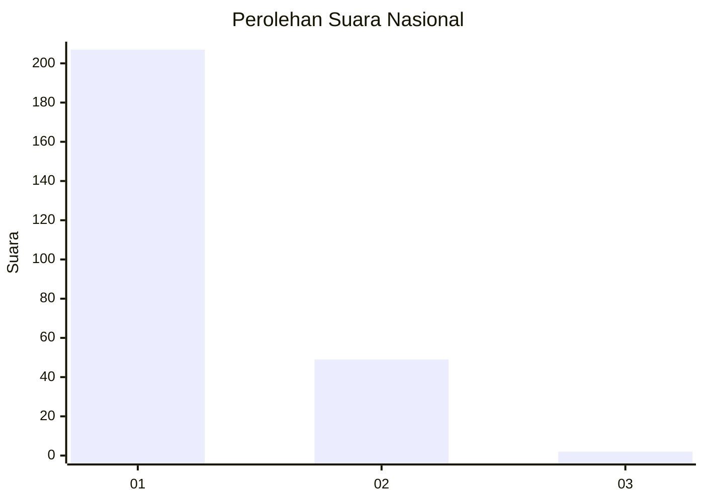
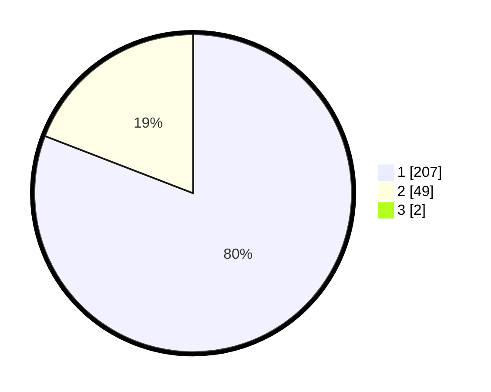

# Hasil

## Grafik

## Tabel

| No. | Nama Paslon    | Suara | Suara (raw) | Persentase |
|:--- |:-------------- | -----:| -----------:| ----------:|
| 1   | ANIES MUHAIMIN | 207   | [207][p-1]  | 80,23      |
| 2   | PRABOWO GIBRAN | 49    | [49][p-2]   | 18,99      |
| 3   | GANJAR MAHFUD  | 2     | [2][p-3]    | 0,78       |

[p-1]: https://github.com/gigit-pemilu/pemilu-2024/blob/main/pilpres/hitung-suara/sub/11-aceh/sub/07-pidie/sub/09-kota-sigli/sub/2001-blang-paseh/sub/003-tps/sub/paslon-1.txt
[p-2]: https://github.com/gigit-pemilu/pemilu-2024/blob/main/pilpres/hitung-suara/sub/11-aceh/sub/07-pidie/sub/09-kota-sigli/sub/2001-blang-paseh/sub/003-tps/sub/paslon-2.txt
[p-3]: https://github.com/gigit-pemilu/pemilu-2024/blob/main/pilpres/hitung-suara/sub/11-aceh/sub/07-pidie/sub/09-kota-sigli/sub/2001-blang-paseh/sub/003-tps/sub/paslon-3.txt

## Foto C Plano

https://sirekap-obj-formc.kpu.go.id/6a27/pemilu/ppwp/11/07/09/20/01/1107092001003-20240219-220648--0d8aabd1-3689-4616-aae1-eb0af6eaaaf9.jpg

https://sirekap-obj-formc.kpu.go.id/6a27/pemilu/ppwp/11/07/09/20/01/1107092001003-20240219-220641--d0cc67f7-0686-49db-bd5a-b026d4e29b95.jpg

https://sirekap-obj-formc.kpu.go.id/6a27/pemilu/ppwp/11/07/09/20/01/1107092001003-20240219-220652--fcb71161-414a-4413-8bc3-abc98dfcf657.jpg

## Metadata

| Key        | Value               |
| ---------- | ------------------- |
| Time Stamp | 2024-02-24 22:31:28 |

