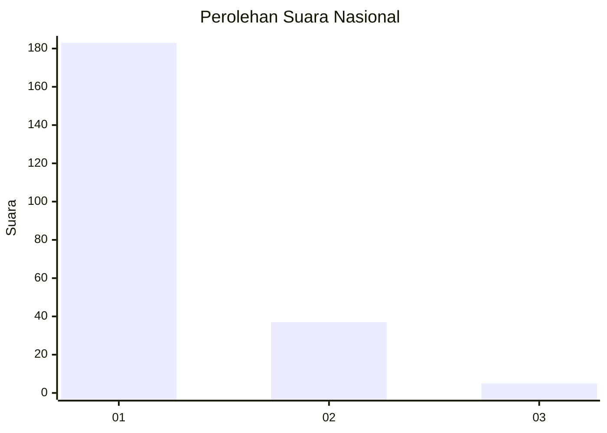
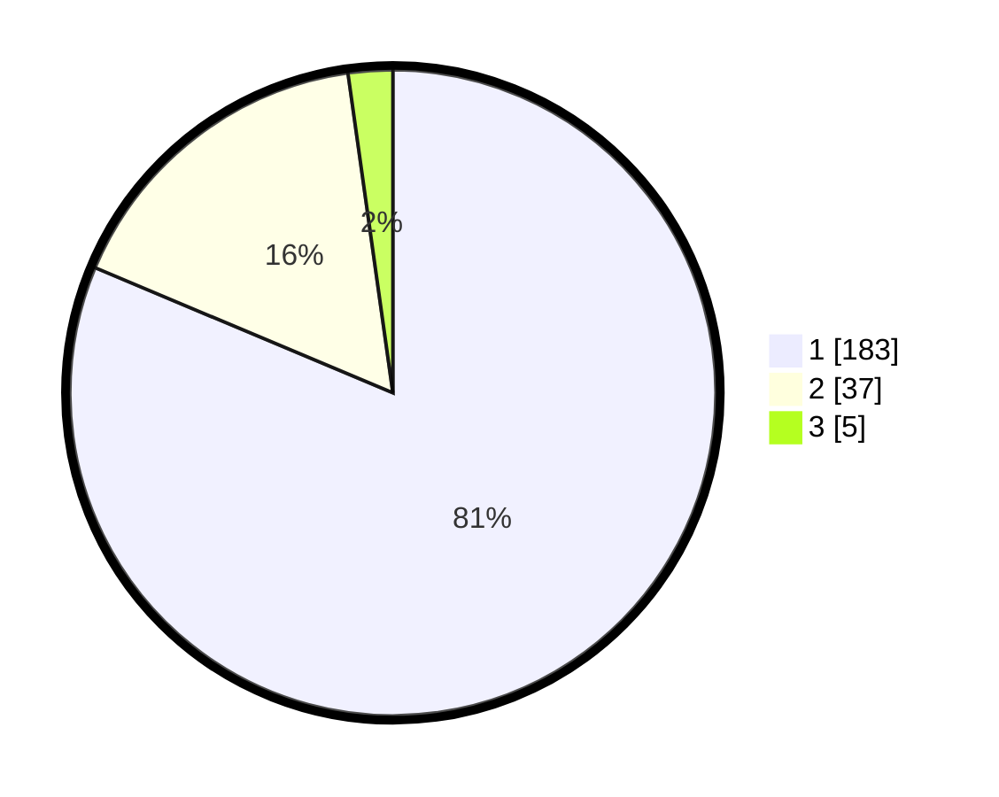

# Hasil

## Grafik

## Tabel

| No. | Nama Paslon    | Suara | Suara (raw) | Persentase |
|:--- |:-------------- | -----:| -----------:| ----------:|
| 1   | ANIES MUHAIMIN | 183   | [183][p-1]  | 81,33      |
| 2   | PRABOWO GIBRAN | 37    | [37][p-2]   | 16,44      |
| 3   | GANJAR MAHFUD  | 5     | [5][p-3]    | 2,22       |

[p-1]: https://github.com/gigit-pemilu/pemilu-2024/blob/main/pilpres/hitung-suara/sub/11-aceh/sub/07-pidie/sub/09-kota-sigli/sub/2001-blang-paseh/sub/004-tps/sub/paslon-1.txt
[p-2]: https://github.com/gigit-pemilu/pemilu-2024/blob/main/pilpres/hitung-suara/sub/11-aceh/sub/07-pidie/sub/09-kota-sigli/sub/2001-blang-paseh/sub/004-tps/sub/paslon-2.txt
[p-3]: https://github.com/gigit-pemilu/pemilu-2024/blob/main/pilpres/hitung-suara/sub/11-aceh/sub/07-pidie/sub/09-kota-sigli/sub/2001-blang-paseh/sub/004-tps/sub/paslon-3.txt

## Foto C Plano

https://sirekap-obj-formc.kpu.go.id/3429/pemilu/ppwp/11/07/09/20/01/1107092001004-20240219-221327--5da20243-1099-40ba-928b-811393eb5080.jpg

https://sirekap-obj-formc.kpu.go.id/3429/pemilu/ppwp/11/07/09/20/01/1107092001004-20240219-221252--ce8d5df1-3c23-4b27-897a-681c3e73e5b5.jpg

https://sirekap-obj-formc.kpu.go.id/3429/pemilu/ppwp/11/07/09/20/01/1107092001004-20240219-221208--b68ef559-23d5-4c42-b94c-3c1be9c872e1.jpg

## Metadata

| Key        | Value               |
| ---------- | ------------------- |
| Time Stamp | 2024-02-25 13:00:00 |

