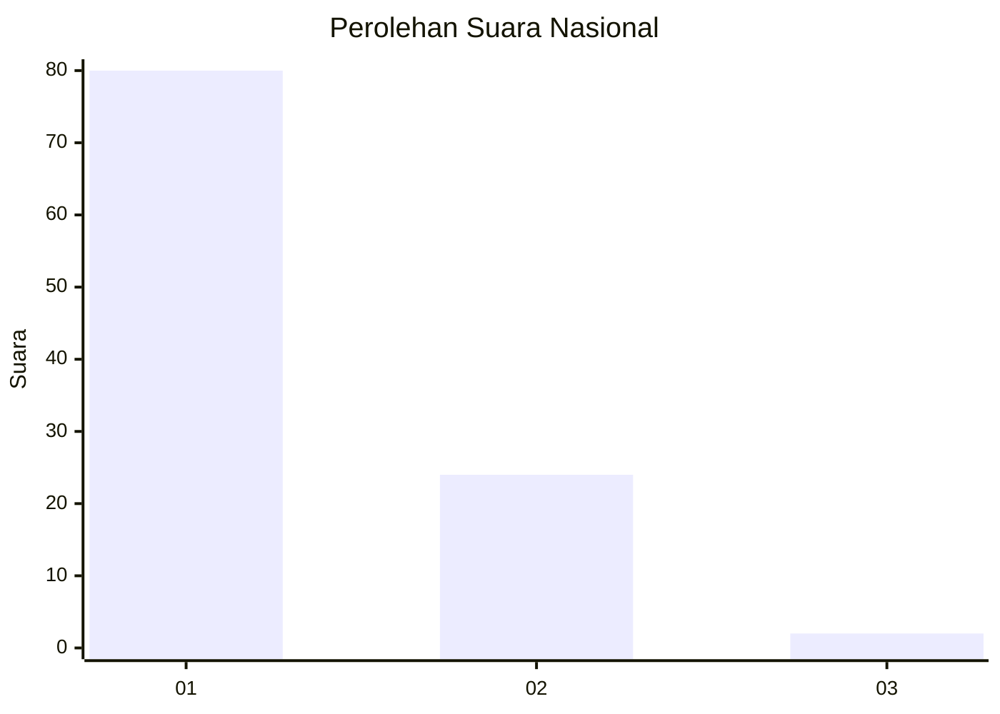
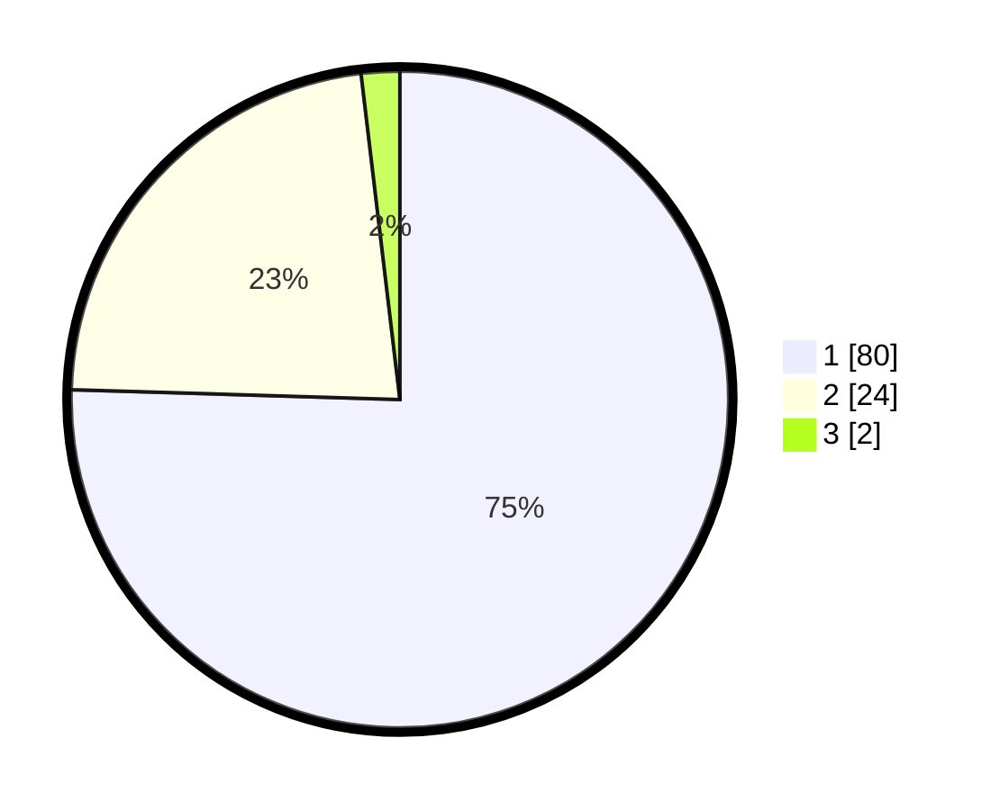

# Hasil

## Grafik

## Tabel

| No. | Nama Paslon    | Suara | Suara (raw) | Persentase |
|:--- |:-------------- | -----:| -----------:| ----------:|
| 1   | ANIES MUHAIMIN | 80    | [80][p-1]   | 75,47      |
| 2   | PRABOWO GIBRAN | 24    | [24][p-2]   | 22,64      |
| 3   | GANJAR MAHFUD  | 2     | [2][p-3]    | 1,89       |

[p-1]: https://github.com/gigit-pemilu/pemilu-2024/blob/main/pilpres/hitung-suara/sub/11-aceh/sub/07-pidie/sub/09-kota-sigli/sub/2008-blok-sawah/sub/002-tps/sub/paslon-1.txt
[p-2]: https://github.com/gigit-pemilu/pemilu-2024/blob/main/pilpres/hitung-suara/sub/11-aceh/sub/07-pidie/sub/09-kota-sigli/sub/2008-blok-sawah/sub/002-tps/sub/paslon-2.txt
[p-3]: https://github.com/gigit-pemilu/pemilu-2024/blob/main/pilpres/hitung-suara/sub/11-aceh/sub/07-pidie/sub/09-kota-sigli/sub/2008-blok-sawah/sub/002-tps/sub/paslon-3.txt

## Foto C Plano

https://sirekap-obj-formc.kpu.go.id/24c0/pemilu/ppwp/11/07/09/20/08/1107092008002-20240220-153758--d424c632-77cc-4bed-b9b3-04a01e6567ab.jpg

https://sirekap-obj-formc.kpu.go.id/24c0/pemilu/ppwp/11/07/09/20/08/1107092008002-20240220-153859--845658f5-5a0f-443f-b875-663f147b334d.jpg

https://sirekap-obj-formc.kpu.go.id/24c0/pemilu/ppwp/11/07/09/20/08/1107092008002-20240220-153959--2a4c699a-5c57-4426-b075-3776f5d64681.jpg

## Metadata

| Key        | Value               |
| ---------- | ------------------- |
| Time Stamp | 2024-02-20 16:00:00 |

## DATA PEMILIH TETAP

Jumlah pemilih dalam DPT: **130**.
 * L: **57**.
 * P: **73**.

## DATA PENGGUNA HAK PILIH

Jumlah pengguna hak pilih dalam DPT: **97**.
 * L: **38**.
 * P: **59**.

Jumlah pengguna hak pilih dalam DPTb: **0**.
 * L: **0**.
 * P: **0**.

Jumlah pengguna hak pilih dalam DPK: **9**.
 * L: **5**.
 * P: **4**.

Jumlah pengguna hak pilih: **106**.
 * L: **43**.
 * P: **63**.

## JUMLAH SUARA SAH DAN TIDAK SAH

JUMLAH SELURUH SUARA SAH: **106**.

JUMLAH SUARA TIDAK SAH: **0**.

JUMLAH SELURUH SUARA SAH DAN SUARA TIDAK SAH: **106**.

