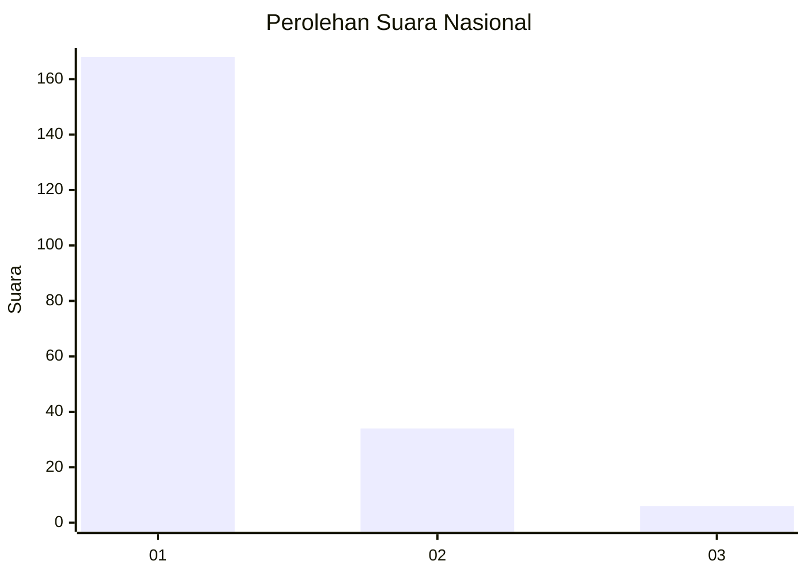
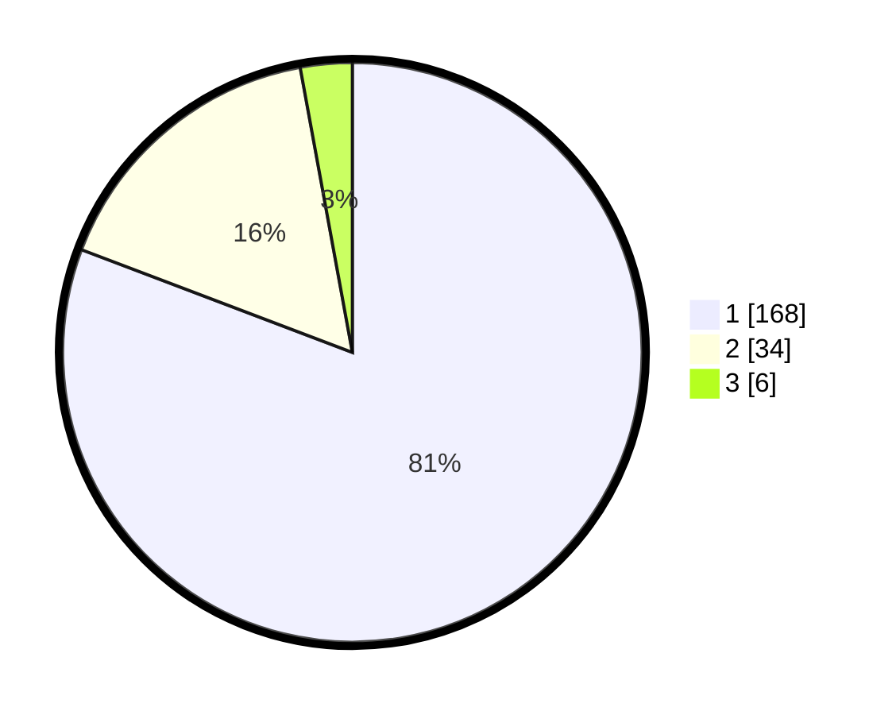

# Hasil

## Grafik

## Tabel

| No. | Nama Paslon    | Suara | Suara (raw) | Persentase |
|:--- |:-------------- | -----:| -----------:| ----------:|
| 1   | ANIES MUHAIMIN | 168   | [168][p-1]  | 80,77      |
| 2   | PRABOWO GIBRAN | 34    | [34][p-2]   | 16,35      |
| 3   | GANJAR MAHFUD  | 6     | [6][p-3]    | 2,88       |

[p-1]: https://github.com/gigit-pemilu/pemilu-2024/blob/main/pilpres/hitung-suara/sub/11-aceh/sub/07-pidie/sub/09-kota-sigli/sub/2011-kampong-asan/sub/001-tps/sub/paslon-1.txt
[p-2]: https://github.com/gigit-pemilu/pemilu-2024/blob/main/pilpres/hitung-suara/sub/11-aceh/sub/07-pidie/sub/09-kota-sigli/sub/2011-kampong-asan/sub/001-tps/sub/paslon-2.txt
[p-3]: https://github.com/gigit-pemilu/pemilu-2024/blob/main/pilpres/hitung-suara/sub/11-aceh/sub/07-pidie/sub/09-kota-sigli/sub/2011-kampong-asan/sub/001-tps/sub/paslon-3.txt

## Foto C Plano

https://sirekap-obj-formc.kpu.go.id/e43e/pemilu/ppwp/11/07/09/20/11/1107092011001-20240220-210757--f06c0126-49a9-422e-9e71-2038fedc11fa.jpg

https://sirekap-obj-formc.kpu.go.id/e43e/pemilu/ppwp/11/07/09/20/11/1107092011001-20240220-210913--fe5a372f-feb6-4e72-9e59-0002da8f55c1.jpg

https://sirekap-obj-formc.kpu.go.id/e43e/pemilu/ppwp/11/07/09/20/11/1107092011001-20240220-211006--01445995-e2a2-4305-86f8-83b9090298ae.jpg

## Metadata

| Key        | Value               |
| ---------- | ------------------- |
| Time Stamp | 2024-02-20 22:00:00 |

