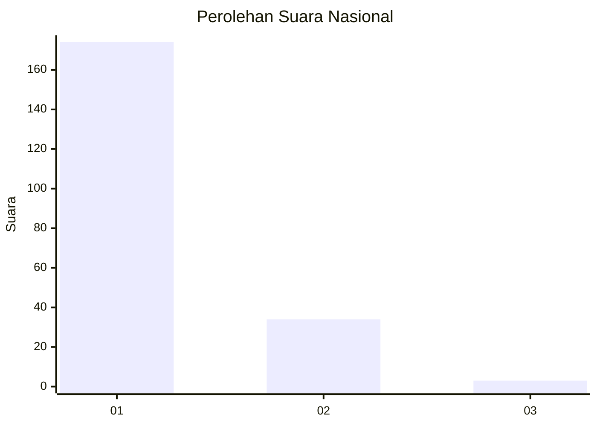
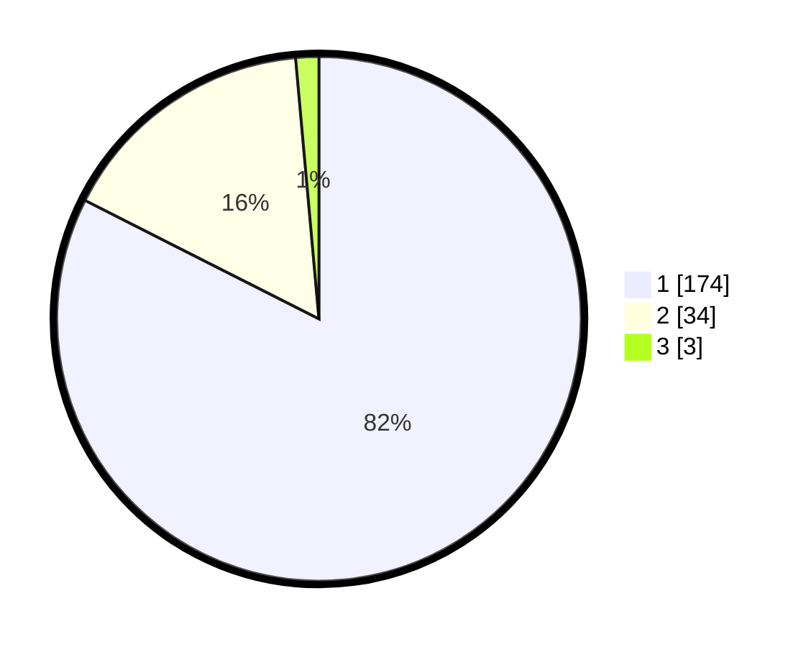

# Hasil

## Grafik

## Tabel

| No. | Nama Paslon    | Suara | Suara (raw) | Persentase |
|:--- |:-------------- | -----:| -----------:| ----------:|
| 1   | ANIES MUHAIMIN | 174   | [174][p-1]  | 82,46      |
| 2   | PRABOWO GIBRAN | 34    | [34][p-2]   | 16,11      |
| 3   | GANJAR MAHFUD  | 3     | [3][p-3]    | 1,42       |

[p-1]: https://github.com/gigit-pemilu/pemilu-2024/blob/main/pilpres/hitung-suara/sub/11-aceh/sub/07-pidie/sub/09-kota-sigli/sub/2011-kampong-asan/sub/003-tps/sub/paslon-1.txt
[p-2]: https://github.com/gigit-pemilu/pemilu-2024/blob/main/pilpres/hitung-suara/sub/11-aceh/sub/07-pidie/sub/09-kota-sigli/sub/2011-kampong-asan/sub/003-tps/sub/paslon-2.txt
[p-3]: https://github.com/gigit-pemilu/pemilu-2024/blob/main/pilpres/hitung-suara/sub/11-aceh/sub/07-pidie/sub/09-kota-sigli/sub/2011-kampong-asan/sub/003-tps/sub/paslon-3.txt

## Foto C Plano

https://sirekap-obj-formc.kpu.go.id/9e1d/pemilu/ppwp/11/07/09/20/11/1107092011003-20240220-211718--93549407-9eb0-4a90-8015-5f40fa427b48.jpg

https://sirekap-obj-formc.kpu.go.id/9e1d/pemilu/ppwp/11/07/09/20/11/1107092011003-20240220-211818--cb5fdb8a-fff7-4515-94ca-32054e9abce7.jpg

https://sirekap-obj-formc.kpu.go.id/9e1d/pemilu/ppwp/11/07/09/20/11/1107092011003-20240220-211850--8962c68d-6564-4f21-9f1e-8f1231923e33.jpg

## Metadata

| Key        | Value               |
| ---------- | ------------------- |
| Time Stamp | 2024-02-20 22:00:00 |

