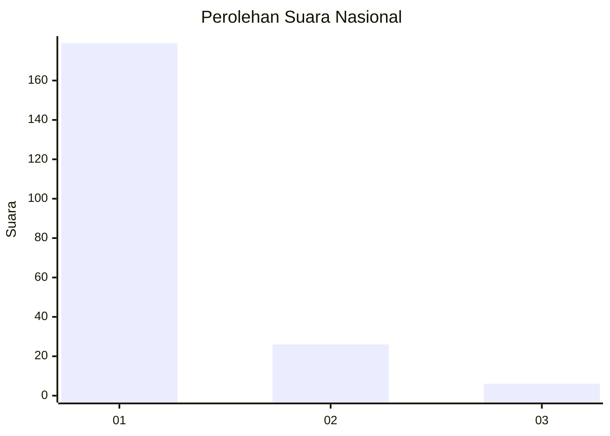
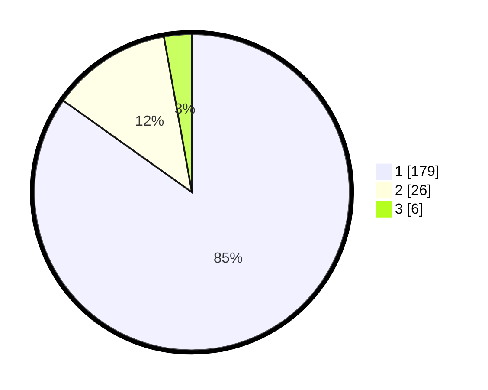

# Hasil

## Grafik

## Tabel

| No. | Nama Paslon    | Suara | Suara (raw) | Persentase |
|:--- |:-------------- | -----:| -----------:| ----------:|
| 1   | ANIES MUHAIMIN | 179   | [179][p-1]  | 84,83      |
| 2   | PRABOWO GIBRAN | 26    | [26][p-2]   | 12,32      |
| 3   | GANJAR MAHFUD  | 6     | [6][p-3]    | 2,84       |

[p-1]: https://github.com/gigit-pemilu/pemilu-2024/blob/main/pilpres/hitung-suara/sub/11-aceh/sub/07-pidie/sub/09-kota-sigli/sub/2012-meunasah-peukan/sub/002-tps/sub/paslon-1.txt
[p-2]: https://github.com/gigit-pemilu/pemilu-2024/blob/main/pilpres/hitung-suara/sub/11-aceh/sub/07-pidie/sub/09-kota-sigli/sub/2012-meunasah-peukan/sub/002-tps/sub/paslon-2.txt
[p-3]: https://github.com/gigit-pemilu/pemilu-2024/blob/main/pilpres/hitung-suara/sub/11-aceh/sub/07-pidie/sub/09-kota-sigli/sub/2012-meunasah-peukan/sub/002-tps/sub/paslon-3.txt

## Foto C Plano

https://sirekap-obj-formc.kpu.go.id/c485/pemilu/ppwp/11/07/09/20/12/1107092012002-20240220-213214--bbdca46a-63e4-4516-ba29-0d070a7f9278.jpg

https://sirekap-obj-formc.kpu.go.id/c485/pemilu/ppwp/11/07/09/20/12/1107092012002-20240220-213248--30a7fc35-5f14-448e-b52c-45211579f5fc.jpg

https://sirekap-obj-formc.kpu.go.id/c485/pemilu/ppwp/11/07/09/20/12/1107092012002-20240220-213318--e7662a85-0acf-4a63-82a5-7d41bd91023e.jpg

## Metadata

| Key        | Value               |
| ---------- | ------------------- |
| Time Stamp | 2024-02-20 22:00:00 |

