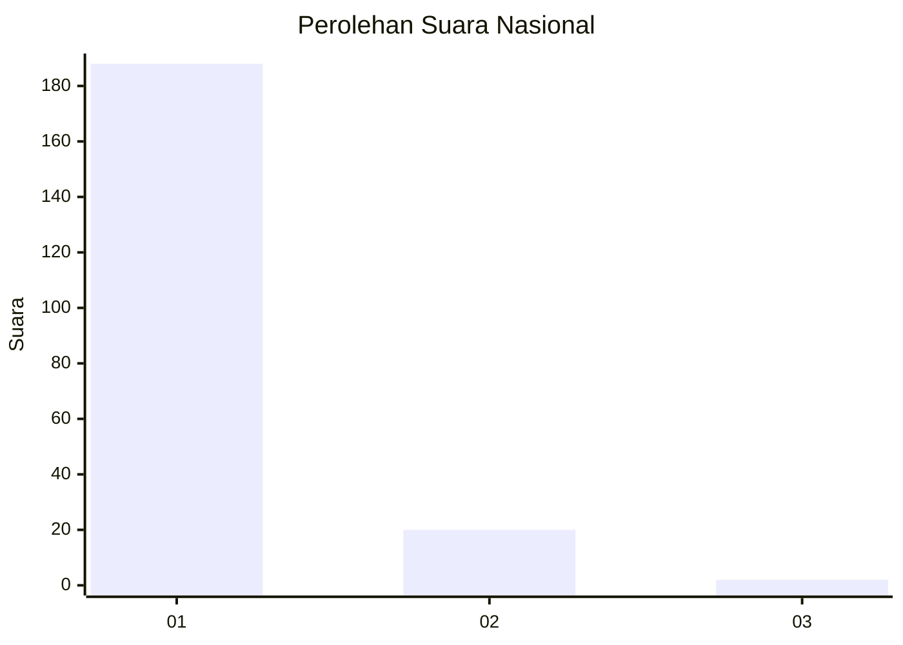
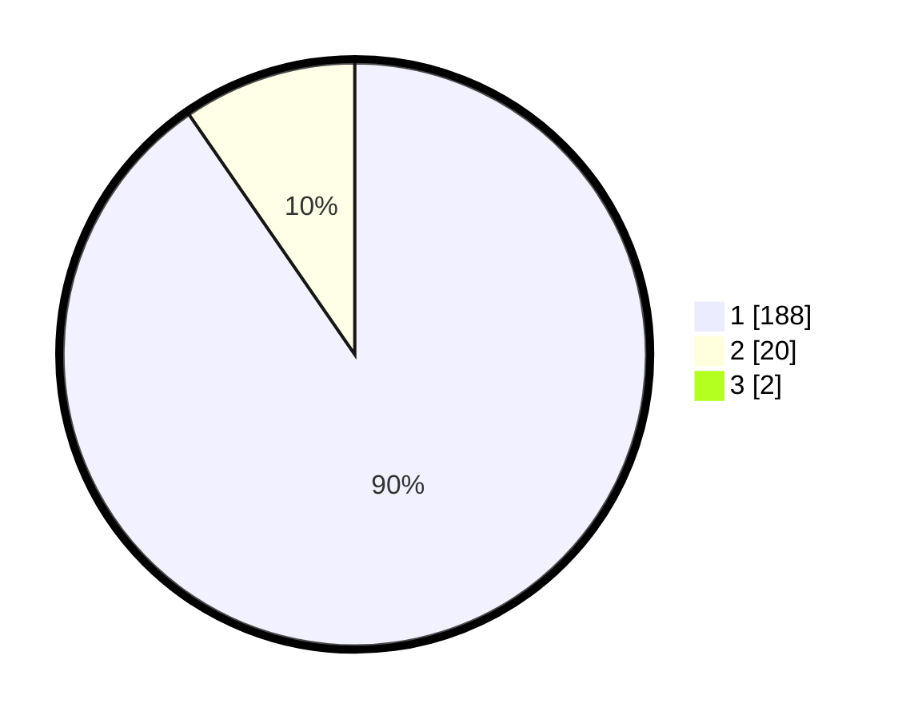

# Hasil

## Grafik

## Tabel

| No. | Nama Paslon    | Suara | Suara (raw) | Persentase |
|:--- |:-------------- | -----:| -----------:| ----------:|
| 1   | ANIES MUHAIMIN | 188   | [188][p-1]  | 89,52      |
| 2   | PRABOWO GIBRAN | 20    | [20][p-2]   | 9,52       |
| 3   | GANJAR MAHFUD  | 2     | [2][p-3]    | 0,95       |

[p-1]: https://github.com/gigit-pemilu/pemilu-2024/blob/main/pilpres/hitung-suara/sub/11-aceh/sub/07-pidie/sub/09-kota-sigli/sub/2013-pasi-rawa/sub/001-tps/sub/paslon-1.txt
[p-2]: https://github.com/gigit-pemilu/pemilu-2024/blob/main/pilpres/hitung-suara/sub/11-aceh/sub/07-pidie/sub/09-kota-sigli/sub/2013-pasi-rawa/sub/001-tps/sub/paslon-2.txt
[p-3]: https://github.com/gigit-pemilu/pemilu-2024/blob/main/pilpres/hitung-suara/sub/11-aceh/sub/07-pidie/sub/09-kota-sigli/sub/2013-pasi-rawa/sub/001-tps/sub/paslon-3.txt

## Foto C Plano

https://sirekap-obj-formc.kpu.go.id/9dc7/pemilu/ppwp/11/07/09/20/13/1107092013001-20240220-215822--305d1619-43ea-4767-85cc-eda02a088708.jpg

https://sirekap-obj-formc.kpu.go.id/9dc7/pemilu/ppwp/11/07/09/20/13/1107092013001-20240220-215904--b30bcd91-b71e-4842-8105-1aa970aad8be.jpg

https://sirekap-obj-formc.kpu.go.id/9dc7/pemilu/ppwp/11/07/09/20/13/1107092013001-20240220-215943--1c41ee59-2469-487a-ad7d-2f5dd09ccaba.jpg

## Metadata

| Key        | Value               |
| ---------- | ------------------- |
| Time Stamp | 2024-02-20 23:00:00 |

