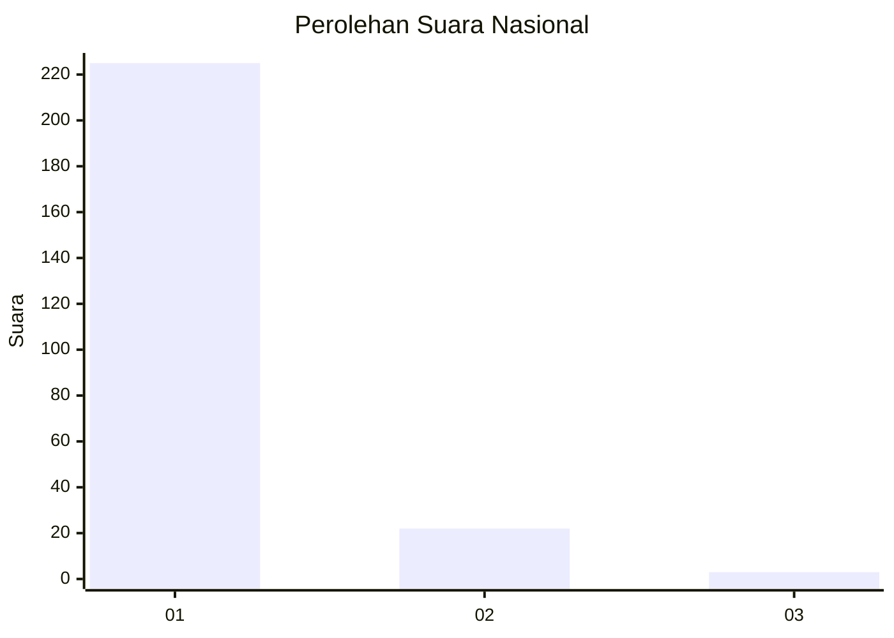
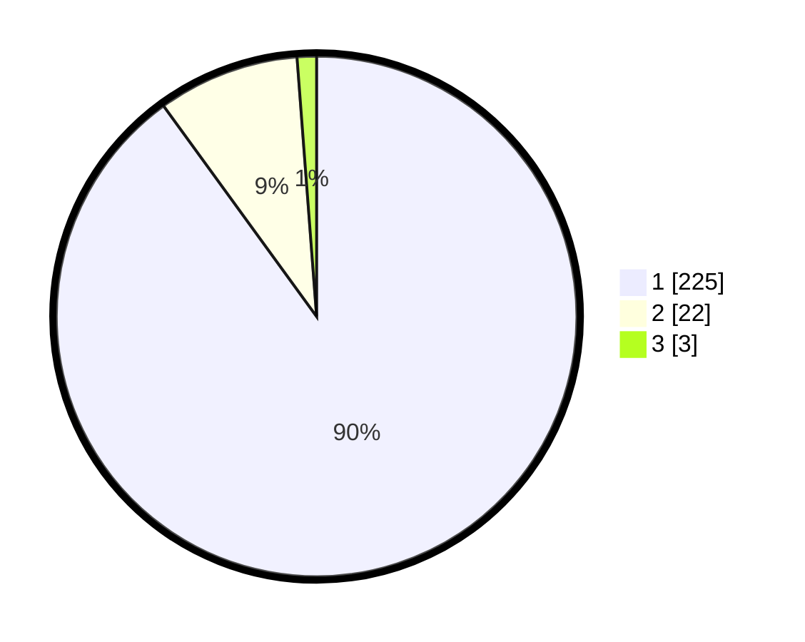

# Hasil

## Grafik

## Tabel

| No. | Nama Paslon    | Suara | Suara (raw) | Persentase |
|:--- |:-------------- | -----:| -----------:| ----------:|
| 1   | ANIES MUHAIMIN | 225   | [225][p-1]  | 90,00      |
| 2   | PRABOWO GIBRAN | 22    | [22][p-2]   | 8,80       |
| 3   | GANJAR MAHFUD  | 3     | [3][p-3]    | 1,20       |

[p-1]: https://github.com/gigit-pemilu/pemilu-2024/blob/main/pilpres/hitung-suara/sub/11-aceh/sub/07-pidie/sub/09-kota-sigli/sub/2013-pasi-rawa/sub/002-tps/sub/paslon-1.txt
[p-2]: https://github.com/gigit-pemilu/pemilu-2024/blob/main/pilpres/hitung-suara/sub/11-aceh/sub/07-pidie/sub/09-kota-sigli/sub/2013-pasi-rawa/sub/002-tps/sub/paslon-2.txt
[p-3]: https://github.com/gigit-pemilu/pemilu-2024/blob/main/pilpres/hitung-suara/sub/11-aceh/sub/07-pidie/sub/09-kota-sigli/sub/2013-pasi-rawa/sub/002-tps/sub/paslon-3.txt

## Foto C Plano

https://sirekap-obj-formc.kpu.go.id/77a1/pemilu/ppwp/11/07/09/20/13/1107092013002-20240221-005006--3d7c8933-a937-4969-87a8-17ba35fa33eb.jpg

https://sirekap-obj-formc.kpu.go.id/77a1/pemilu/ppwp/11/07/09/20/13/1107092013002-20240221-005051--3267329d-23bb-44e7-8f0e-2fa15487133f.jpg

https://sirekap-obj-formc.kpu.go.id/77a1/pemilu/ppwp/11/07/09/20/13/1107092013002-20240221-005118--e1af4c8f-d1b8-45b0-b616-7a4973ca0607.jpg

## Metadata

| Key        | Value               |
| ---------- | ------------------- |
| Time Stamp | 2024-02-24 22:31:28 |

