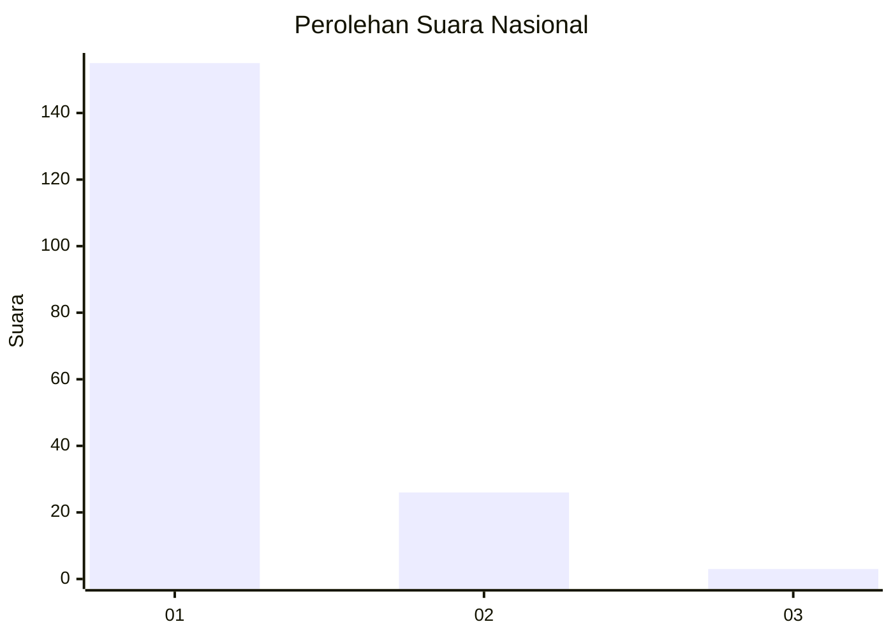
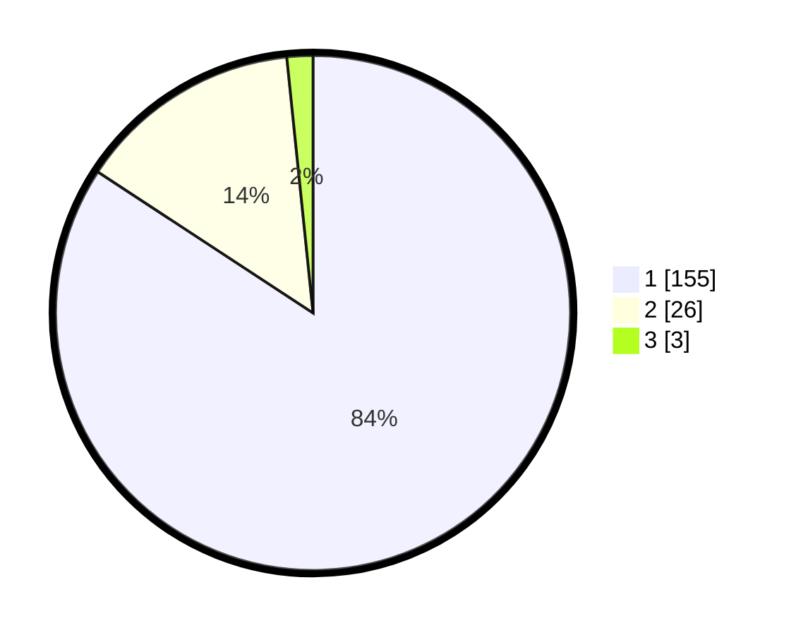

# Hasil

## Grafik

## Tabel

| No. | Nama Paslon    | Suara | Suara (raw) | Persentase |
|:--- |:-------------- | -----:| -----------:| ----------:|
| 1   | ANIES MUHAIMIN | 155   | [155][p-1]  | 84,24      |
| 2   | PRABOWO GIBRAN | 26    | [26][p-2]   | 14,13      |
| 3   | GANJAR MAHFUD  | 3     | [3][p-3]    | 1,63       |

[p-1]: https://github.com/gigit-pemilu/pemilu-2024/blob/main/pilpres/hitung-suara/sub/11-aceh/sub/07-pidie/sub/11-mila/sub/2002-teumeucet/sub/001-tps/sub/paslon-1.txt
[p-2]: https://github.com/gigit-pemilu/pemilu-2024/blob/main/pilpres/hitung-suara/sub/11-aceh/sub/07-pidie/sub/11-mila/sub/2002-teumeucet/sub/001-tps/sub/paslon-2.txt
[p-3]: https://github.com/gigit-pemilu/pemilu-2024/blob/main/pilpres/hitung-suara/sub/11-aceh/sub/07-pidie/sub/11-mila/sub/2002-teumeucet/sub/001-tps/sub/paslon-3.txt

## Foto C Plano

https://sirekap-obj-formc.kpu.go.id/68c4/pemilu/ppwp/11/07/11/20/02/1107112002001-20240214-214801--48ffc208-457d-4929-be87-735854cc4acb.jpg

https://sirekap-obj-formc.kpu.go.id/68c4/pemilu/ppwp/11/07/11/20/02/1107112002001-20240214-214855--8727ad38-393a-4954-a07a-6fc1ac126d90.jpg

https://sirekap-obj-formc.kpu.go.id/68c4/pemilu/ppwp/11/07/11/20/02/1107112002001-20240214-214930--9b9f8b68-970e-4e62-af7d-631dc5190350.jpg

## Metadata

| Key        | Value               |
| ---------- | ------------------- |
| Time Stamp | 2024-02-19 06:16:00 |

