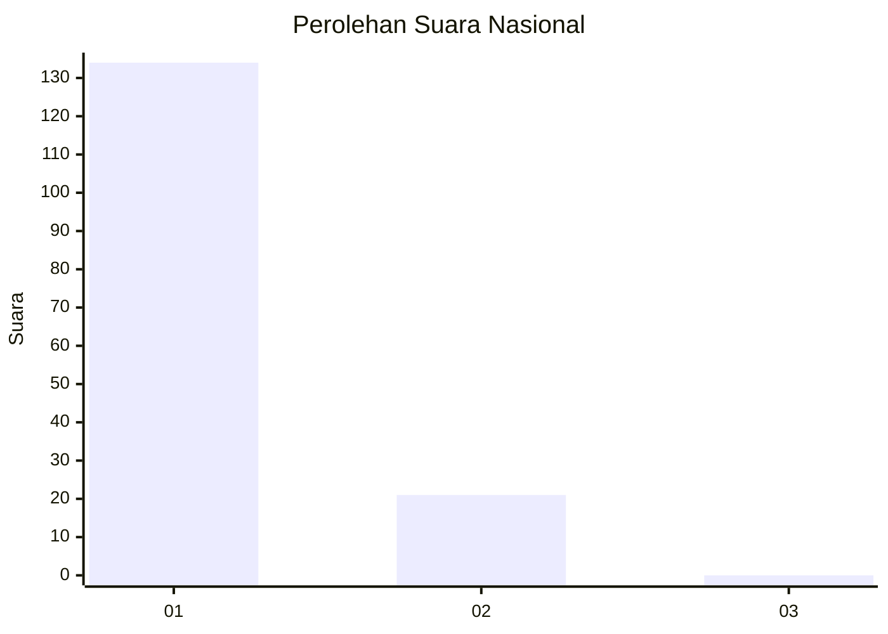
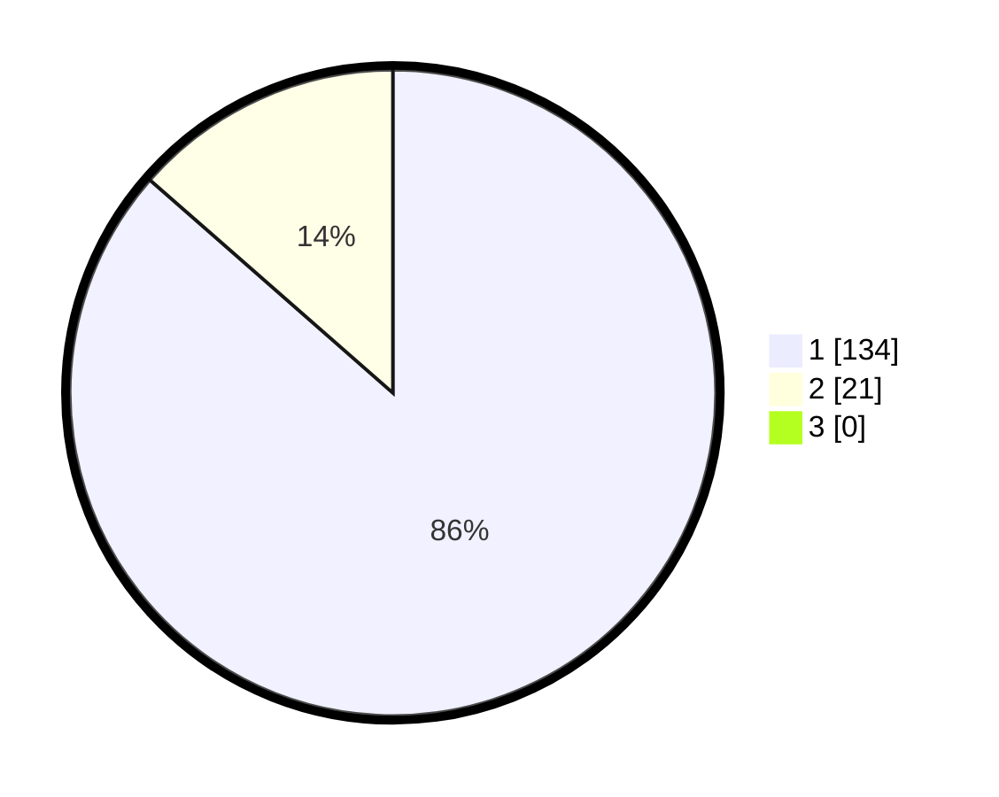

# Hasil

## Grafik

## Tabel

| No. | Nama Paslon    | Suara | Suara (raw) | Persentase |
|:--- |:-------------- | -----:| -----------:| ----------:|
| 1   | ANIES MUHAIMIN | 134   | [134][p-1]  | 86,45      |
| 2   | PRABOWO GIBRAN | 21    | [21][p-2]   | 13,55      |
| 3   | GANJAR MAHFUD  | 0     | [0][p-3]    | 0,00       |

[p-1]: https://github.com/gigit-pemilu/pemilu-2024/blob/main/pilpres/hitung-suara/sub/11-aceh/sub/07-pidie/sub/11-mila/sub/2003-blang-cut/sub/001-tps/sub/paslon-1.txt
[p-2]: https://github.com/gigit-pemilu/pemilu-2024/blob/main/pilpres/hitung-suara/sub/11-aceh/sub/07-pidie/sub/11-mila/sub/2003-blang-cut/sub/001-tps/sub/paslon-2.txt
[p-3]: https://github.com/gigit-pemilu/pemilu-2024/blob/main/pilpres/hitung-suara/sub/11-aceh/sub/07-pidie/sub/11-mila/sub/2003-blang-cut/sub/001-tps/sub/paslon-3.txt

## Foto C Plano

https://sirekap-obj-formc.kpu.go.id/3885/pemilu/ppwp/11/07/11/20/03/1107112003001-20240214-225630--450da4c0-3bf0-4dfd-93d3-09e3ef25c38e.jpg

https://sirekap-obj-formc.kpu.go.id/3885/pemilu/ppwp/11/07/11/20/03/1107112003001-20240214-213620--09dde642-ad5e-461a-9204-2c21ea14a26b.jpg

https://sirekap-obj-formc.kpu.go.id/3885/pemilu/ppwp/11/07/11/20/03/1107112003001-20240214-213841--2c7b413a-da87-4843-b11d-9a9450eb21f5.jpg

## Metadata

| Key        | Value               |
| ---------- | ------------------- |
| Time Stamp | 2024-02-19 06:16:00 |

