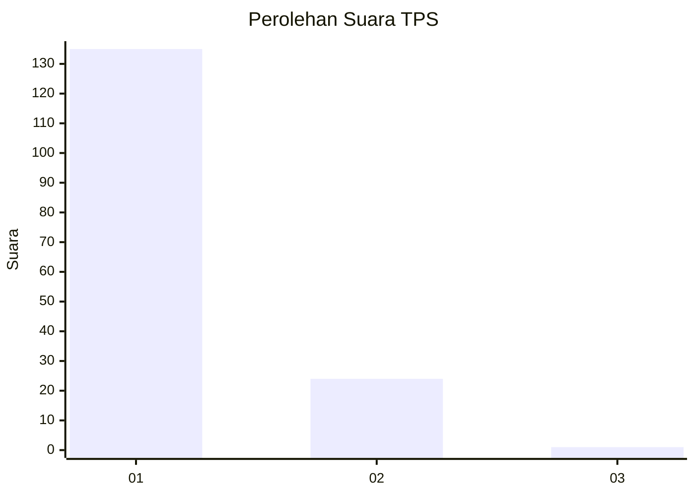
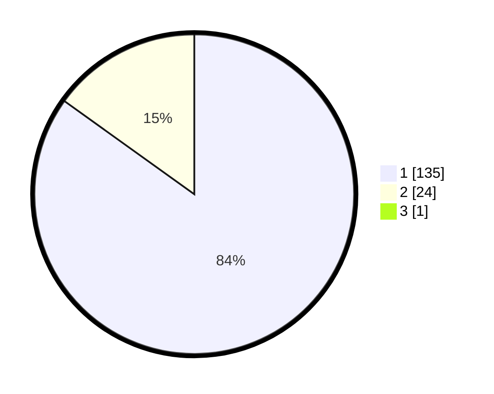

# Hasil

## Grafik

## Tabel

| No. | Nama Paslon    | Suara | Suara (raw) | Persentase |
|:--- |:-------------- | -----:| -----------:| ----------:|
| 1   | ANIES MUHAIMIN | 135   | [135][p-1]  | 84,38      |
| 2   | PRABOWO GIBRAN | 24    | [24][p-2]   | 15,00      |
| 3   | GANJAR MAHFUD  | 1     | [1][p-3]    | 0,63       |

[p-1]: https://github.com/gigit-pemilu/pemilu-2024-11-aceh/blob/main/pilpres/hitung-suara/sub/11-aceh/sub/07-pidie/sub/11-mila/sub/2003-blang-cut/sub/002-tps/sub/paslon-1.txt
[p-2]: https://github.com/gigit-pemilu/pemilu-2024-11-aceh/blob/main/pilpres/hitung-suara/sub/11-aceh/sub/07-pidie/sub/11-mila/sub/2003-blang-cut/sub/002-tps/sub/paslon-2.txt
[p-3]: https://github.com/gigit-pemilu/pemilu-2024-11-aceh/blob/main/pilpres/hitung-suara/sub/11-aceh/sub/07-pidie/sub/11-mila/sub/2003-blang-cut/sub/002-tps/sub/paslon-3.txt

## Foto C Plano

https://sirekap-obj-formc.kpu.go.id/729a/pemilu/ppwp/11/07/11/20/03/1107112003002-20240214-213025--457d9049-5a9a-4f3a-a747-2bdbb543154d.jpg

https://sirekap-obj-formc.kpu.go.id/729a/pemilu/ppwp/11/07/11/20/03/1107112003002-20240214-213447--721fd9e3-2956-4890-ba98-92cd604ca0d8.jpg

https://sirekap-obj-formc.kpu.go.id/729a/pemilu/ppwp/11/07/11/20/03/1107112003002-20240214-213724--2b184f9c-231c-4d6f-92db-ff25a51dc41b.jpg

## Metadata

| Key        | Value               |
| ---------- | ------------------- |
| Time Stamp | 2024-02-19 06:16:00 |

