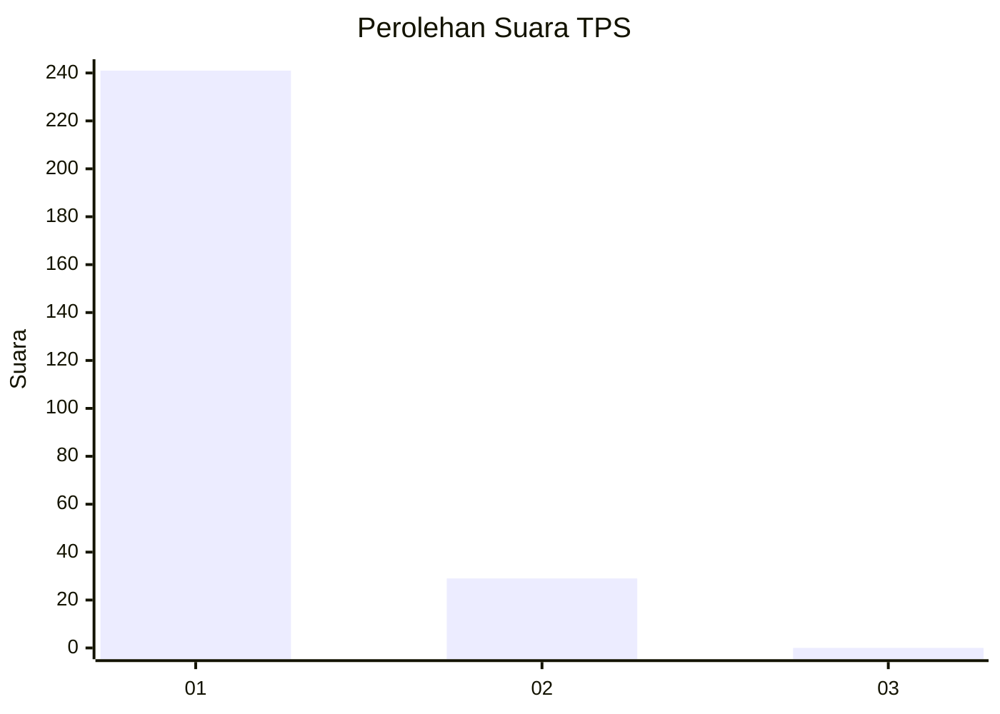
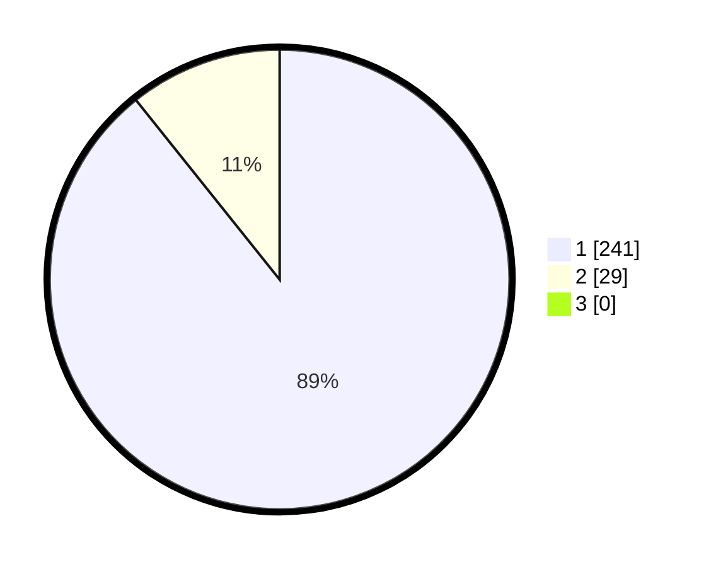

# Hasil

## Grafik

## Tabel

| No. | Nama Paslon    | Suara | Suara (raw) | Persentase |
|:--- |:-------------- | -----:| -----------:| ----------:|
| 1   | ANIES MUHAIMIN | 241   | [241][p-1]  | 89,26      |
| 2   | PRABOWO GIBRAN | 29    | [29][p-2]   | 10,74      |
| 3   | GANJAR MAHFUD  | 0     | [0][p-3]    | 0,00       |

[p-1]: https://github.com/gigit-pemilu/pemilu-2024-11-aceh/blob/main/pilpres/hitung-suara/sub/11-aceh/sub/07-pidie/sub/11-mila/sub/2004-kumbang/sub/002-tps/sub/paslon-1.txt
[p-2]: https://github.com/gigit-pemilu/pemilu-2024-11-aceh/blob/main/pilpres/hitung-suara/sub/11-aceh/sub/07-pidie/sub/11-mila/sub/2004-kumbang/sub/002-tps/sub/paslon-2.txt
[p-3]: https://github.com/gigit-pemilu/pemilu-2024-11-aceh/blob/main/pilpres/hitung-suara/sub/11-aceh/sub/07-pidie/sub/11-mila/sub/2004-kumbang/sub/002-tps/sub/paslon-3.txt

## Foto C Plano

https://sirekap-obj-formc.kpu.go.id/41f3/pemilu/ppwp/11/07/11/20/04/1107112004002-20240215-093716--ddbd9c0d-ba7a-48e4-b578-5e3fdcf0cb92.jpg

https://sirekap-obj-formc.kpu.go.id/41f3/pemilu/ppwp/11/07/11/20/04/1107112004002-20240215-141815--5f657f37-32b7-4e2e-a4b6-556ccf4b8676.jpg

https://sirekap-obj-formc.kpu.go.id/41f3/pemilu/ppwp/11/07/11/20/04/1107112004002-20240215-141820--4a80b146-88fa-4436-acf0-feae3c4c13d0.jpg

## Metadata

| Key        | Value               |
| ---------- | ------------------- |
| Time Stamp | 2024-02-25 17:00:00 |

