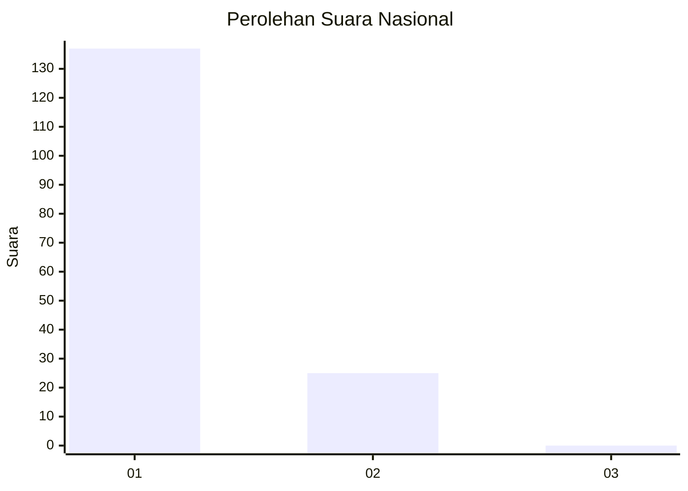
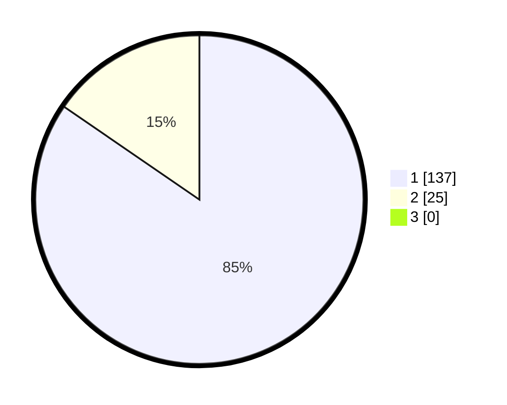

# Hasil

## Grafik

## Tabel

| No. | Nama Paslon    | Suara | Suara (raw) | Persentase |
|:--- |:-------------- | -----:| -----------:| ----------:|
| 1   | ANIES MUHAIMIN | 137   | [137][p-1]  | 84,57      |
| 2   | PRABOWO GIBRAN | 25    | [25][p-2]   | 15,43      |
| 3   | GANJAR MAHFUD  | 0     | [0][p-3]    | 0,00       |

[p-1]: https://github.com/gigit-pemilu/pemilu-2024/blob/main/pilpres/hitung-suara/sub/11-aceh/sub/07-pidie/sub/11-mila/sub/2007-lagang/sub/001-tps/sub/paslon-1.txt
[p-2]: https://github.com/gigit-pemilu/pemilu-2024/blob/main/pilpres/hitung-suara/sub/11-aceh/sub/07-pidie/sub/11-mila/sub/2007-lagang/sub/001-tps/sub/paslon-2.txt
[p-3]: https://github.com/gigit-pemilu/pemilu-2024/blob/main/pilpres/hitung-suara/sub/11-aceh/sub/07-pidie/sub/11-mila/sub/2007-lagang/sub/001-tps/sub/paslon-3.txt

## Foto C Plano

https://sirekap-obj-formc.kpu.go.id/37d3/pemilu/ppwp/11/07/11/20/07/1107112007001-20240215-001921--c5b5507a-b4b2-4235-9175-6fbe8021213c.jpg

https://sirekap-obj-formc.kpu.go.id/37d3/pemilu/ppwp/11/07/11/20/07/1107112007001-20240215-002051--af8cdcbd-3535-4d93-8050-db494dc9d39a.jpg

https://sirekap-obj-formc.kpu.go.id/37d3/pemilu/ppwp/11/07/11/20/07/1107112007001-20240214-195403--d81f3bdd-2397-46c4-b9ec-ea72547da6ca.jpg

## Metadata

| Key        | Value               |
| ---------- | ------------------- |
| Time Stamp | 2024-02-19 06:16:00 |

