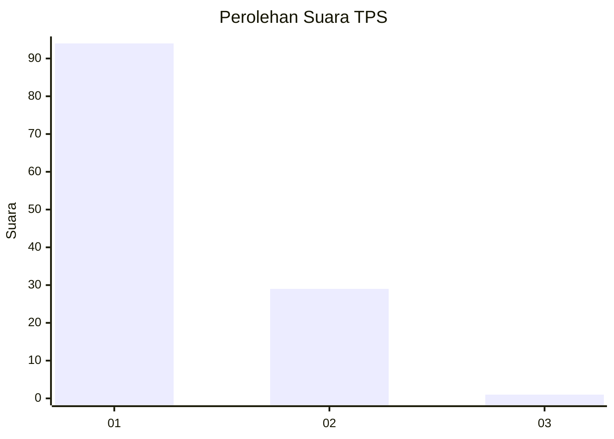
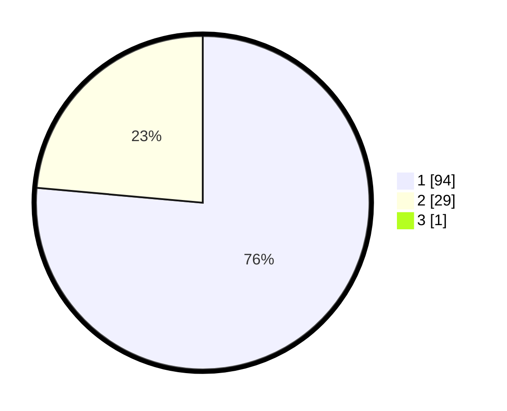

# Hasil

## Grafik

## Tabel

| No. | Nama Paslon    | Suara | Suara (raw) | Persentase |
|:--- |:-------------- | -----:| -----------:| ----------:|
| 1   | ANIES MUHAIMIN | 94    | [94][p-1]   | 75,81      |
| 2   | PRABOWO GIBRAN | 29    | [29][p-2]   | 23,39      |
| 3   | GANJAR MAHFUD  | 1     | [1][p-3]    | 0,81       |

[p-1]: https://github.com/gigit-pemilu/pemilu-2024-11-aceh/blob/main/pilpres/hitung-suara/sub/11-aceh/sub/07-pidie/sub/11-mila/sub/2007-lagang/sub/002-tps/sub/paslon-1.txt
[p-2]: https://github.com/gigit-pemilu/pemilu-2024-11-aceh/blob/main/pilpres/hitung-suara/sub/11-aceh/sub/07-pidie/sub/11-mila/sub/2007-lagang/sub/002-tps/sub/paslon-2.txt
[p-3]: https://github.com/gigit-pemilu/pemilu-2024-11-aceh/blob/main/pilpres/hitung-suara/sub/11-aceh/sub/07-pidie/sub/11-mila/sub/2007-lagang/sub/002-tps/sub/paslon-3.txt

## Foto C Plano

https://sirekap-obj-formc.kpu.go.id/9660/pemilu/ppwp/11/07/11/20/07/1107112007002-20240214-213016--0464ffbf-6a41-430f-98e9-da7d7cb9db55.jpg

https://sirekap-obj-formc.kpu.go.id/9660/pemilu/ppwp/11/07/11/20/07/1107112007002-20240214-212834--7637ea5a-3714-48a4-bbe7-364d6feeb420.jpg

https://sirekap-obj-formc.kpu.go.id/9660/pemilu/ppwp/11/07/11/20/07/1107112007002-20240215-064308--b73b5e64-cd05-48f5-b391-5f48b26cc39a.jpg

## Metadata

| Key        | Value               |
| ---------- | ------------------- |
| Time Stamp | 2024-02-19 06:16:00 |

