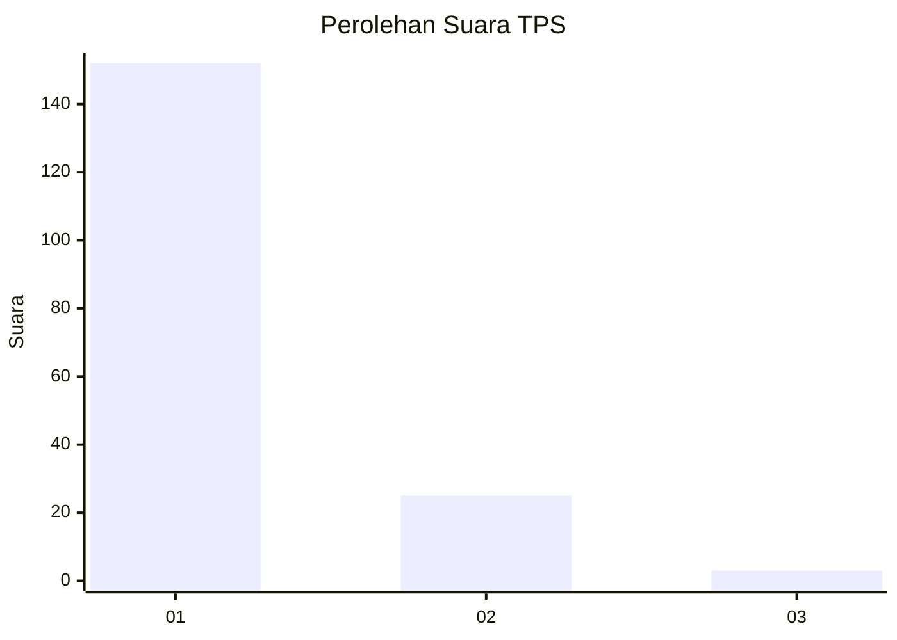
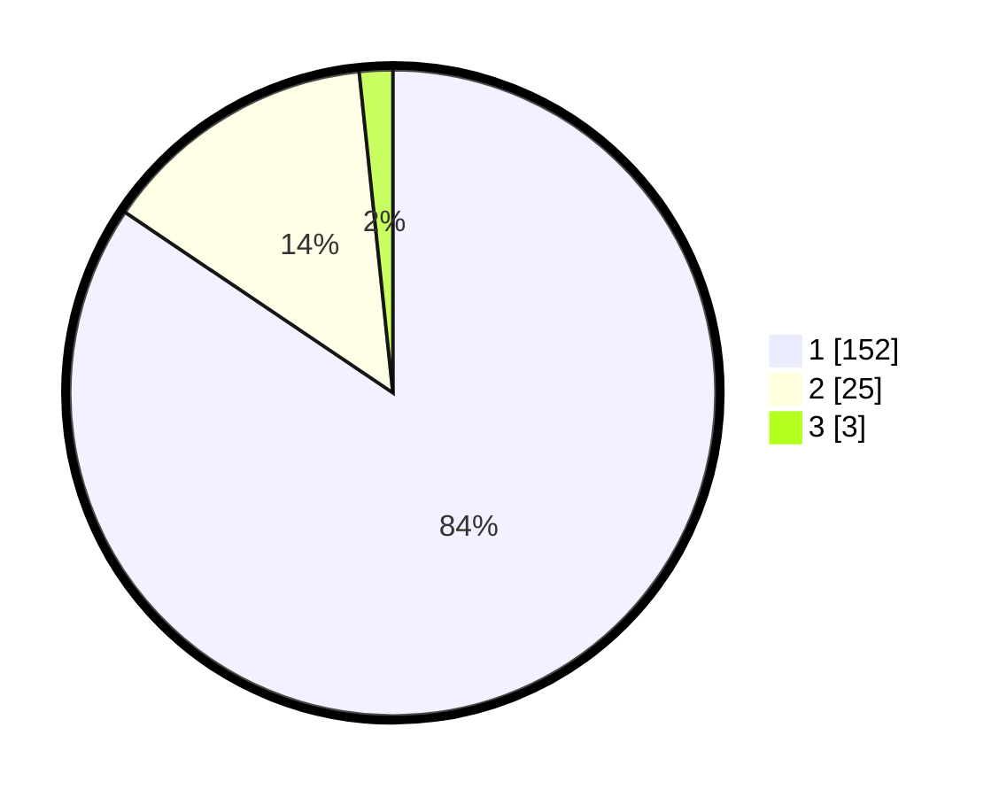

# Hasil

## Grafik

## Tabel

| No. | Nama Paslon    | Suara | Suara (raw) | Persentase |
|:--- |:-------------- | -----:| -----------:| ----------:|
| 1   | ANIES MUHAIMIN | 152   | [152][p-1]  | 84,44      |
| 2   | PRABOWO GIBRAN | 25    | [25][p-2]   | 13,89      |
| 3   | GANJAR MAHFUD  | 3     | [3][p-3]    | 1,67       |

[p-1]: https://github.com/gigit-pemilu/pemilu-2024-11-aceh/blob/main/pilpres/hitung-suara/sub/11-aceh/sub/07-pidie/sub/11-mila/sub/2008-mesjid-ilot/sub/001-tps/sub/paslon-1.txt
[p-2]: https://github.com/gigit-pemilu/pemilu-2024-11-aceh/blob/main/pilpres/hitung-suara/sub/11-aceh/sub/07-pidie/sub/11-mila/sub/2008-mesjid-ilot/sub/001-tps/sub/paslon-2.txt
[p-3]: https://github.com/gigit-pemilu/pemilu-2024-11-aceh/blob/main/pilpres/hitung-suara/sub/11-aceh/sub/07-pidie/sub/11-mila/sub/2008-mesjid-ilot/sub/001-tps/sub/paslon-3.txt

## Foto C Plano

https://sirekap-obj-formc.kpu.go.id/c0db/pemilu/ppwp/11/07/11/20/08/1107112008001-20240214-233043--38b6a5e9-f22f-4189-83ae-a2119eb211e9.jpg

https://sirekap-obj-formc.kpu.go.id/c0db/pemilu/ppwp/11/07/11/20/08/1107112008001-20240214-212303--efd08db1-fd9a-4be5-ae32-2b0b04e880b2.jpg

https://sirekap-obj-formc.kpu.go.id/c0db/pemilu/ppwp/11/07/11/20/08/1107112008001-20240214-211538--2c144703-e7bc-484b-9521-051c888b5e83.jpg

## Metadata

| Key        | Value               |
| ---------- | ------------------- |
| Time Stamp | 2024-02-19 06:16:00 |

