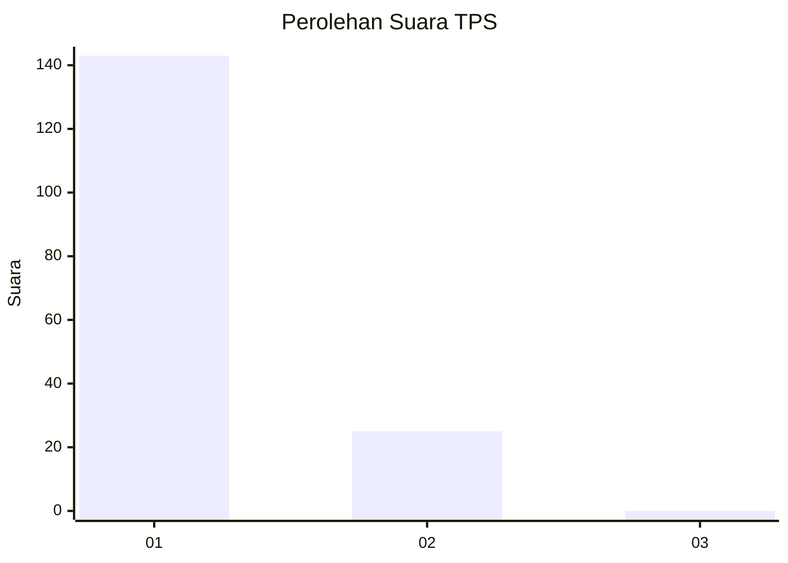
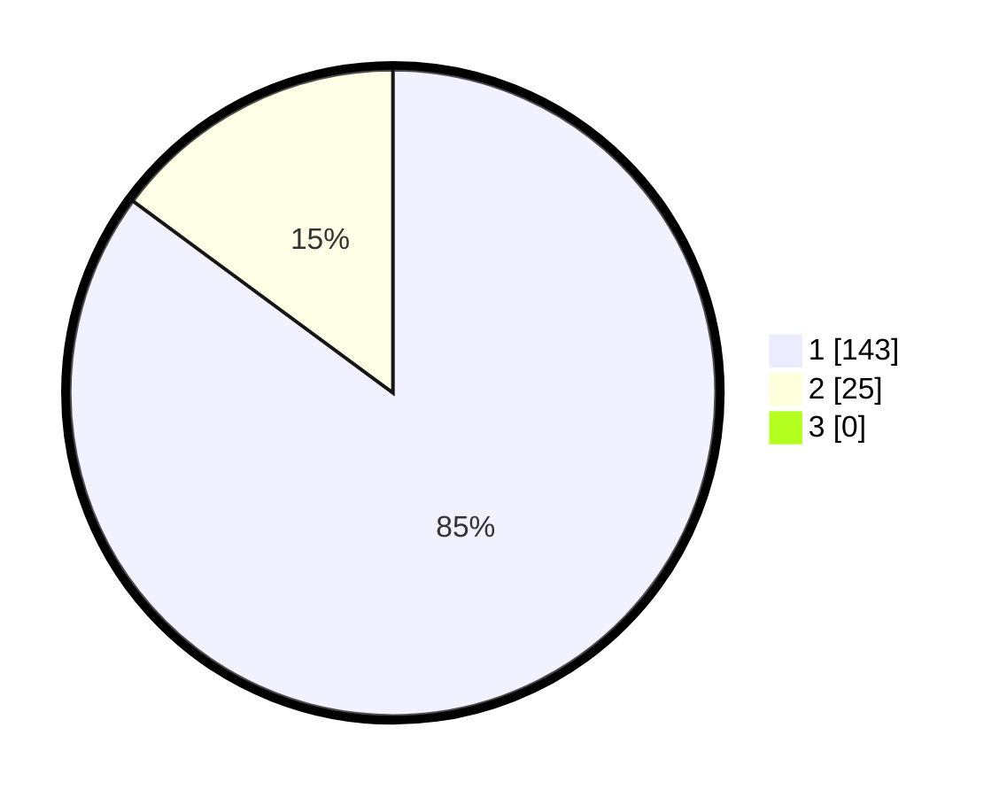

# Hasil

## Grafik

## Tabel

| No. | Nama Paslon    | Suara | Suara (raw) | Persentase |
|:--- |:-------------- | -----:| -----------:| ----------:|
| 1   | ANIES MUHAIMIN | 143   | [143][p-1]  | 85,12      |
| 2   | PRABOWO GIBRAN | 25    | [25][p-2]   | 14,88      |
| 3   | GANJAR MAHFUD  | 0     | [0][p-3]    | 0,00       |

[p-1]: https://github.com/gigit-pemilu/pemilu-2024-11-aceh/blob/main/pilpres/hitung-suara/sub/11-aceh/sub/07-pidie/sub/11-mila/sub/2008-mesjid-ilot/sub/002-tps/sub/paslon-1.txt
[p-2]: https://github.com/gigit-pemilu/pemilu-2024-11-aceh/blob/main/pilpres/hitung-suara/sub/11-aceh/sub/07-pidie/sub/11-mila/sub/2008-mesjid-ilot/sub/002-tps/sub/paslon-2.txt
[p-3]: https://github.com/gigit-pemilu/pemilu-2024-11-aceh/blob/main/pilpres/hitung-suara/sub/11-aceh/sub/07-pidie/sub/11-mila/sub/2008-mesjid-ilot/sub/002-tps/sub/paslon-3.txt

## Foto C Plano

https://sirekap-obj-formc.kpu.go.id/8a9c/pemilu/ppwp/11/07/11/20/08/1107112008002-20240214-211007--07ac7622-aa8b-42e5-8557-454cd8e90faa.jpg

https://sirekap-obj-formc.kpu.go.id/8a9c/pemilu/ppwp/11/07/11/20/08/1107112008002-20240214-211411--bae60e73-7e73-49f0-809a-3a68923d7b28.jpg

https://sirekap-obj-formc.kpu.go.id/8a9c/pemilu/ppwp/11/07/11/20/08/1107112008002-20240214-211754--523a8b90-d051-4452-8e5f-35b893ab6e28.jpg

## Metadata

| Key        | Value               |
| ---------- | ------------------- |
| Time Stamp | 2024-02-25 11:00:00 |

