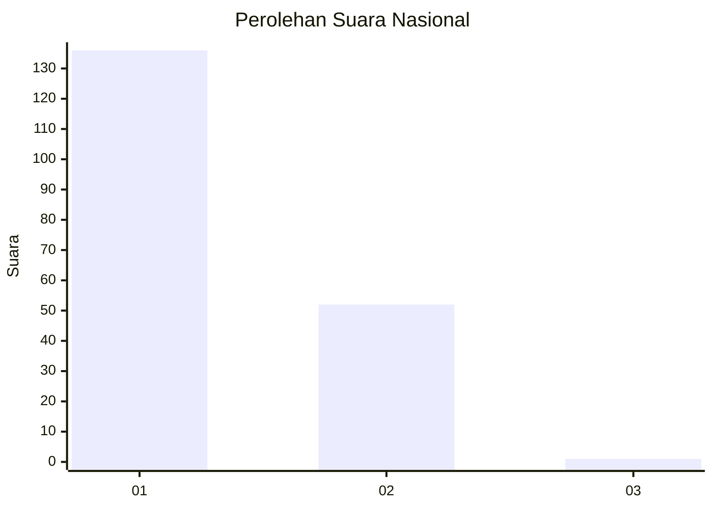
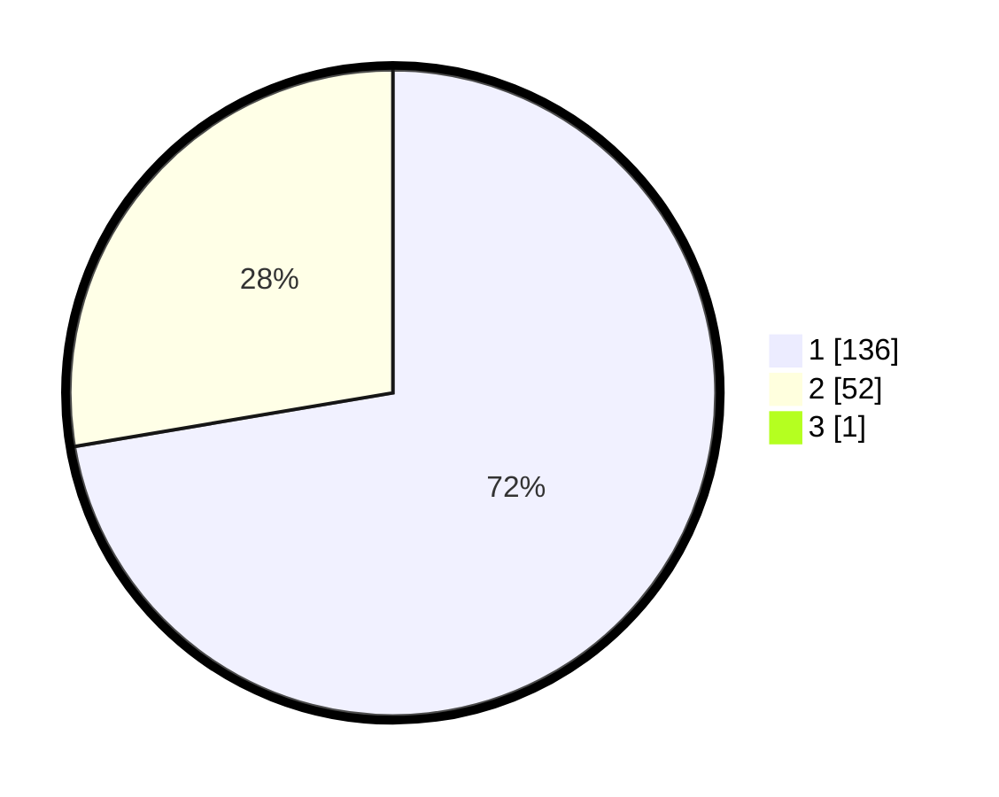

# Hasil

## Grafik

## Tabel

| No. | Nama Paslon    | Suara | Suara (raw) | Persentase |
|:--- |:-------------- | -----:| -----------:| ----------:|
| 1   | ANIES MUHAIMIN | 136   | [136][p-1]  | 71,96      |
| 2   | PRABOWO GIBRAN | 52    | [52][p-2]   | 27,51      |
| 3   | GANJAR MAHFUD  | 1     | [1][p-3]    | 0,53       |

[p-1]: https://github.com/gigit-pemilu/pemilu-2024/blob/main/pilpres/hitung-suara/sub/11-aceh/sub/07-pidie/sub/11-mila/sub/2009-baroh-ilot/sub/001-tps/sub/paslon-1.txt
[p-2]: https://github.com/gigit-pemilu/pemilu-2024/blob/main/pilpres/hitung-suara/sub/11-aceh/sub/07-pidie/sub/11-mila/sub/2009-baroh-ilot/sub/001-tps/sub/paslon-2.txt
[p-3]: https://github.com/gigit-pemilu/pemilu-2024/blob/main/pilpres/hitung-suara/sub/11-aceh/sub/07-pidie/sub/11-mila/sub/2009-baroh-ilot/sub/001-tps/sub/paslon-3.txt

## Foto C Plano

https://sirekap-obj-formc.kpu.go.id/1dfb/pemilu/ppwp/11/07/11/20/09/1107112009001-20240215-060954--407ba96f-4739-40d8-9ace-19d1ccdb3004.jpg

https://sirekap-obj-formc.kpu.go.id/1dfb/pemilu/ppwp/11/07/11/20/09/1107112009001-20240214-212644--a71bc4c8-8207-4f5c-aeae-126c0e7b1db6.jpg

https://sirekap-obj-formc.kpu.go.id/1dfb/pemilu/ppwp/11/07/11/20/09/1107112009001-20240214-214020--f07950df-5cf9-4227-bdbe-db81b688f267.jpg

## Metadata

| Key        | Value               |
| ---------- | ------------------- |
| Time Stamp | 2024-02-19 06:16:00 |

