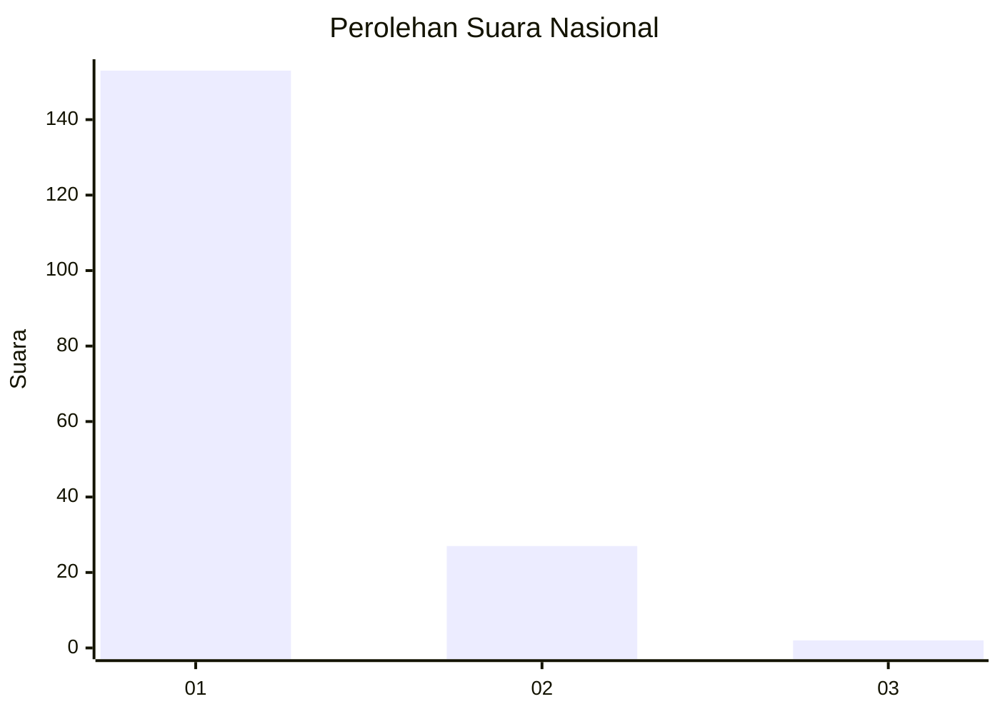
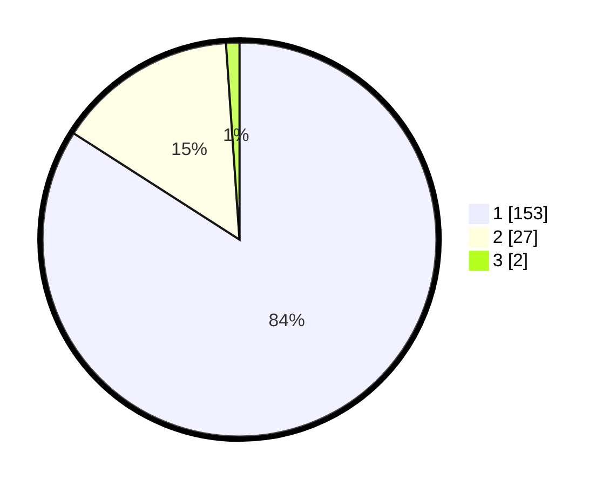

# Hasil

## Grafik

## Tabel

| No. | Nama Paslon    | Suara | Suara (raw) | Persentase |
|:--- |:-------------- | -----:| -----------:| ----------:|
| 1   | ANIES MUHAIMIN | 153   | [153][p-1]  | 84,07      |
| 2   | PRABOWO GIBRAN | 27    | [27][p-2]   | 14,84      |
| 3   | GANJAR MAHFUD  | 2     | [2][p-3]    | 1,10       |

[p-1]: https://github.com/gigit-pemilu/pemilu-2024/blob/main/pilpres/hitung-suara/sub/11-aceh/sub/07-pidie/sub/11-mila/sub/2012-dayah-andeue/sub/003-tps/sub/paslon-1.txt
[p-2]: https://github.com/gigit-pemilu/pemilu-2024/blob/main/pilpres/hitung-suara/sub/11-aceh/sub/07-pidie/sub/11-mila/sub/2012-dayah-andeue/sub/003-tps/sub/paslon-2.txt
[p-3]: https://github.com/gigit-pemilu/pemilu-2024/blob/main/pilpres/hitung-suara/sub/11-aceh/sub/07-pidie/sub/11-mila/sub/2012-dayah-andeue/sub/003-tps/sub/paslon-3.txt

## Foto C Plano

https://sirekap-obj-formc.kpu.go.id/01e7/pemilu/ppwp/11/07/11/20/12/1107112012003-20240215-033104--bbbb8265-15e5-43dd-af63-13c26c4f3b80.jpg

https://sirekap-obj-formc.kpu.go.id/01e7/pemilu/ppwp/11/07/11/20/12/1107112012003-20240215-032930--f320d42b-b4ad-4c0f-86fc-5f83596877f8.jpg

https://sirekap-obj-formc.kpu.go.id/01e7/pemilu/ppwp/11/07/11/20/12/1107112012003-20240215-033202--7542708e-ffac-4d61-9b7c-f0c959156fd7.jpg

## Metadata

| Key        | Value               |
| ---------- | ------------------- |
| Time Stamp | 2024-02-15 12:00:28 |

