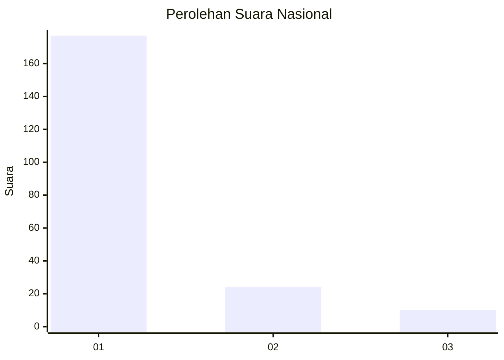
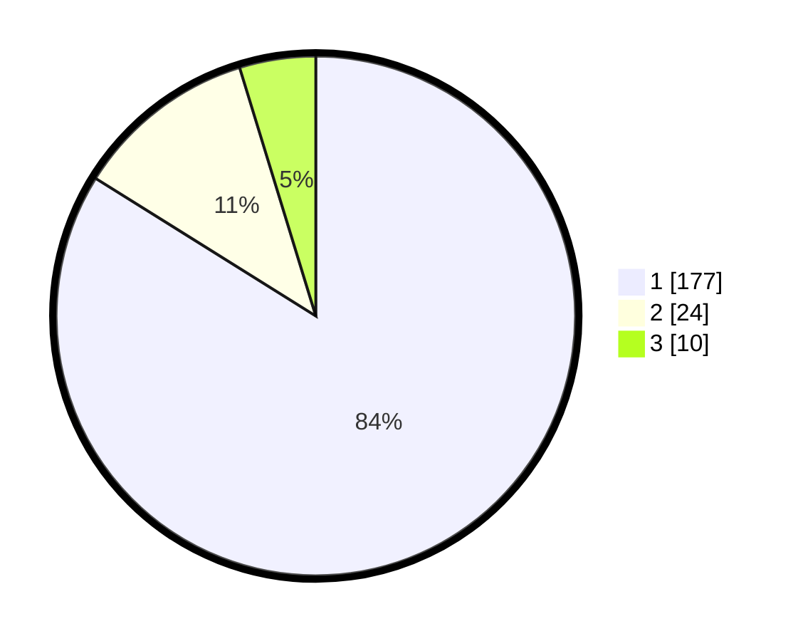

# Hasil

## Grafik

## Tabel

| No. | Nama Paslon    | Suara | Suara (raw) | Persentase |
|:--- |:-------------- | -----:| -----------:| ----------:|
| 1   | ANIES MUHAIMIN | 177   | [177][p-1]  | 83,89      |
| 2   | PRABOWO GIBRAN | 24    | [24][p-2]   | 11,37      |
| 3   | GANJAR MAHFUD  | 10    | [10][p-3]   | 4,74       |

[p-1]: https://github.com/gigit-pemilu/pemilu-2024/blob/main/pilpres/hitung-suara/sub/11-aceh/sub/07-pidie/sub/11-mila/sub/2014-kulu/sub/001-tps/sub/paslon-1.txt
[p-2]: https://github.com/gigit-pemilu/pemilu-2024/blob/main/pilpres/hitung-suara/sub/11-aceh/sub/07-pidie/sub/11-mila/sub/2014-kulu/sub/001-tps/sub/paslon-2.txt
[p-3]: https://github.com/gigit-pemilu/pemilu-2024/blob/main/pilpres/hitung-suara/sub/11-aceh/sub/07-pidie/sub/11-mila/sub/2014-kulu/sub/001-tps/sub/paslon-3.txt

## Foto C Plano

https://sirekap-obj-formc.kpu.go.id/ed2f/pemilu/ppwp/11/07/11/20/14/1107112014001-20240215-113536--61d19172-428f-4bae-8b22-e89c0175e97c.jpg

https://sirekap-obj-formc.kpu.go.id/ed2f/pemilu/ppwp/11/07/11/20/14/1107112014001-20240215-113728--4a9370c4-a22f-4fa6-95dd-96817ca3f62f.jpg

https://sirekap-obj-formc.kpu.go.id/ed2f/pemilu/ppwp/11/07/11/20/14/1107112014001-20240215-113845--7ba71abb-45aa-46d9-821c-36e7597eaec2.jpg

## Metadata

| Key        | Value               |
| ---------- | ------------------- |
| Time Stamp | 2024-02-19 06:16:00 |

