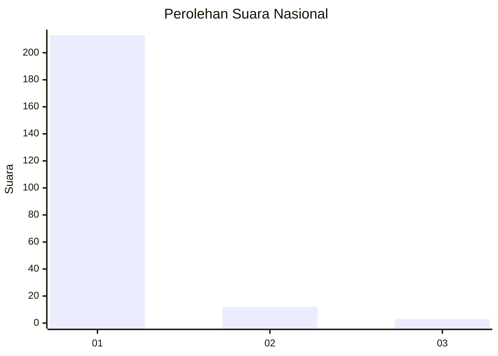
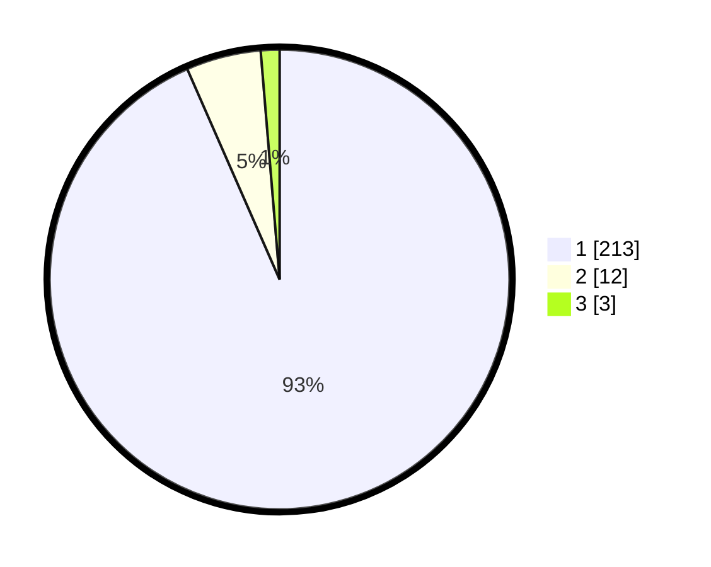

# Hasil

## Grafik

## Tabel

| No. | Nama Paslon    | Suara | Suara (raw) | Persentase |
|:--- |:-------------- | -----:| -----------:| ----------:|
| 1   | ANIES MUHAIMIN | 213   | [213][p-1]  | 93,42      |
| 2   | PRABOWO GIBRAN | 12    | [12][p-2]   | 5,26       |
| 3   | GANJAR MAHFUD  | 3     | [3][p-3]    | 1,32       |

[p-1]: https://github.com/gigit-pemilu/pemilu-2024/blob/main/pilpres/hitung-suara/sub/11-aceh/sub/07-pidie/sub/11-mila/sub/2014-kulu/sub/002-tps/sub/paslon-1.txt
[p-2]: https://github.com/gigit-pemilu/pemilu-2024/blob/main/pilpres/hitung-suara/sub/11-aceh/sub/07-pidie/sub/11-mila/sub/2014-kulu/sub/002-tps/sub/paslon-2.txt
[p-3]: https://github.com/gigit-pemilu/pemilu-2024/blob/main/pilpres/hitung-suara/sub/11-aceh/sub/07-pidie/sub/11-mila/sub/2014-kulu/sub/002-tps/sub/paslon-3.txt

## Foto C Plano

https://sirekap-obj-formc.kpu.go.id/ac60/pemilu/ppwp/11/07/11/20/14/1107112014002-20240215-113901--1ea3ec45-afbf-49ef-9600-01752594d544.jpg

https://sirekap-obj-formc.kpu.go.id/ac60/pemilu/ppwp/11/07/11/20/14/1107112014002-20240215-114025--5621d771-189f-4539-8b36-452a257d374a.jpg

https://sirekap-obj-formc.kpu.go.id/ac60/pemilu/ppwp/11/07/11/20/14/1107112014002-20240215-114152--cdb56f95-4984-4614-a516-5b4cc7f585c9.jpg

## Metadata

| Key        | Value               |
| ---------- | ------------------- |
| Time Stamp | 2024-02-24 22:31:28 |

