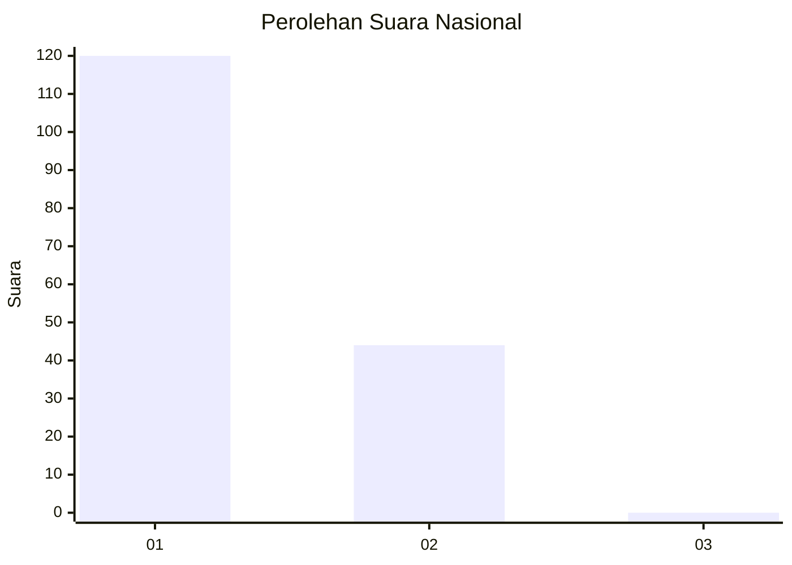
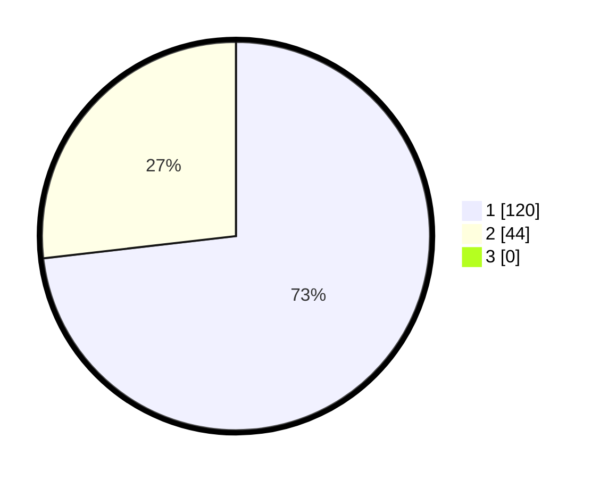

# Hasil

## Grafik

## Tabel

| No. | Nama Paslon    | Suara | Suara (raw) | Persentase |
|:--- |:-------------- | -----:| -----------:| ----------:|
| 1   | ANIES MUHAIMIN | 120   | [120][p-1]  | 73,17      |
| 2   | PRABOWO GIBRAN | 44    | [44][p-2]   | 26,83      |
| 3   | GANJAR MAHFUD  | 0     | [0][p-3]    | 0,00       |

[p-1]: https://github.com/gigit-pemilu/pemilu-2024/blob/main/pilpres/hitung-suara/sub/11-aceh/sub/07-pidie/sub/11-mila/sub/2015-mesjid-andeue/sub/002-tps/sub/paslon-1.txt
[p-2]: https://github.com/gigit-pemilu/pemilu-2024/blob/main/pilpres/hitung-suara/sub/11-aceh/sub/07-pidie/sub/11-mila/sub/2015-mesjid-andeue/sub/002-tps/sub/paslon-2.txt
[p-3]: https://github.com/gigit-pemilu/pemilu-2024/blob/main/pilpres/hitung-suara/sub/11-aceh/sub/07-pidie/sub/11-mila/sub/2015-mesjid-andeue/sub/002-tps/sub/paslon-3.txt

## Foto C Plano

https://sirekap-obj-formc.kpu.go.id/4b9e/pemilu/ppwp/11/07/11/20/15/1107112015002-20240215-045410--d31cc8c9-a4a5-4af6-882e-49e0522f826e.jpg

https://sirekap-obj-formc.kpu.go.id/4b9e/pemilu/ppwp/11/07/11/20/15/1107112015002-20240215-045618--3509a719-84f3-47f6-9c16-7f0f7ba704b4.jpg

https://sirekap-obj-formc.kpu.go.id/4b9e/pemilu/ppwp/11/07/11/20/15/1107112015002-20240215-045743--1ca0a290-b32c-4f88-87af-ac606ad60217.jpg

## Metadata

| Key        | Value               |
| ---------- | ------------------- |
| Time Stamp | 2024-02-19 06:16:00 |

