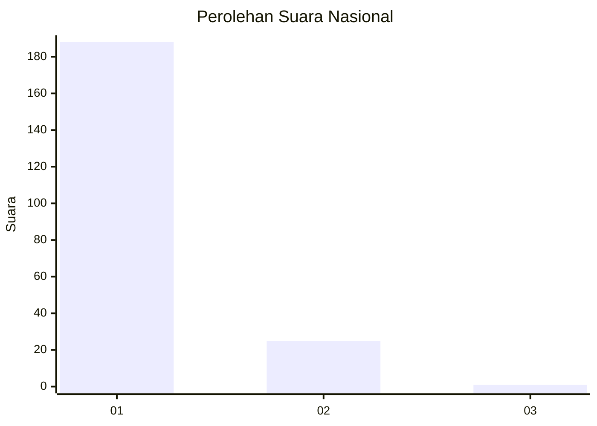
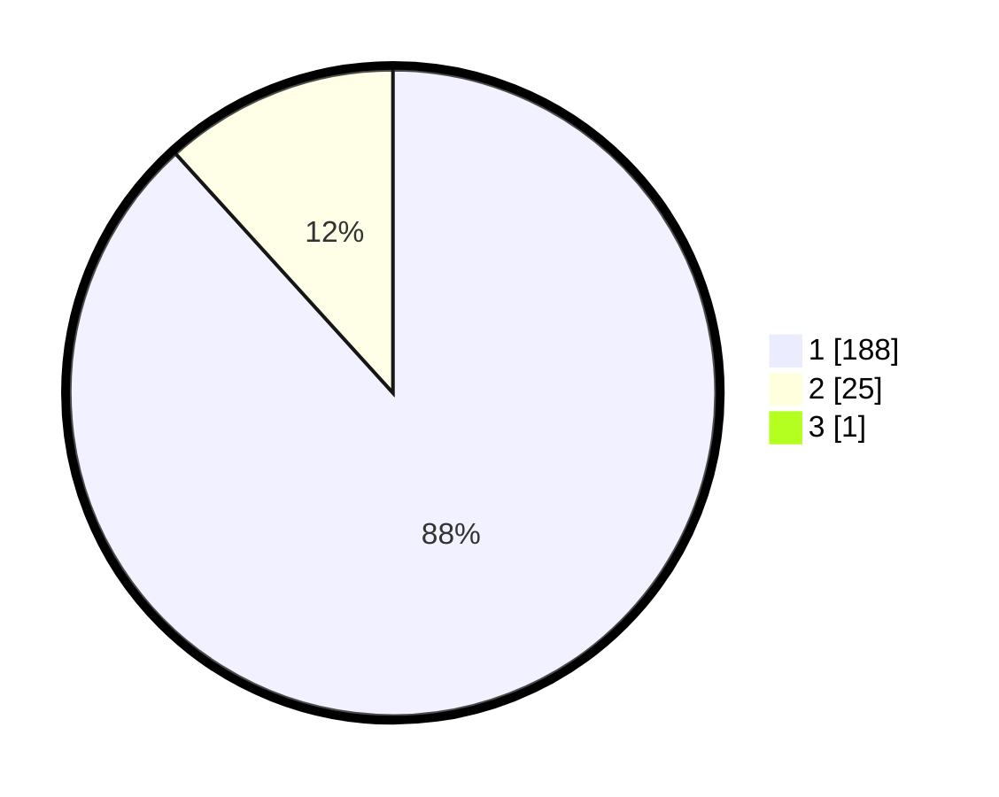

# Hasil

## Grafik

## Tabel

| No. | Nama Paslon    | Suara | Suara (raw) | Persentase |
|:--- |:-------------- | -----:| -----------:| ----------:|
| 1   | ANIES MUHAIMIN | 188   | [188][p-1]  | 87,85      |
| 2   | PRABOWO GIBRAN | 25    | [25][p-2]   | 11,68      |
| 3   | GANJAR MAHFUD  | 1     | [1][p-3]    | 0,47       |

[p-1]: https://github.com/gigit-pemilu/pemilu-2024/blob/main/pilpres/hitung-suara/sub/11-aceh/sub/07-pidie/sub/11-mila/sub/2020-krueng-lala/sub/001-tps/sub/paslon-1.txt
[p-2]: https://github.com/gigit-pemilu/pemilu-2024/blob/main/pilpres/hitung-suara/sub/11-aceh/sub/07-pidie/sub/11-mila/sub/2020-krueng-lala/sub/001-tps/sub/paslon-2.txt
[p-3]: https://github.com/gigit-pemilu/pemilu-2024/blob/main/pilpres/hitung-suara/sub/11-aceh/sub/07-pidie/sub/11-mila/sub/2020-krueng-lala/sub/001-tps/sub/paslon-3.txt

## Foto C Plano

https://sirekap-obj-formc.kpu.go.id/a829/pemilu/ppwp/11/07/11/20/20/1107112020001-20240214-224332--ca6bebeb-a880-453f-b5be-e9bf7c9987fc.jpg

https://sirekap-obj-formc.kpu.go.id/a829/pemilu/ppwp/11/07/11/20/20/1107112020001-20240214-224943--cbfbc389-7782-48e5-9a22-6efef139c03f.jpg

https://sirekap-obj-formc.kpu.go.id/a829/pemilu/ppwp/11/07/11/20/20/1107112020001-20240214-225143--1afeacba-4d0a-4c49-9ee5-7e795a95d32a.jpg

## Metadata

| Key        | Value               |
| ---------- | ------------------- |
| Time Stamp | 2024-02-19 06:16:00 |

