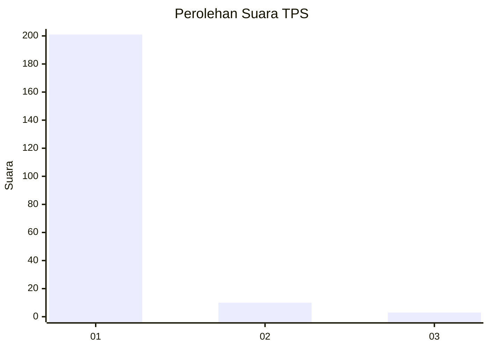
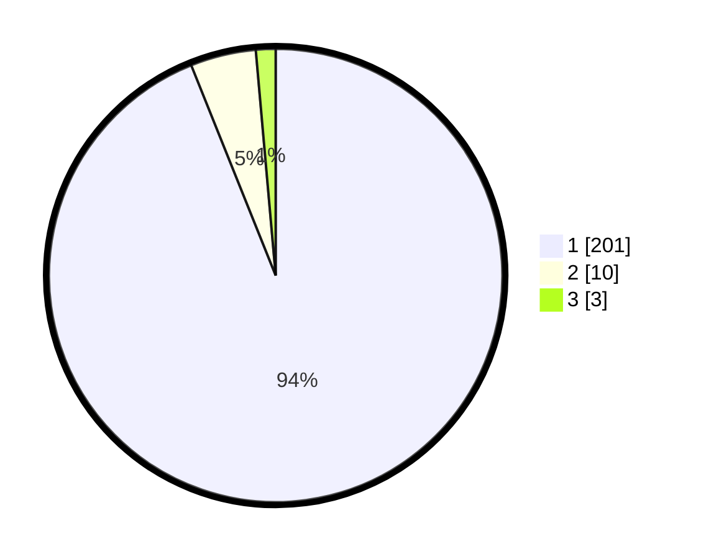

# Hasil

## Grafik

## Tabel

| No. | Nama Paslon    | Suara | Suara (raw) | Persentase |
|:--- |:-------------- | -----:| -----------:| ----------:|
| 1   | ANIES MUHAIMIN | 201   | [201][p-1]  | 93,93      |
| 2   | PRABOWO GIBRAN | 10    | [10][p-2]   | 4,67       |
| 3   | GANJAR MAHFUD  | 3     | [3][p-3]    | 1,40       |

[p-1]: https://github.com/gigit-pemilu/pemilu-2024-11-aceh/blob/main/pilpres/hitung-suara/sub/11-aceh/sub/07-pidie/sub/12-muara-tiga/sub/2002-tgk-dilaweueng/sub/005-tps/sub/paslon-1.txt
[p-2]: https://github.com/gigit-pemilu/pemilu-2024-11-aceh/blob/main/pilpres/hitung-suara/sub/11-aceh/sub/07-pidie/sub/12-muara-tiga/sub/2002-tgk-dilaweueng/sub/005-tps/sub/paslon-2.txt
[p-3]: https://github.com/gigit-pemilu/pemilu-2024-11-aceh/blob/main/pilpres/hitung-suara/sub/11-aceh/sub/07-pidie/sub/12-muara-tiga/sub/2002-tgk-dilaweueng/sub/005-tps/sub/paslon-3.txt

## Foto C Plano

https://sirekap-obj-formc.kpu.go.id/32d0/pemilu/ppwp/11/07/12/20/02/1107122002005-20240214-205308--ca7ea1c4-7be6-41ee-80ab-0fdbbc7c8206.jpg

https://sirekap-obj-formc.kpu.go.id/32d0/pemilu/ppwp/11/07/12/20/02/1107122002005-20240214-205514--4c891681-f298-4064-b63c-a4b63eae7861.jpg

https://sirekap-obj-formc.kpu.go.id/32d0/pemilu/ppwp/11/07/12/20/02/1107122002005-20240214-200907--7784ddfa-fd75-4db9-9233-169d7bafc349.jpg

## Metadata

| Key        | Value               |
| ---------- | ------------------- |
| Time Stamp | 2024-02-24 22:31:28 |

